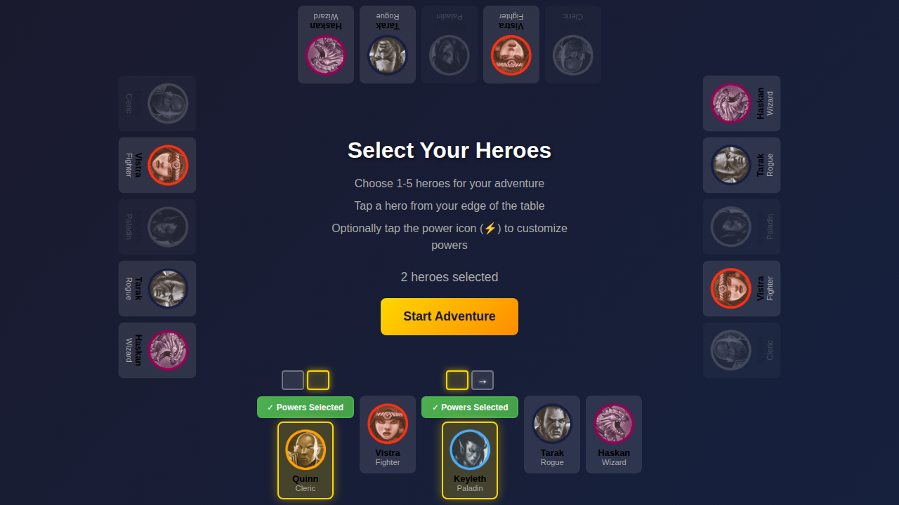
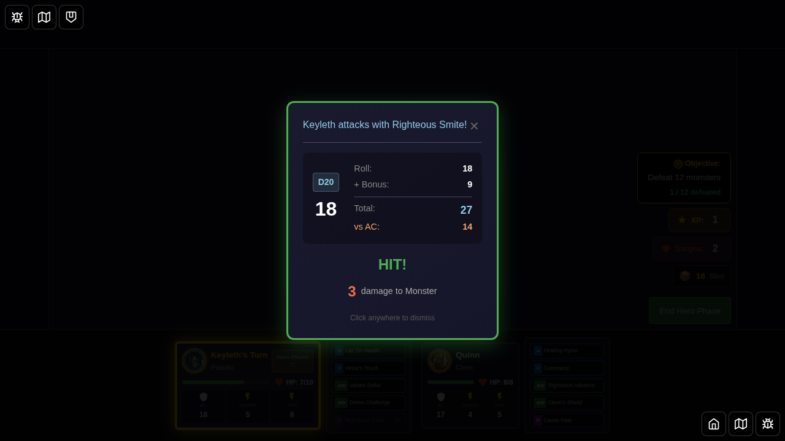
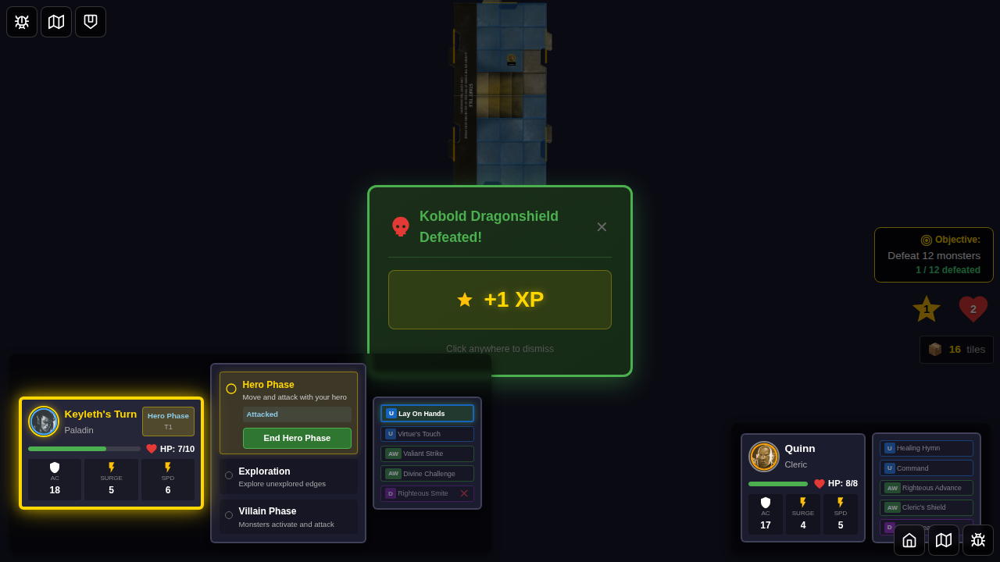
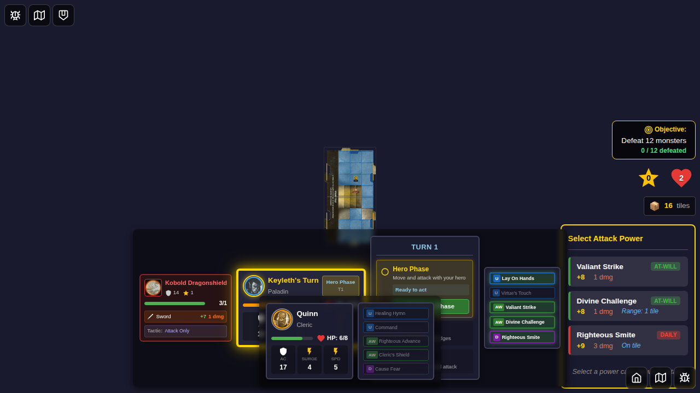
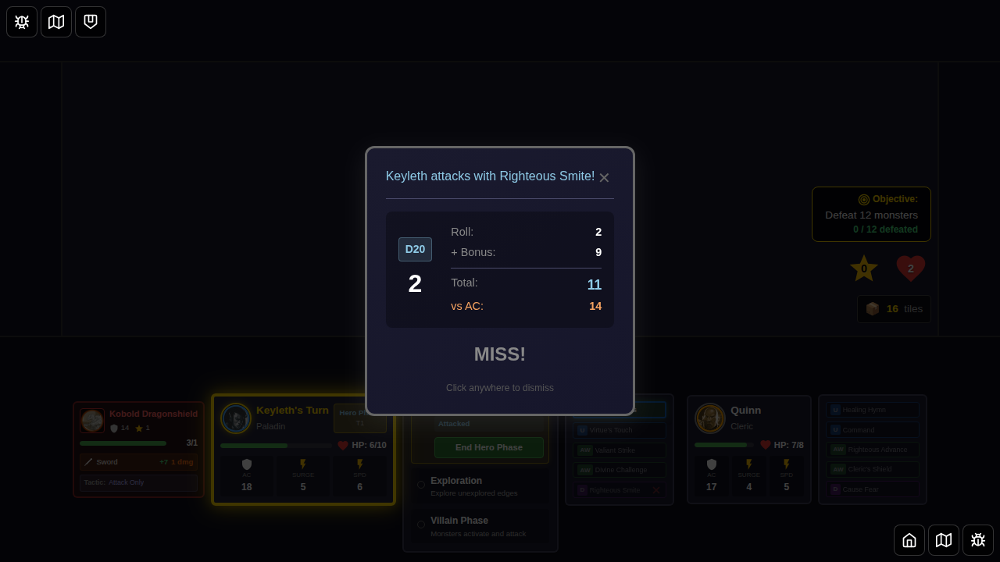
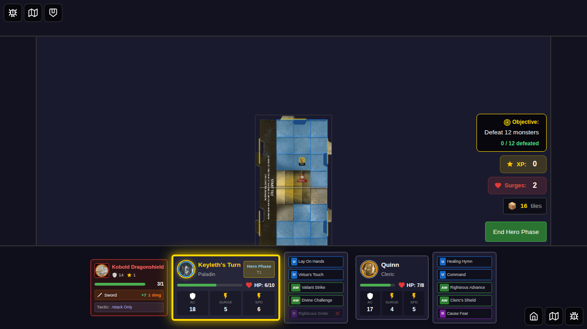
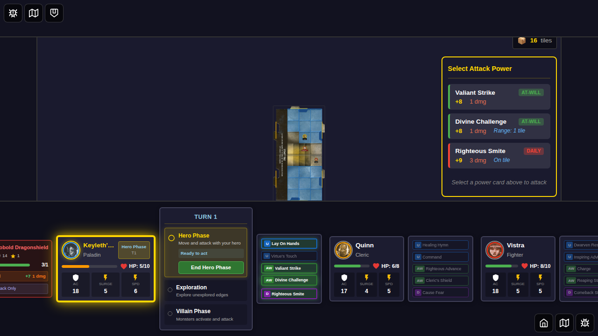
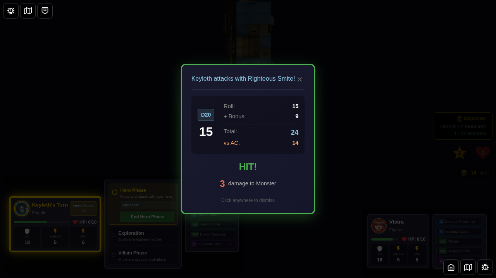

# E2E Test 051: Righteous Smite (Card ID: 27)

This E2E test validates that the Righteous Smite power card (ID: 27) correctly applies its "Hit or Miss" healing effect to all heroes on the same tile, regardless of whether the attack hits or misses.

## User Story

As a Paladin player using Righteous Smite:
1. I select Keyleth (Paladin) and Quinn (Cleric) as heroes
2. Both heroes are positioned on the same tile and are damaged
3. I use Righteous Smite to attack an adjacent monster
4. **Regardless of hit/miss**: Both heroes on the same tile regain 1 HP
5. Heroes on different tiles do not receive the healing

## Test Coverage

This test suite includes three test cases:

### Test 1: All heroes on tile regain 1 HP on hit
- **Setup**: Two heroes (Keyleth and Quinn) positioned together, both damaged
- **Action**: Attack with Righteous Smite (guaranteed hit with roll of 17)
- **Verification**: Both heroes regain 1 HP after attack

### Test 2: All heroes on tile regain 1 HP on miss
- **Setup**: Two heroes positioned together, both damaged
- **Action**: Attack with Righteous Smite (guaranteed miss with roll of 2)
- **Verification**: Both heroes regain 1 HP despite the miss

### Test 3: Only heroes on same tile receive healing
- **Setup**: Three heroes - Keyleth and Quinn together, Vistra separate
- **Action**: Attack with Righteous Smite
- **Verification**: Only Keyleth and Quinn (on same tile) are healed, Vistra is not

## Screenshots

### Test 1: Hit Scenario

| Step | Description | Screenshot |
|------|-------------|------------|
| 000 | Two heroes selected |  |
| 001 | Setup complete - heroes damaged, monster spawned |  |
| 002 | Attack hit result displayed |  |
| 003 | After hit - heroes healed |  |

### Test 2: Miss Scenario

| Step | Description | Screenshot |
|------|-------------|------------|
| 000 | Setup for miss test |  |
| 001 | Attack miss result displayed |  |
| 002 | After miss - heroes still healed |  |

### Test 3: Same Tile Only

| Step | Description | Screenshot |
|------|-------------|------------|
| 000 | Three heroes setup - two together, one separate |  |
| 001 | Only same-tile heroes healed |  |

## Programmatic Verification

Each screenshot includes programmatic verification:
- Heroes' HP values before and after attack
- Attack result (hit/miss) matches expected outcome
- Healing applied only to heroes on the same tile as the attacker

## Implementation Details

The test validates the following implementation in `gameSlice.ts`:
- Hit-or-miss healing effects are parsed from power card rules
- Healing is applied to all heroes on the attacker's tile
- Healing amount is capped at each hero's maximum HP
- Effect triggers regardless of attack outcome (hit or miss)

## Related Issue

This test addresses issue #209: E2E coverage for area healing effects that trigger regardless of attack result.
