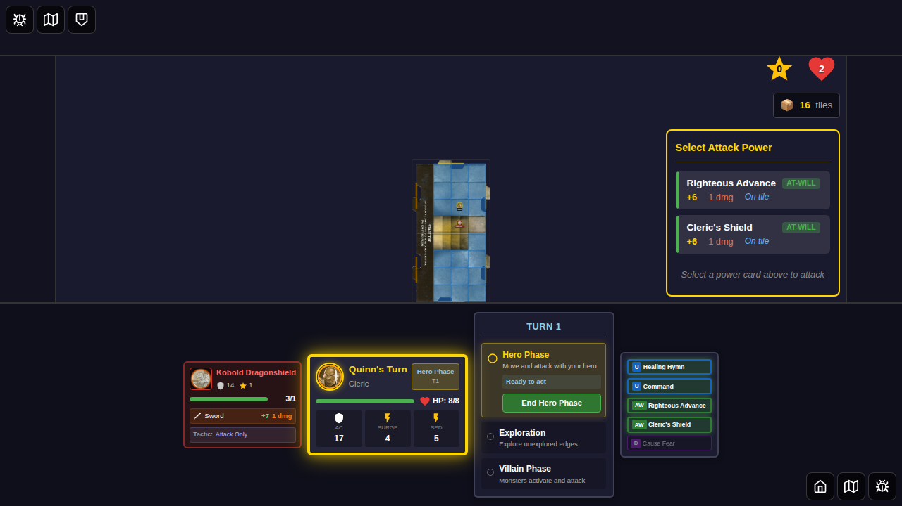
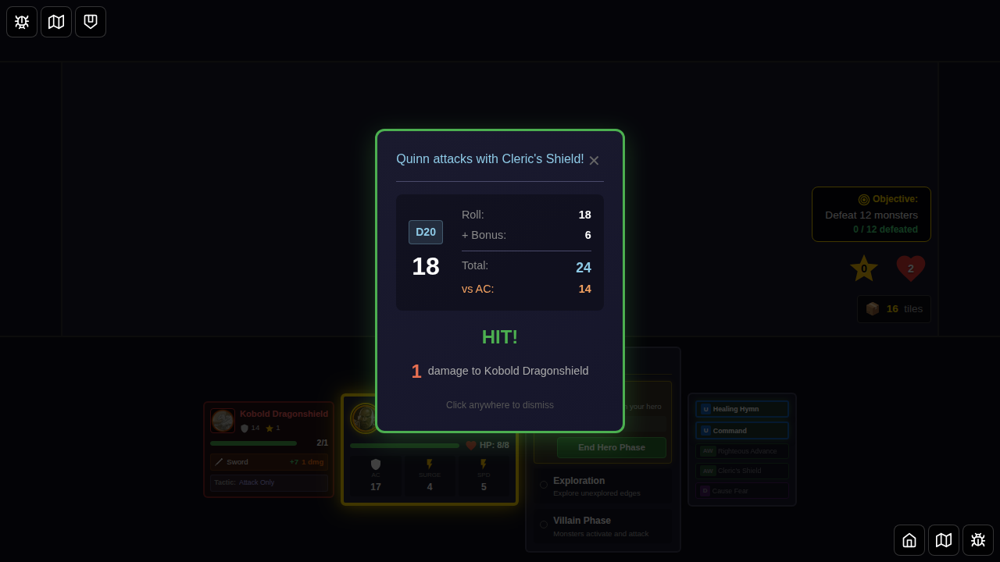
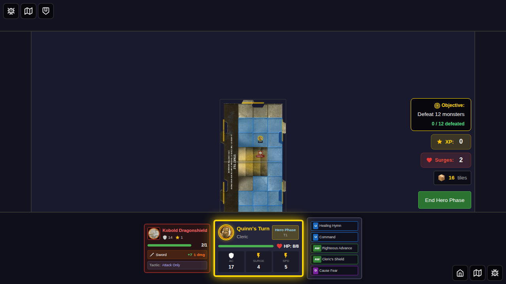
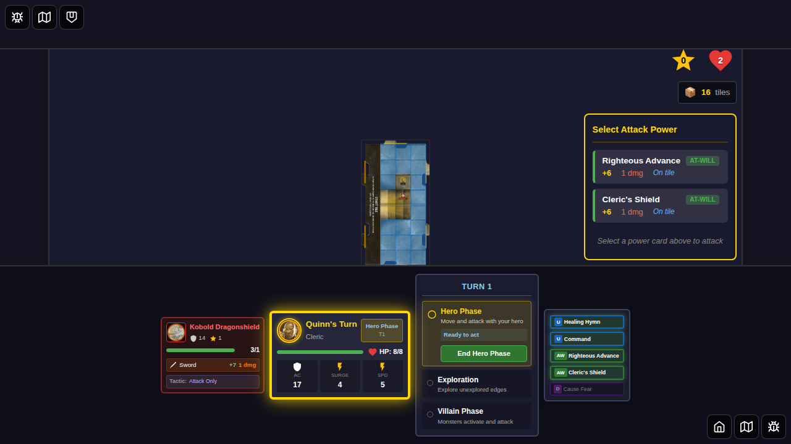
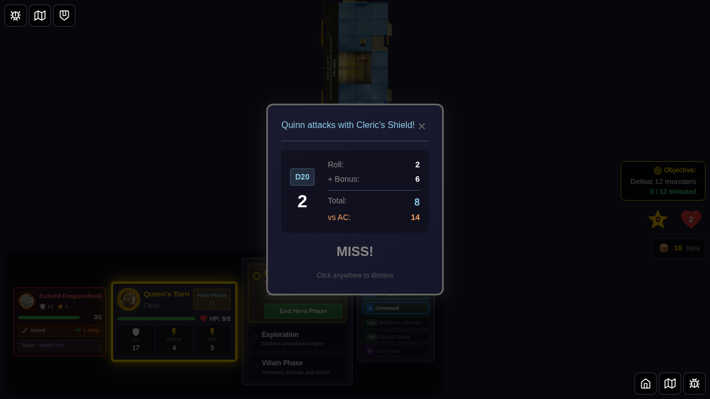
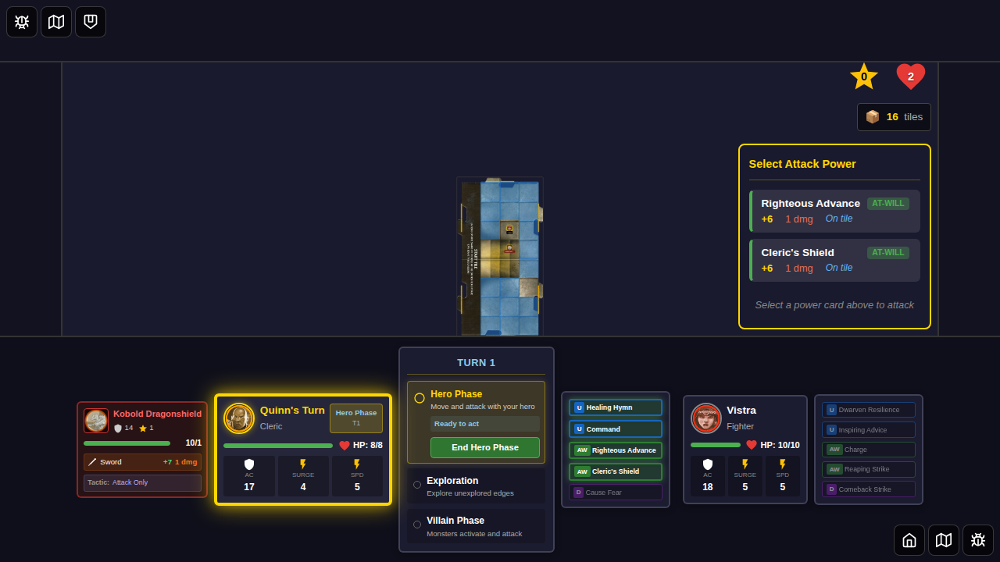
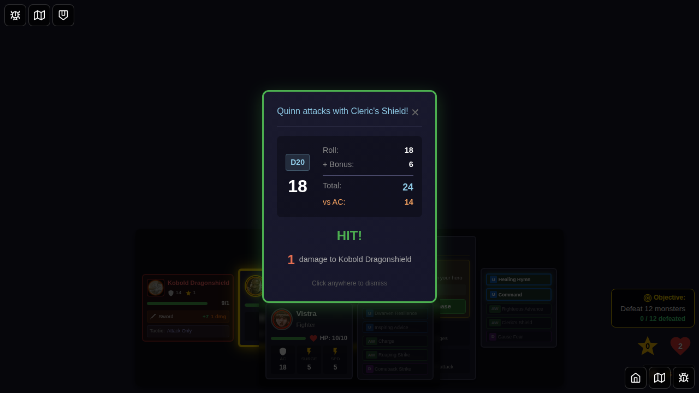
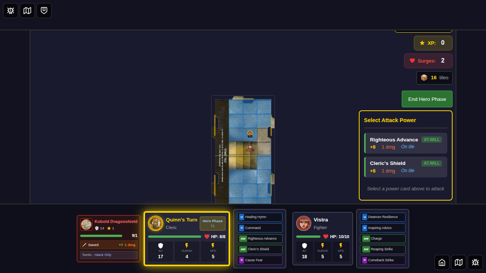
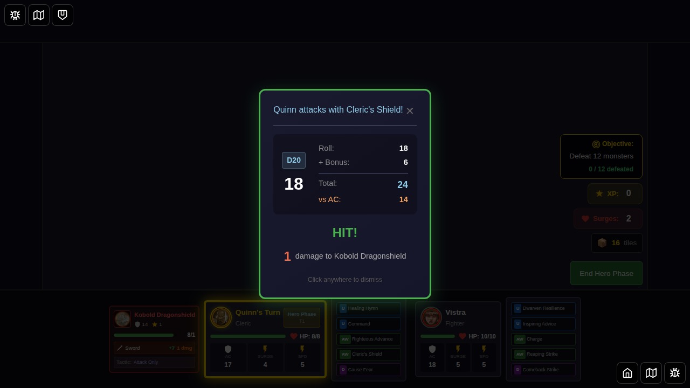

# E2E Test 052: Cleric's Shield (Card ID: 2)

This E2E test validates that the Cleric's Shield power card (ID: 2) correctly applies its "Hit or Miss" AC bonus effect regardless of whether the attack hits or misses, and that the bonus persists until the power is used again.

## User Story

As a Cleric player using Cleric's Shield:
1. I select Quinn (Cleric) as my hero
2. I position Quinn adjacent to a monster
3. I use Cleric's Shield to attack the monster
4. **Regardless of hit/miss**: Quinn (or another hero on the same tile) gains a +2 bonus to AC
5. The AC bonus persists until Cleric's Shield is used again
6. When I use Cleric's Shield again, the bonus is reapplied (potentially to a different target)

## Test Coverage

This test suite includes three test cases:

### Test 1: AC bonus applies on hit
- **Setup**: Quinn positioned adjacent to a kobold
- **Action**: Attack with Cleric's Shield (guaranteed hit with roll of 17)
- **Verification**: AC bonus is applied to Quinn after the attack

### Test 2: AC bonus applies on miss
- **Setup**: Quinn positioned adjacent to a kobold
- **Action**: Attack with Cleric's Shield (guaranteed miss with roll of 2)
- **Verification**: AC bonus is applied to Quinn even though the attack missed

### Test 3: Bonus persists and can be reapplied
- **Setup**: Two heroes (Quinn and Vistra) positioned together
- **Action**: Use Cleric's Shield twice
- **Verification**: 
  - Bonus applies after first use
  - Bonus persists until second use
  - Bonus is reapplied after second use

## Screenshots

### Test 1: Hit Scenario

| Step | Description | Screenshot |
|------|-------------|------------|
| 000 | Hero selected |  |
| 001 | Setup complete - monster spawned |  |
| 002 | Attack hit result displayed |  |
| 003 | After hit - AC bonus applied |  |

### Test 2: Miss Scenario

| Step | Description | Screenshot |
|------|-------------|------------|
| 000 | Setup for miss test |  |
| 001 | Attack miss result displayed |  |
| 002 | After miss - AC bonus still applied |  |

### Test 3: Persistence and Reapplication

| Step | Description | Screenshot |
|------|-------------|------------|
| 000 | Two heroes selected |  |
| 001 | Initial setup |  |
| 002 | First use - bonus applied |  |
| 003 | Bonus persists before second use |  |
| 004 | Second use - bonus reapplied |  |

## Programmatic Verification

Each screenshot includes programmatic verification:
- `clericsShieldTarget` state variable is null before first use
- `clericsShieldTarget` is set to the target hero ID after using Cleric's Shield
- AC bonus applies regardless of hit or miss result
- Bonus persists until Cleric's Shield is used again
- When used again, bonus is reapplied (same or different target)

## Implementation Details

The test validates the following implementation:
- **State tracking**: `clericsShieldTarget` in `GameState` tracks which hero has the AC bonus
- **Parser**: `actionCardParser.ts` correctly parses "ac-bonus" from hit-or-miss effects
- **Application**: `gameSlice.ts` applies the bonus when Cleric's Shield is used
- **AC calculation**: Monster attacks use `calculateTotalAC()` which includes the +2 bonus
- **Persistence**: Bonus persists across turns until Cleric's Shield is used again

## Related Issue

This test addresses issue #2: E2E test coverage for Cleric's Shield AC bonus that applies on hit or miss, tracking conditional defense bonuses per issue egirard/Ashardalon#209.

## Card Details

**Cleric's Shield (ID: 2)**
- Type: At-Will
- Class: Cleric
- Attack Bonus: +6
- Damage: 1
- Rule: "Attack one adjacent Monster. Hit or Miss: Choose 1 Hero on your tile. That Hero gains a +2 bonus to AC until you use this power again."
