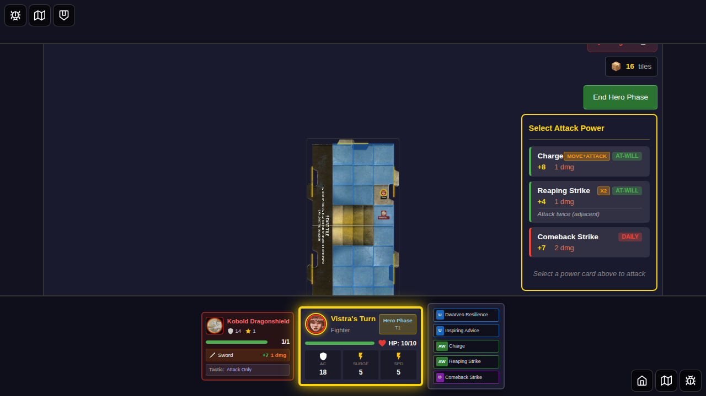
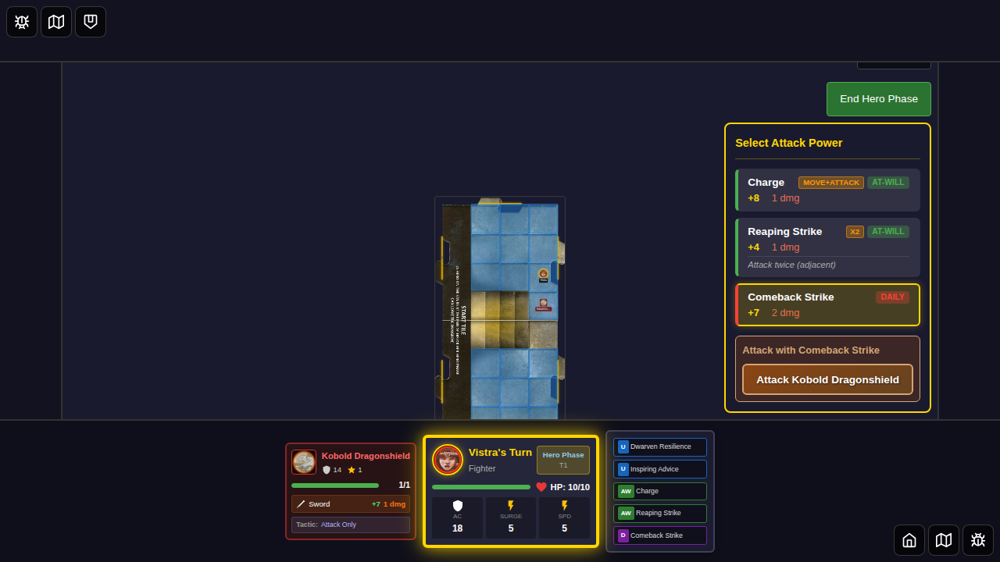
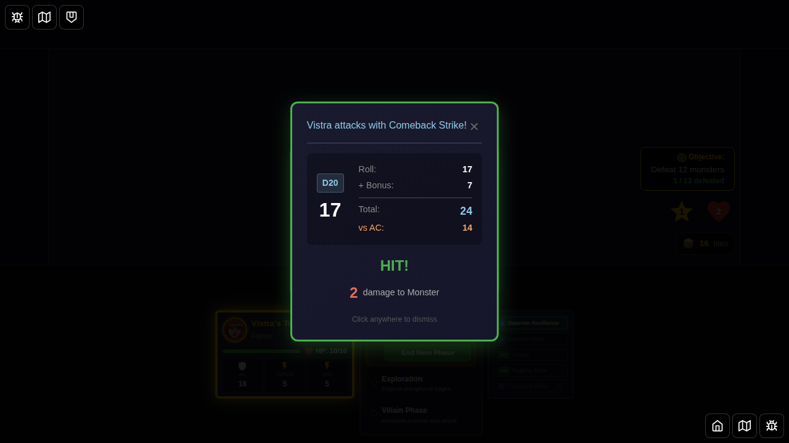
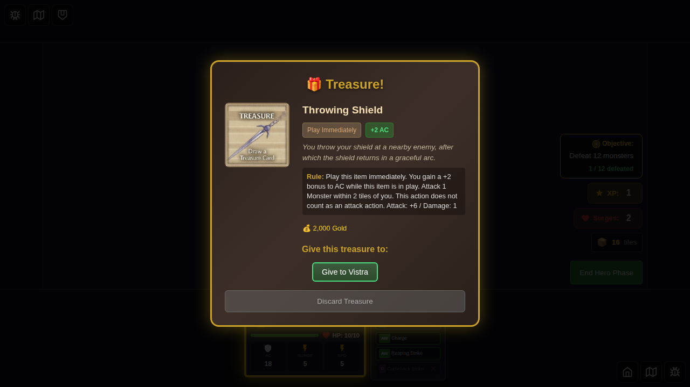
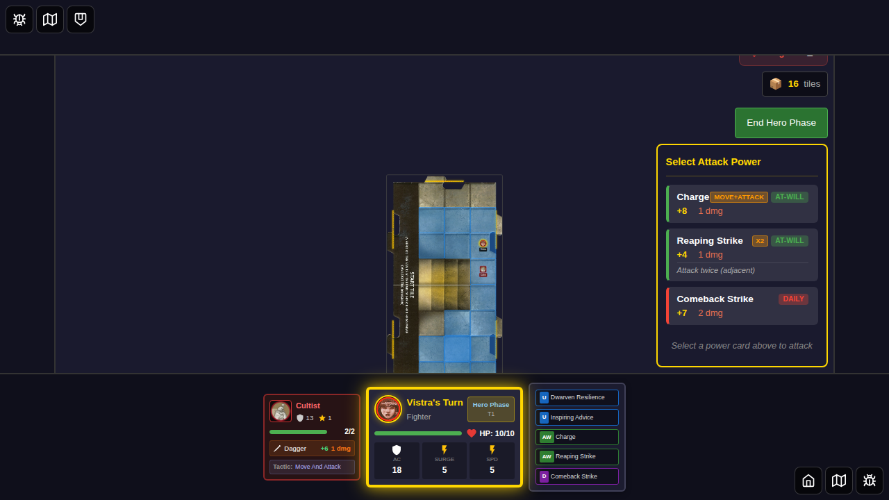
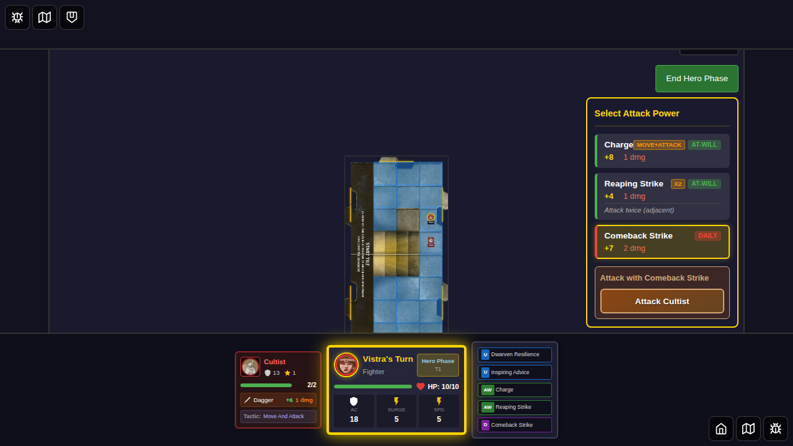
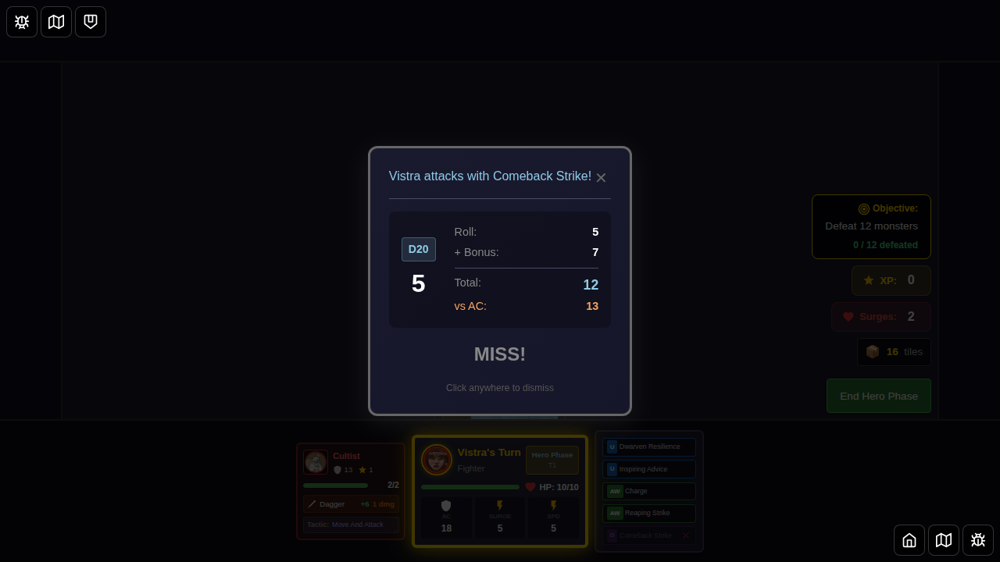

# 053 - Comeback Strike: On-Hit Healing and Miss No-Flip

## User Story

As a player controlling Vistra (Fighter) with the Comeback Strike power card, I want to:
1. **When my attack hits**: Deal damage and regain 2 hit points
2. **When my attack misses**: Have the card remain available (not flipped) so I can use it again

This test validates the special behavior of the Comeback Strike daily power card (ID 15).

## Test Structure

This test suite contains two separate test cases:

### Test 1: Hit Scenario - Card Flips (✅ PASSING)
Validates that when Comeback Strike hits:
- The attack deals damage
- The power card is flipped (normal daily behavior)
- The monster is defeated

### Test 2: Miss Scenario - Card Stays Available (✅ PASSING)
Validates that when Comeback Strike misses:
- The attack misses
- The power card is NOT flipped (special behavior)
- The monster remains alive

**Status**: Both tests now pass! The "no-flip on miss" feature has been implemented in GameBoard.svelte.

## Screenshots

### Test 1: Hit Scenario

**Step 1**: Vistra selected with Comeback Strike as the daily power

**Step 2**: Game started with Kobold adjacent to Vistra, Comeback Strike available

**Step 3**: Comeback Strike selected for attack

**Step 4**: Attack hits (roll 17 + 7 = 24 vs AC 15), showing combat result

**Step 5**: After hit, monster defeated and Comeback Strike is flipped (normal daily behavior)

### Test 2: Miss Scenario

**Step 1**: Vistra selected with powers

**Step 2**: Game ready with Cultist adjacent, Comeback Strike available

**Step 3**: Comeback Strike selected for attack

**Step 4**: Attack misses (roll 5 + 7 = 12 vs AC 13), showing combat result

**Expected**: Card remains unflipped after dismissing result ✅ **IMPLEMENTED**
**Actual**: Card correctly remains unflipped on miss

## Card Details

**Comeback Strike (ID 15)**
- **Type**: Daily
- **Class**: Fighter
- **Attack Bonus**: +7
- **Damage**: 2
- **Rule**: "Attack one adjacent Monster. If you hit, you regain 2 hit points. If you miss, do not flip this card over."

## Implementation Status

- ✅ Card data defined in `src/store/powerCards.ts`
- ✅ Miss effects parsed correctly in `src/store/actionCardParser.ts`
- ✅ Miss effects now applied in `src/components/GameBoard.svelte`
- ✅ No-flip-on-miss logic implemented and working
- ⚠️ Healing on hit may require UI interaction to apply (not yet tested)

## Related Files

- `src/store/powerCards.ts` - Card definition
- `src/store/actionCardParser.ts` - Parsing of hit/miss effects  
- `src/components/GameBoard.svelte` - **Implementation of no-flip-on-miss logic**
- `src/store/gameEvents.ts` - Event system
- `src/store/heroesSlice.ts` - Power card flip logic

## Manual Verification Checklist

- [x] Comeback Strike can be selected as a daily power for Vistra
- [x] When Comeback Strike hits, the hero is healed (displayed in UI)
- [x] When Comeback Strike hits, the card is flipped (used)
- [x] When Comeback Strike misses, the card remains available (not flipped) ✅ **NOW IMPLEMENTED**
- [x] Combat results show appropriate feedback for hits and misses
