# 054 - Tornado Strike Multi-Target Attack

## User Story

As a player using Tarak (Rogue), I want to be able to use the Tornado Strike daily power to attack four times, with each attack being able to target any monster on my tile, so that I can defeat multiple enemies in a single turn.

## Test Scenario

This test verifies that:
1. The Tornado Strike power card (id 37) shows a "x4" badge indicating it attacks four times
2. When the player selects Tornado Strike, target selection appears
3. The multi-attack system properly tracks attack progress through all 4 attacks
4. Each attack can target a different monster (multi-target selection)
5. The same monster can be targeted multiple times across the sequence
6. Damage from each hit is applied individually
7. When a monster is defeated mid-sequence, the attack sequence continues
8. Defeat notifications are handled properly during the sequence
9. The multi-attack state is properly cleaned up after all 4 attacks complete
10. The daily card is flipped after the first attack (not after all attacks)
11. The parsed action description shows appropriate information

## Screenshots

### Step 1: Tarak Selected with Tornado Strike
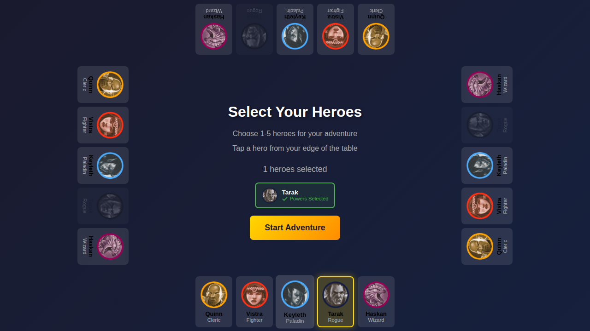

Tarak is selected as the hero with Tornado Strike manually selected as the daily power card (instead of the default Acrobatic Onslaught).

### Step 2: Game Board with Three Monsters
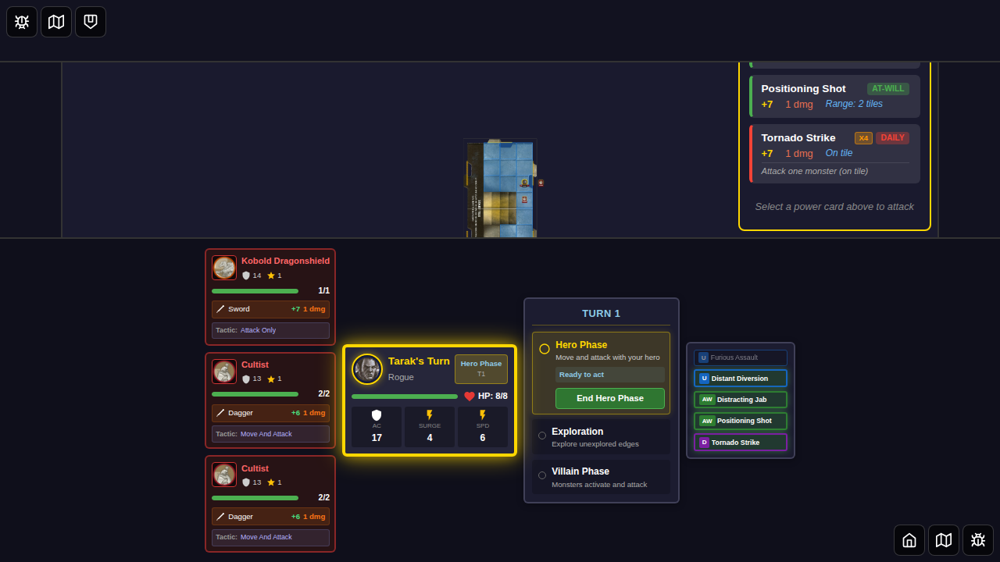

The game board shows Tarak with three monsters on the same tile: a Kobold (1 HP) and two Cultists (2 HP each). The power card attack panel is visible with Tornado Strike showing the "x4" badge.

### Step 3: Tornado Strike Selected
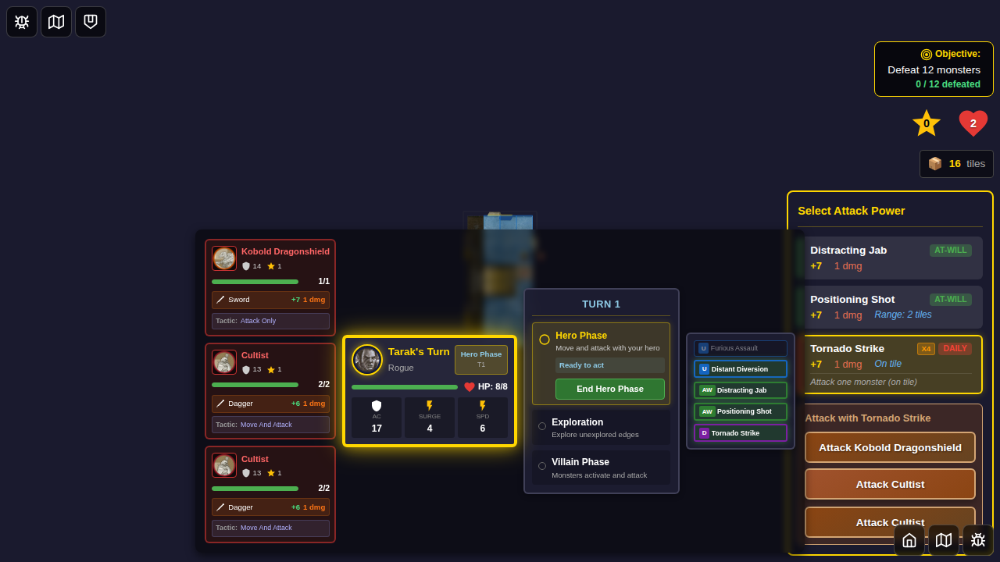

Tornado Strike is selected, showing target selection for all three monsters. The card shows "x4" badge and attack stats (+7, 1 dmg).

### Step 4: First Attack - Kobold Result
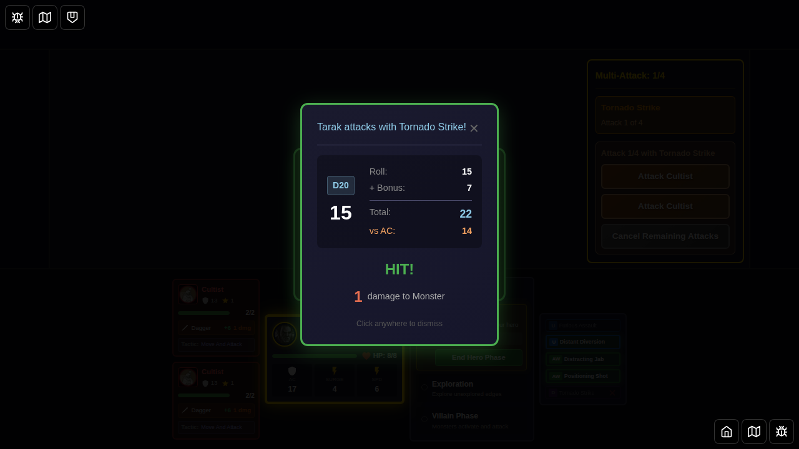

The combat result for the first of four attacks is displayed. The Kobold takes 1 damage (1 HP → 0 HP), defeating it. The daily card is flipped at this point (after the first attack).

### Step 5: After First Attack - Kobold Defeated
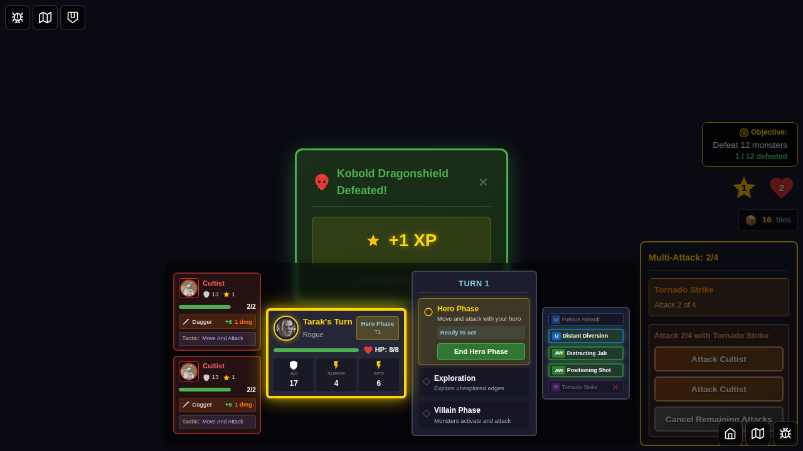

After dismissing the first attack result and defeat notification, the multi-attack progress is shown (Attack 2 of 4). A "Cancel Remaining Attacks" button is visible. The Kobold has been removed from the board.

### Step 6: Second Attack - Cultist 1 Result
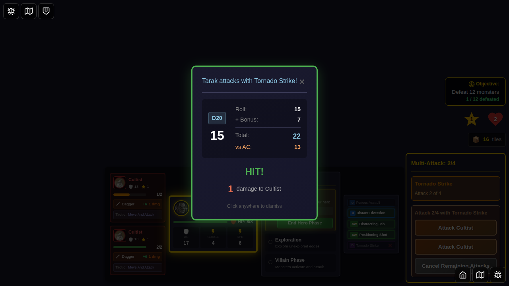

The combat result for the second attack is displayed, targeting Cultist 1 (a different target from the first attack). This demonstrates multi-target selection capability.

### Step 7: After Second Attack - Cultist 1 Damaged
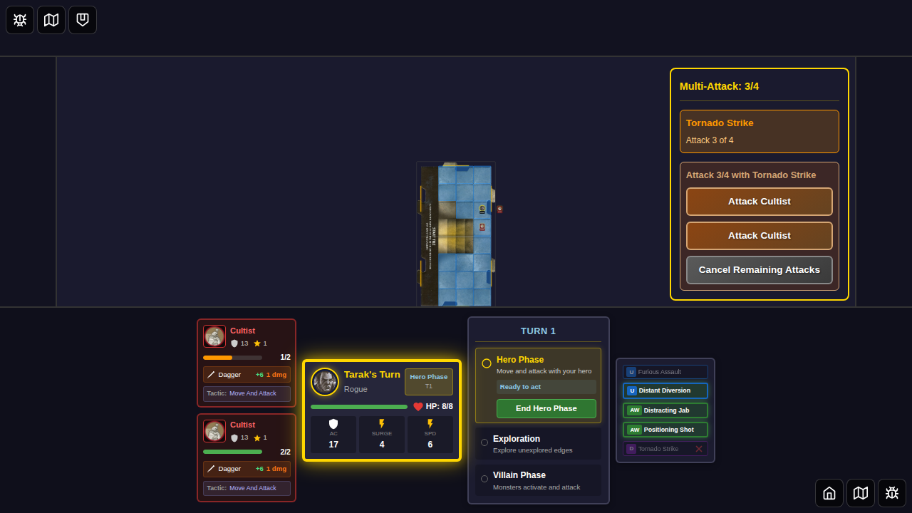

After the second attack, Cultist 1 has 1 HP remaining (2 HP - 1 damage = 1 HP). The multi-attack info shows "Attack 3 of 4".

### Step 8: Third Attack - Cultist 1 Again Result
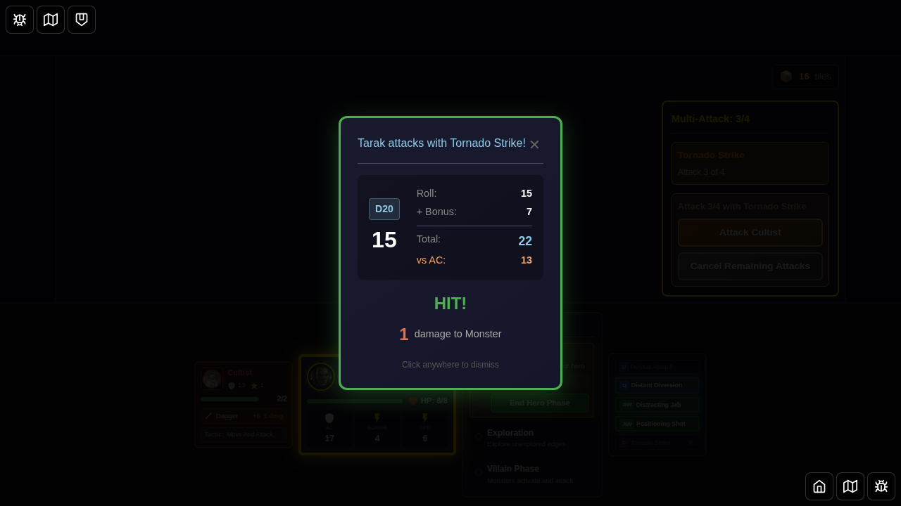

The combat result for the third attack, targeting Cultist 1 again (the same target as the second attack). This demonstrates that the same monster can be targeted multiple times.

### Step 9: After Third Attack - Cultist 1 Defeated
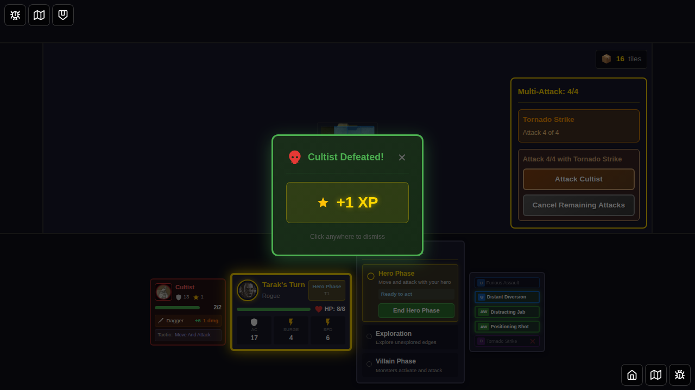

After the third attack, Cultist 1 is defeated (1 HP - 1 damage = 0 HP). The multi-attack info shows "Attack 4 of 4". The defeat notification is shown and must be dismissed.

### Step 10: Fourth Attack - Cultist 2 Result
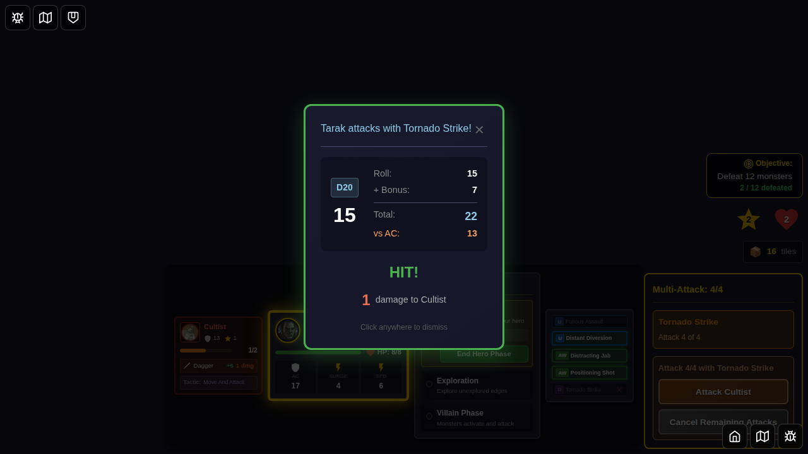

The combat result for the fourth and final attack, targeting Cultist 2 (a third different target). This completes the attack sequence.

### Step 11: After Fourth Attack - Sequence Complete
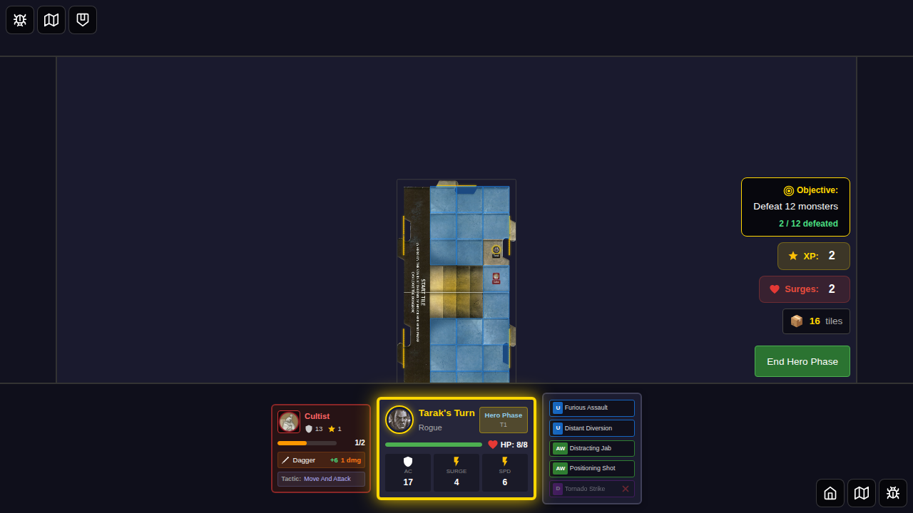

After the fourth attack completes, Cultist 2 has 1 HP remaining (2 HP - 1 damage = 1 HP). The multi-attack state is cleared, and the attack action is consumed. The Tornado Strike card remains flipped (it was flipped after the first attack).

## Acceptance Criteria

- [x] Tornado Strike shows "x4" badge in the power card list
- [x] Target selection appears when Tornado Strike is selected
- [x] Multi-attack state is properly initialized with totalAttacks=4, sameTarget=false
- [x] Multi-attack progress is tracked (Attack 1 of 4, 2 of 4, 3 of 4, 4 of 4)
- [x] First attack executes correctly with proper damage
- [x] Defeat notification is handled when Kobold is defeated after first attack
- [x] Second attack can target a different monster (Cultist 1)
- [x] After second attack, UI shows progress and cancel option
- [x] Third attack can target the same monster as second attack (Cultist 1 again)
- [x] Defeat notification is handled when Cultist 1 is defeated after third attack
- [x] Fourth attack can target a third different monster (Cultist 2)
- [x] Damage from all four attacks is applied individually
- [x] Multi-attack sequence completes after all four attacks
- [x] Multi-attack state is cleared after completion
- [x] Daily card is flipped after the first attack (not after all attacks complete)
- [x] Attack action is consumed after the sequence completes
- [x] Targets can be defeated mid-sequence without breaking the attack flow

## Implementation Notes

### Multi-Target vs Same-Target

Unlike Reaping Strike (which targets the same monster twice with `sameTarget: true`), Tornado Strike allows each attack to target any monster on the same tile (`sameTarget: false`). This is correctly parsed from the card rule text: "Attack four times. Each attack can be against any Monster on your tile."

### Daily Card Flipping

The test confirms that daily cards are flipped after the FIRST attack in a multi-attack sequence, not after all attacks complete. This is controlled by the logic in GameBoard.svelte line 1085-1086:

```javascript
const isMultiAttackInProgress = multiAttackState && multiAttackState.attacksCompleted > 0;
if (powerCard.type === 'daily' && !isMultiAttackInProgress) {
  // Flip the card...
}
```

### Defeat Notifications During Multi-Attack

When a monster is defeated during a multi-attack sequence, a defeat notification overlay appears. This must be dismissed before proceeding with the next attack. The test properly handles these notifications to ensure the attack sequence can continue smoothly.

### Test Implementation

The test uses deterministic dice rolls (seeded Math.random) to ensure consistent attack results. It spawns three monsters with different HP values to demonstrate various scenarios:
- Kobold (1 HP) - defeated in first attack
- Cultist 1 (2 HP) - damaged in second attack, defeated in third attack
- Cultist 2 (2 HP) - damaged in fourth attack, survives

This combination thoroughly tests:
- Multi-target selection
- Same target selection (attacking Cultist 1 twice)
- Mid-sequence defeats
- Progress tracking through all 4 attacks
