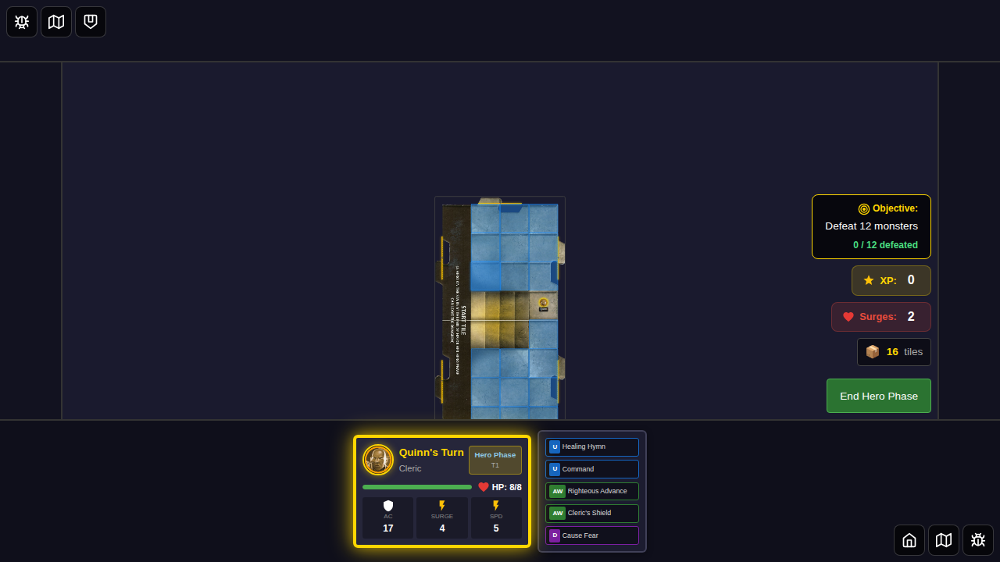
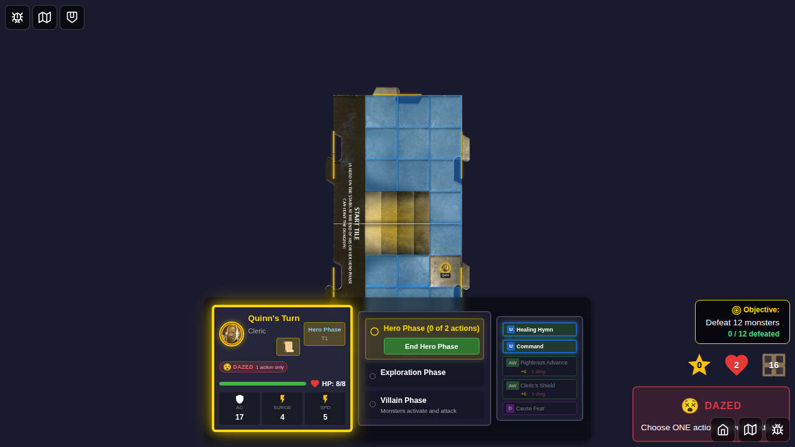
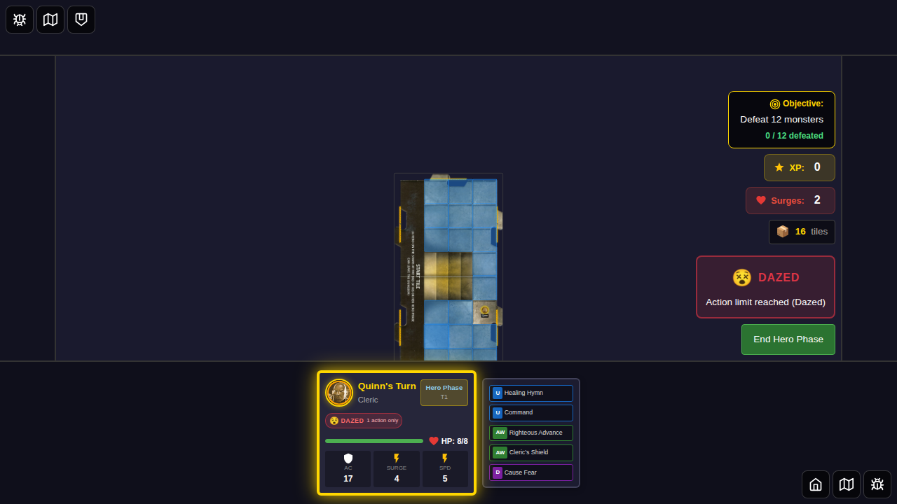
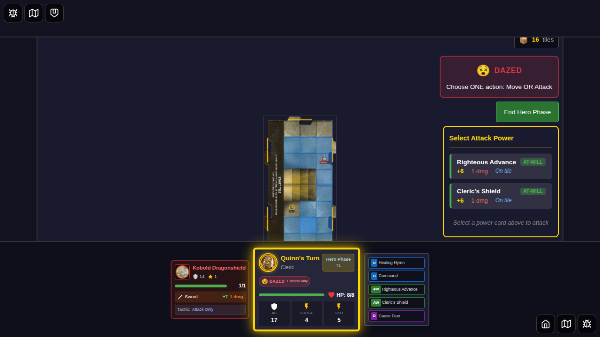
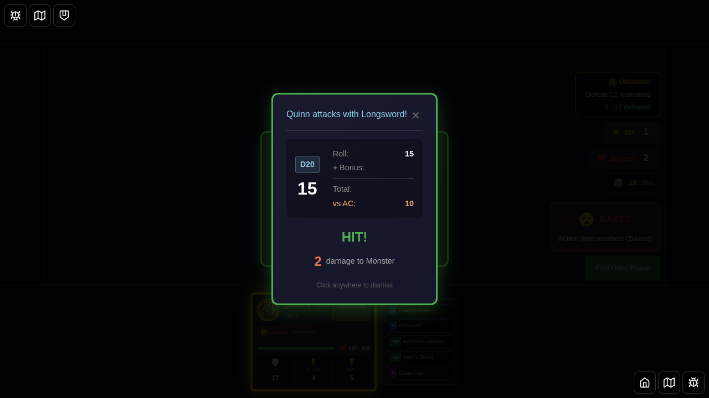
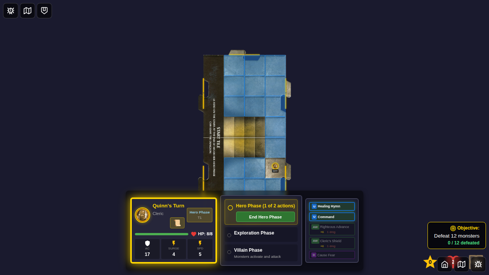

# E2E Test 055: Dazed Action Restrictions

## Overview

This test verifies that the Dazed status condition correctly restricts heroes to taking only one action per turn, as specified in the Wrath of Ashardalon rules.

## User Story

As a player whose hero is affected by the Dazed condition:
1. I should only be able to take ONE action per turn (move OR attack, not both)
2. After taking that single action, my turn should end immediately
3. The Dazed status icon should be clearly displayed on my hero card
4. Without the Dazed condition, I should be able to take two actions as normal

## Test Scenarios

### Scenario 1: Dazed Hero Can Only Take One Action

This scenario verifies that a Dazed hero is restricted to a single action.

**Step 1:** Game starts with Quinn. Hero has normal action capabilities (can move AND attack).

**Step 2:** Dazed status is applied to Quinn. The Dazed icon (😵) is displayed on the hero card.

**Step 3:** After Quinn takes a move action, both canMove and canAttack are set to false. The hero cannot take any more actions this turn.

**Step 4:** On the next turn, the Dazed status persists according to its duration (2 turns).

### Scenario 2: Dazed Hero Taking Attack Ends Turn

This scenario demonstrates that attacking while Dazed also ends the turn immediately.

**Step 1:** Quinn is Dazed and a monster (Kobold) is nearby. Both the Dazed icon and monster token are visible.

**Step 2:** After Quinn attacks the monster, no more actions are available. Turn ends after the single attack action.

### Scenario 3: Normal Hero Can Take Two Actions

This scenario confirms that non-Dazed heroes retain their normal two-action capability.

**Step 1:** Quinn starts with no status effects. Normal action capabilities are available.

**Step 2:** After moving, Quinn (without Dazed) can still attack. Both canMove and canAttack remain true.

## Acceptance Criteria

- [x] Dazed status icon (😵) is displayed on hero card when applied
- [x] Dazed hero taking a move action cannot take any more actions
- [x] Dazed hero taking an attack action cannot take any more actions
- [x] Dazed status persists for the specified duration (e.g., 2 turns)
- [x] Non-Dazed heroes can take two actions normally
- [x] Hero turn actions state (canMove, canAttack, actionsTaken) is correctly updated

## Technical Implementation

### Status Effect Application
- Dazed status is applied via `applyHeroStatus` action
- Status type: `'dazed'`
- Duration: configurable (e.g., 1 or 2 turns)
- Source: tracked for removal and debugging

### Action Restriction Logic
- Implemented in `computeHeroTurnActions` function
- When hero is Dazed:
  - After taking ONE action (move or attack)
  - Both `canMove` and `canAttack` are set to `false`
  - Turn effectively ends as no more actions are available

### Status Display
- Dazed icon: 😵
- Displayed via `[data-testid="condition-dazed"]`
- Part of hero card conditions display

## Related Files

- **Implementation**: `src/store/gameSlice.ts` (computeHeroTurnActions function)
- **Status Effects**: `src/store/statusEffects.ts` (isDazed helper)
- **Unit Tests**: `src/store/gameSlice.test.ts` (Dazed Action Restrictions section)
- **E2E Test**: `e2e/055-dazed-action-restrictions/055-dazed-action-restrictions.spec.ts`

## References

- [Wrath of Ashardalon Rulebook](../../public/assets/WrathofAshardalon_v1.1.pdf)
- [Dazed Condition Implementation Guide](../../DAZED_CONDITION_IMPLEMENTATION.md)
- [E2E Test Guidelines](../../docs/E2E_TEST_GUIDELINES.md)
