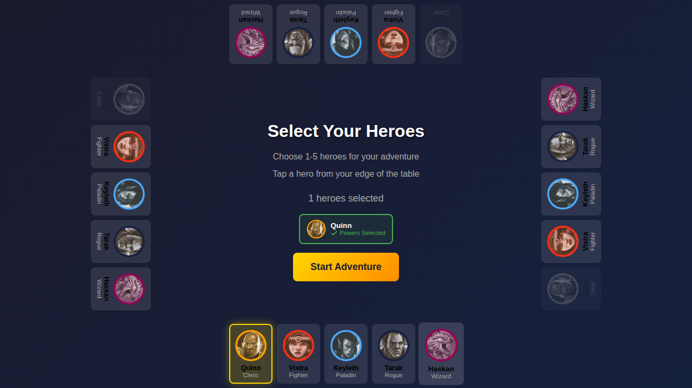
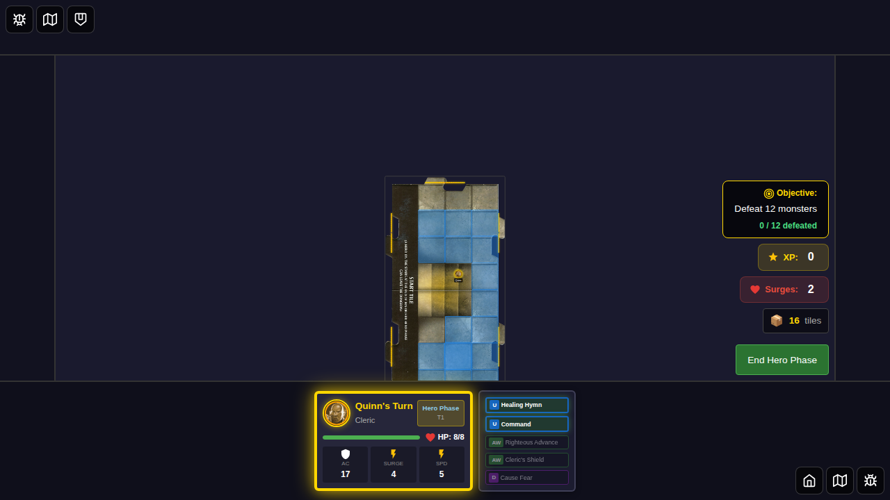
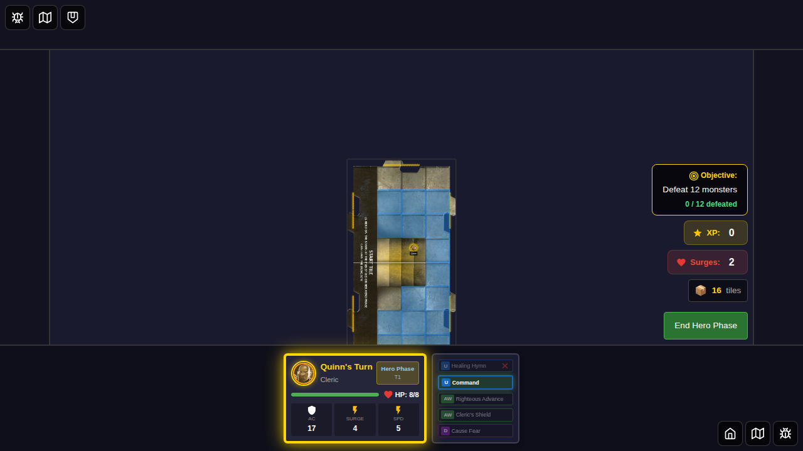
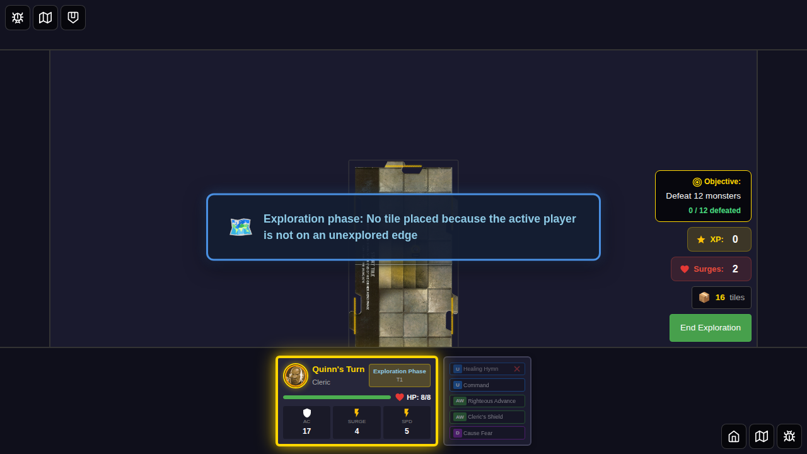
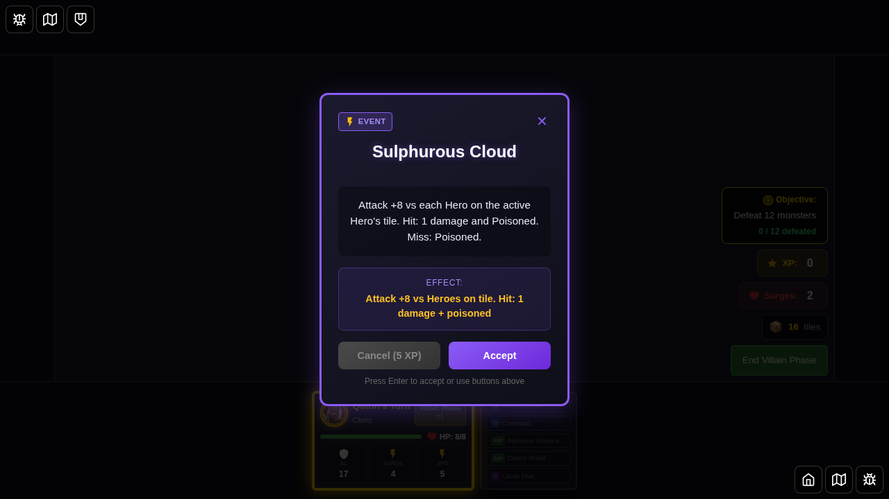
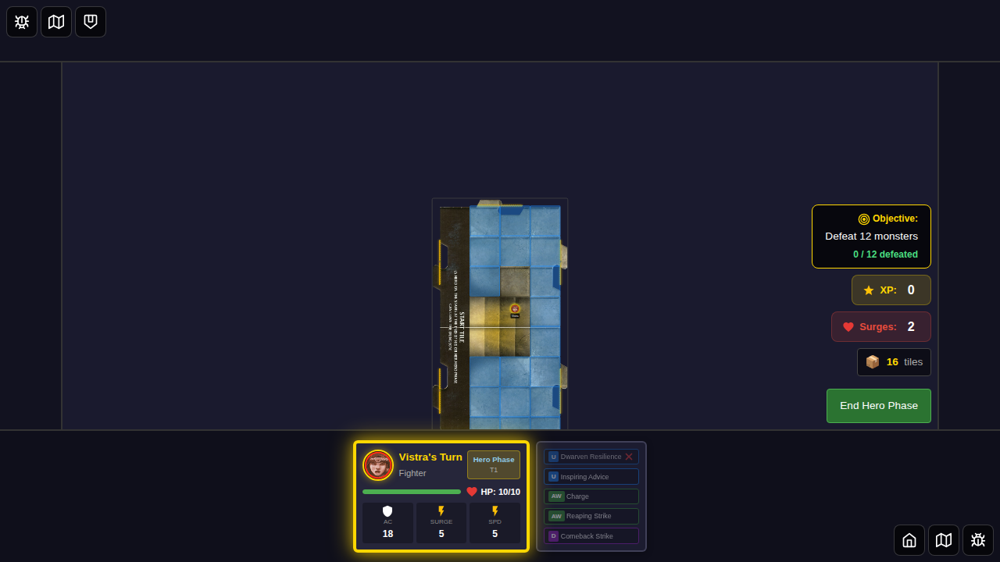

# E2E Test 057: Power Card Dashboard Activation

## User Story

As a player, I want to activate my power cards directly from the player dashboard so that I can use utility and custom ability cards during my turn without needing to navigate to separate panels.

## Feature Description

This test verifies the new power card activation feature that allows players to:
- See all their power cards displayed on the player dashboard
- Identify which cards are eligible for activation (highlighted in green with pulsing animation)
- Click/tap on eligible cards to activate them
- See visual feedback when cards are used (grayed out with X icon)
- Understand when cards cannot be activated (grayed out during other phases)

## Test Scenarios

### Test 1: Activate Utility Power Cards with Visual States

This test demonstrates the complete power card activation flow with Quinn (Cleric):

1. **Hero Selection** - Select Quinn who has activatable utility cards
2. **Game Start** - Enter hero phase with all cards available
3. **Eligible Cards** - See "Healing Hymn" and "Command" highlighted in green
4. **Card Activation** - Click "Healing Hymn" to use it
5. **Visual Feedback** - Card becomes grayed with X icon after use
6. **Phase Changes** - Cards become ineligible during other phases

### Test 2: Different Heroes Show Different Cards

This test verifies that different hero classes have different eligible cards:
- Uses Vistra (Fighter/Dwarf) with "Dwarven Resilience" custom ability
- Shows card can be activated and marked as used

## Screenshot Gallery

### Test 1: Utility Power Card Activation

#### Screenshot 000: Hero Selected

**What to verify:**
- Quinn is selected on character screen
- Start game button is enabled
- Power card selection is complete

#### Screenshot 001: Game Started - Hero Phase

**What to verify:**
- Game board is visible with Quinn's turn active
- Player dashboard shows Quinn's power cards
- All power cards are in unflipped state
- It's hero phase (shown in turn indicator)

#### Screenshot 002: Eligible Cards Highlighted

**What to verify:**
- "Healing Hymn" (U) card is highlighted in green with pulsing border
- "Command" (U) card is also highlighted in green
- Attack cards (AW) are grayed out (handled by separate attack panel)
- Daily card (D) is grayed out (not activatable from dashboard)
- Visual distinction between eligible and ineligible cards is clear

#### Screenshot 003: Healing Hymn Used

**What to verify:**
- "Healing Hymn" card now shows with reduced opacity (grayed out)
- Red X icon appears on the used card
- "Command" card remains highlighted (still eligible)
- Card state persists correctly

#### Screenshot 004: Exploration Phase - Cards Ineligible

**What to verify:**
- Phase indicator shows "Exploration Phase"
- Used card ("Healing Hymn") remains grayed with X icon
- Unused cards ("Command") are now grayed out (not eligible during exploration phase)
- No cards are highlighted in green

#### Screenshot 005: Villain Phase - Cards Remain Ineligible

**What to verify:**
- Phase indicator shows "Villain Phase"
- All cards remain in their previous state
- No cards are eligible for activation
- Card states persist across phase transitions

### Test 2: Different Hero Power Cards

#### Screenshot 000: Vistra Power Cards

**What to verify:**
- Vistra (Fighter) is the active hero
- "Dwarven Resilience" (U) custom ability card is highlighted in green
- Different power cards than Quinn (different hero class)

#### Screenshot 001: Dwarven Resilience Used

**What to verify:**
- "Dwarven Resilience" card is now grayed out with X icon
- Card activation works for different hero classes
- Visual feedback is consistent across heroes

## Manual Verification Checklist

When reviewing these screenshots, verify:

### Visual Design
- [ ] Green highlighted cards have visible pulsing border animation (check animation in browser)
- [ ] Grayed out cards have 50% opacity for ineligible, 40% for disabled
- [ ] Red X icon is clearly visible on used cards
- [ ] Card text remains readable in all states
- [ ] Hover effects are visible on eligible cards (check in browser)

### Functionality
- [ ] Only utility and custom ability cards are eligible during hero phase
- [ ] Attack cards are always grayed (handled by attack panel)
- [ ] Cards become ineligible during exploration and villain phases
- [ ] Used cards remain marked with X icon across phases
- [ ] Different heroes show different eligible cards

### Accessibility
- [ ] Cards are proper `<button>` elements (check in browser inspector)
- [ ] Disabled state prevents clicking on ineligible cards
- [ ] Tooltips provide clear information about eligibility
- [ ] Focus outline is visible when navigating with keyboard (check Tab navigation)
- [ ] ARIA labels are present for screen readers (check in browser inspector)

### Cross-Platform
- [ ] Screenshots are consistent and pixel-perfect
- [ ] Layout works at different viewport sizes
- [ ] Touch events work on mobile/tablet (manual test)

## Key Features Demonstrated

1. **Visual States**
   - Eligible: Green border, pulsing animation, enabled button
   - Ineligible: Gray, 50% opacity, disabled button
   - Disabled/Used: Gray, 40% opacity, X icon, disabled button

2. **Eligibility Logic**
   - Cards are only eligible during hero phase
   - Only utility and custom ability cards are dashboard-activatable
   - Attack cards remain in attack panel
   - Reactive cards (event-triggered) are not dashboard-activatable

3. **State Persistence**
   - Used cards remain marked across phase changes
   - Unused cards become eligible again when it's player's turn
   - Card states are properly tracked in Redux store

4. **Multi-Hero Support**
   - Different heroes have different power card sets
   - Each hero's custom ability is properly displayed and activatable
   - Eligibility logic works consistently across hero classes

## Implementation Details

**Files Modified:**
- `src/store/powerCardEligibility.ts` - Eligibility checking logic
- `src/components/PlayerPowerCards.svelte` - Interactive button UI with visual states
- `src/components/GameBoard.svelte` - Activation handler integration

**Currently Activatable Cards:**
- Healing Hymn (Cleric - ID 1)
- Dwarven Resilience (Dwarf - ID 11)
- Lay On Hands (Paladin - ID 21)
- Command (Cleric - ID 9)
- Distant Diversion (Rogue - ID 38)
- Invisibility (Wizard - ID 48)
- Mirror Image (Wizard - ID 49)
- Wizard Eye (Wizard - ID 50)

## Notes

- This test focuses on the UI and interaction layer
- Actual power card effects (healing, moving monsters, etc.) are not yet implemented
- Cards are marked as "used" but don't perform their game effects yet
- Future work will integrate this UI with the power card effects system
