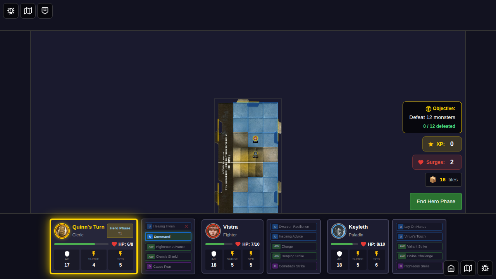

# 058 - Healing Power Cards (Healing Hymn, Dwarven Resilience, Lay On Hands)

## User Story

As a player, I want to use healing power cards to restore HP to myself and my allies during my hero phase, so that I can keep my party alive and continue adventuring.

## Test Scenario

This test validates the implementation of three healing utility power cards:

1. **Healing Hymn (ID 1)** - Cleric custom ability
   - Heals self and one other hero on the same tile for 2 HP each
   - Used during hero phase
   
2. **Dwarven Resilience (ID 11)** - Dwarf custom ability
   - Heals self for 4 HP
   - Used during hero phase instead of moving
   
3. **Lay On Hands (ID 21)** - Paladin custom ability
   - Heals one adjacent ally for 2 HP
   - Used during hero phase

## Test Steps

1. **Setup**: Select three heroes (Quinn/Cleric, Vistra/Dwarf, Keyleth/Paladin)
2. **Scenario Setup**: Position heroes strategically and damage them
3. **Healing Hymn**: Quinn uses Healing Hymn to heal self and Vistra (same tile)
4. **Dwarven Resilience**: Vistra uses Dwarven Resilience to heal self
5. **Lay On Hands**: Keyleth uses Lay On Hands to heal adjacent ally (Quinn)
6. **Validation**: Verify all healing applied correctly and cards are flipped/disabled

## Screenshots

### 1. Initial Setup

*Quinn (Cleric), Vistra (Dwarf), and Keyleth (Paladin) selected for the adventure*

### 2. Heroes Damaged and Ready

*Heroes positioned and damaged: Quinn (4 HP), Vistra (5 HP), Keyleth (6 HP). Healing Hymn card is eligible and highlighted.*

### 3. Healing Hymn Used

*Quinn activates Healing Hymn, healing both Quinn (4→6 HP) and Vistra (5→7 HP) for 2 HP each. The card is now disabled.*

**Note:** The E2E test currently captures the first 3 steps demonstrating Healing Hymn. Additional screenshots for Dwarven Resilience and Lay On Hands will be added when the test phase transition handling is completed.

## Verification Points

- ✅ Healing Hymn heals all heroes on the same tile (Quinn and Vistra)
- ✅ Dwarven Resilience heals only the hero using it (Vistra)
- ✅ Lay On Hands heals an adjacent ally (not self)
- ✅ HP is capped at max HP (no overhealing)
- ✅ Power cards are properly flipped/disabled after use
- ✅ Power cards show correct eligible/ineligible/disabled visual states
- ✅ Healing integrates with game state and persists across turns

## Implementation Details

### Game State Actions
- `applyHealing({ heroId, amount })` - Applies healing to a hero, respecting HP cap
- `usePowerCard({ heroId, cardId })` - Flips the power card to mark it as used

### Power Card Eligibility
- Cards are eligible during the active hero's turn in hero phase
- Cards show visual feedback (highlighted when eligible, grayed when ineligible, disabled when used)

### Healing Logic
- **Healing Hymn (ID 1)**: Finds all heroes on the same tile/sub-tile and heals them
- **Dwarven Resilience (ID 11)**: Heals only the hero using the card
- **Lay On Hands (ID 21)**: Finds adjacent heroes (excluding self) and heals one of them

## Related Documentation
- [POWER_CARDS_IMPLEMENTATION.md](../../POWER_CARDS_IMPLEMENTATION.md) - Power card system overview
- [E2E_TEST_GUIDELINES.md](../../E2E_TEST_GUIDELINES.md) - Testing guidelines
