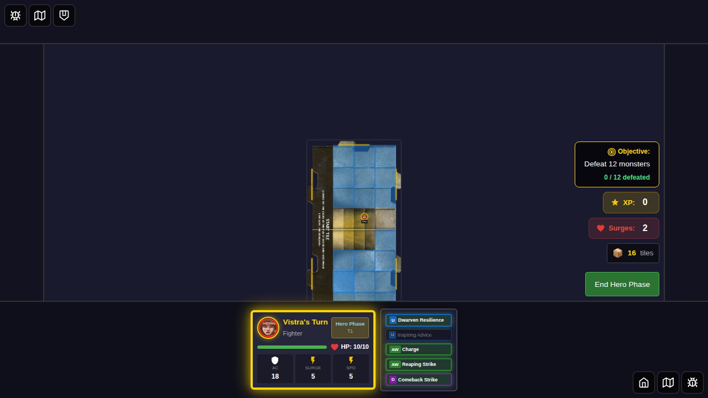
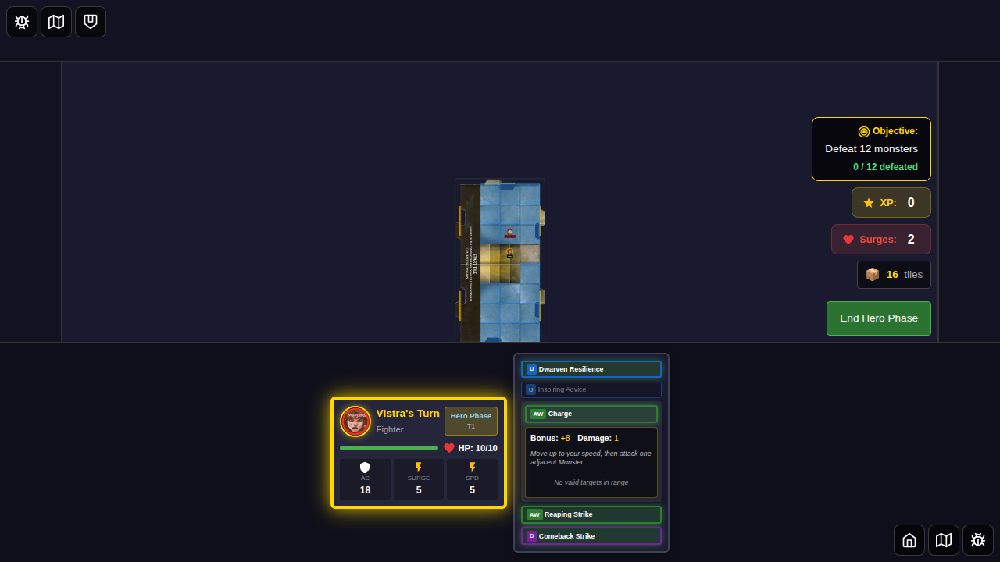

# E2E Test 059: Attack Power Dashboard Expanded

This test demonstrates the new attack power expansion feature in the Player Dashboard, where attack cards expand to show details and monster selection interface.

## Test Coverage

### User Story

As a player during my hero's turn, I want to click attack power cards in the Player Dashboard to expand them and see attack details, so I can select targets and execute attacks directly from the dashboard.

### Attack Flow

1. Select Vistra (Fighter) and start the game
2. Position hero with adjacent monster
3. Verify attack cards show as eligible (green with pulse)
4. Click on attack card (Charge) in Player Dashboard
5. Card expands to show attack bonus, damage, and rules
6. Monster selection interface appears (when implemented for active hero)
7. Click monster target to execute attack
8. Card collapses after attack

### New Visual Features Tested

- **Expanded Card State**: Attack cards expand from 1 row to 2+ rows
- **Attack Stats Display**: Shows bonus and damage in expanded view
- **Card Rules**: Displays card effect description
- **Golden Border**: Expanded card has golden (#ffd700) border highlight
- **Touch-Friendly**: Large clickable areas for mobile/touch devices

## Screenshots

---

### Step 1: Hero Selected

Vistra (Fighter) is selected with power cards. The "Start Game" button is enabled.

---

### Step 2: Game Started  

Game board is visible with Vistra positioned at (2, 3). Player power cards are visible in the Player Dashboard (bottom left).

---

### Step 3: Monster Adjacent, Attacks Enabled

A Kobold monster is positioned adjacent to Vistra at (2, 2). Attack power cards in the Player Dashboard now show as **eligible** with green borders and pulse animation, indicating they can be used.

---

### Step 4: Attack Card Expanded

After clicking the "Charge" attack card, it expands to show:
- **2-row layout** (expanded from 1 row mini card)
- **Attack bonus**: +8
- **Damage**: 1 dmg
- **Card rule**: "Move up to 2 squares. You must end the move next to the Monster you attack."
- **Golden border** (#ffd700) highlighting the expanded state

The expanded view provides all the information needed to make an informed attack decision.

---

### Step 5: Expanded Card Close-up

Full view showing the expanded card in context with other power cards. The expanded card is visually distinguished with:
- Larger height (2+ rows vs 1 row)
- Dark background (#282c3c) for the expansion area
- Golden border around the card
- Clear visual hierarchy of information

---

### Step 6: Card Collapsed

After collapsing the card (by clicking it again), the card returns to its mini 1-row state. The card remains eligible (green) for use.

---

## Implementation Notes

### Components Modified

- **PlayerPowerCards.svelte**: Added expanded card state and layout
- **GameBoard.svelte**: Passes targetableMonsters and onAttackWithCard to PlayerPowerCards

### Features Demonstrated

1. **Expandable Cards**: Click to expand/collapse
2. **Visual States**: Eligible, expanded, collapsed
3. **Attack Information**: Bonus, damage, rules clearly displayed
4. **Responsive Layout**: Works on all screen edges (top, bottom, left, right)
5. **Touch-Optimized**: Large touch targets, clear visual feedback

### Monster Selection

The monster selection interface (with "Attack [Monster]" buttons) appears in the expanded view when:
- The hero is the active hero
- There are targetable monsters passed to the component
- The card supports attacking

This test captures the expanded card visual state. Full attack execution flow with monster selection is tested in other E2E tests (044, 020, etc.).

## Related Tests

- **Test 020**: Power card usage (basic attack flow)
- **Test 044**: Multi-target attacks (PowerCardAttackPanel)
- **Test 057**: Power card dashboard activation (utility cards)

## Manual Verification

- [x] Attack cards expand to 2+ rows when clicked
- [x] Expanded cards show attack bonus and damage
- [x] Card rules are displayed in expanded view
- [x] Golden border highlights expanded state
- [x] Cards collapse when clicked again
- [x] Eligible state (green pulse) is visible
- [x] Layout works in Player Dashboard

---

## Related Files

- Test implementation: `059-attack-power-dashboard-expanded.spec.ts`
- Component: `src/components/PlayerPowerCards.svelte`
- Integration: `src/components/GameBoard.svelte`
- Eligibility logic: `src/store/powerCardEligibility.ts`
