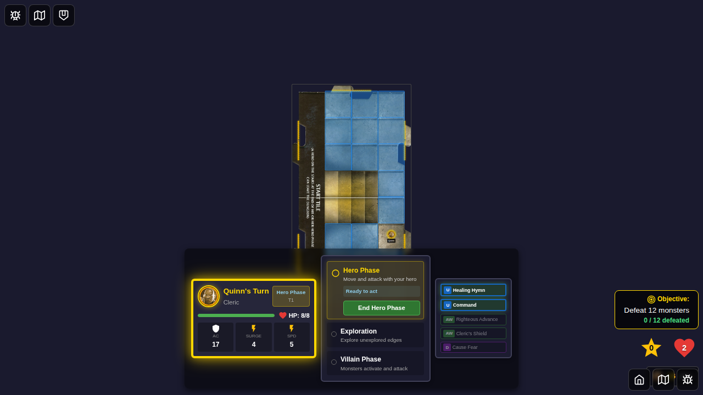
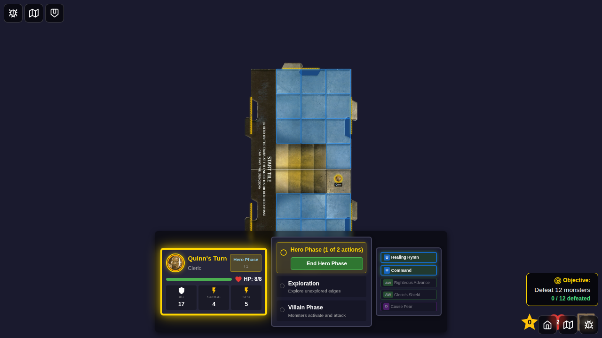
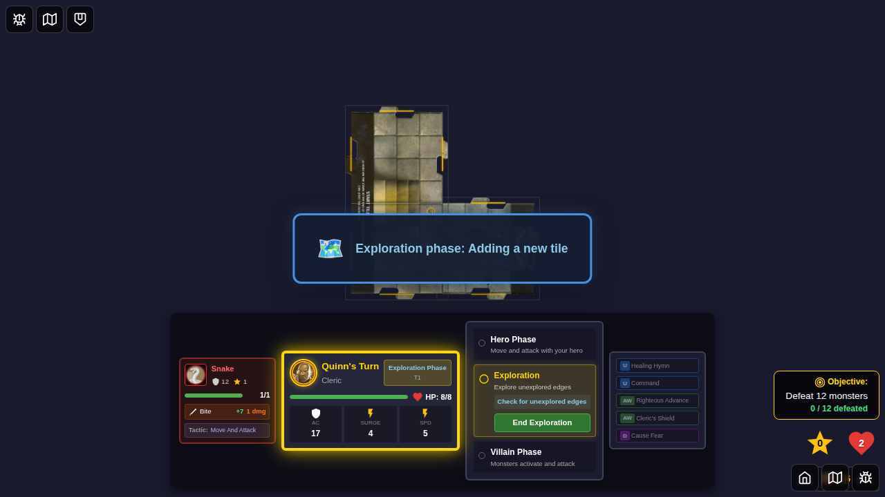
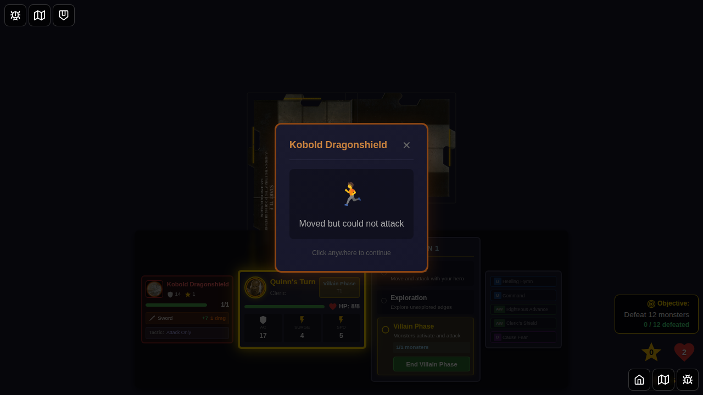

# 061 - Turn Progress Indicator

## User Story

As a player, I want to see a visual indicator that shows me which phase of the turn I'm currently in (Hero Phase, Exploration, or Villain Phase) and what happens in each phase, so that I can understand the game flow and anticipate what's coming next.

## Test Coverage

This E2E test verifies that the Turn Progress Card component:
- Displays next to the active player's dashboard
- Shows all three game phases (Hero Phase, Exploration, Villain Phase)
- Highlights the currently active phase
- Updates phase-specific details as the turn progresses
- Displays the current turn number

## Screenshots

### 000 - Hero Phase with Turn Progress Card

**What to verify:**
- Turn Progress Card is visible next to Quinn's player dashboard
- "TURN 1" label is displayed at the top
- Hero Phase is highlighted with a golden/yellow indicator
- Phase detail shows "Ready to act"
- Exploration and Villain Phase are shown but not highlighted

### 001 - Hero Phase After Move

**What to verify:**
- Hero Phase remains highlighted
- Phase detail now shows "Moved" instead of "Ready to act"
- Turn Progress Card updates dynamically as actions are taken

### 002 - Exploration Phase Active

**What to verify:**
- Exploration phase is now highlighted with active indicator
- Phase detail shows "Check for unexplored edges"
- Hero Phase is no longer highlighted
- Player dashboard shows "Exploration Phase" badge

### 003 - Villain Phase Active

**What to verify:**
- Villain Phase is now highlighted with active indicator
- If monsters are present, phase detail shows monster count (e.g., "1/1 monsters")
- Exploration phase is no longer highlighted
- Player dashboard shows "Villain Phase" badge
- All three phases are visible in the Turn Progress Card

## Manual Verification Checklist

- [ ] Turn Progress Card appears next to the active player's dashboard
- [ ] Card shows "TURN 1" (or current turn number) at the top
- [ ] All three phases are listed: Hero Phase, Exploration, Villain Phase
- [ ] Each phase has a brief description of what happens
- [ ] Active phase is visually highlighted (golden border, active indicator)
- [ ] Active phase indicator animates (pulsing effect)
- [ ] Phase details update dynamically (e.g., "Ready to act" → "Moved")
- [ ] Inactive phases have a subtle, non-highlighted appearance
- [ ] Card styling matches the game's UI design (dark background, consistent colors)
- [ ] Card is positioned correctly and doesn't overlap other UI elements
- [ ] Card updates correctly as the game progresses through phases
