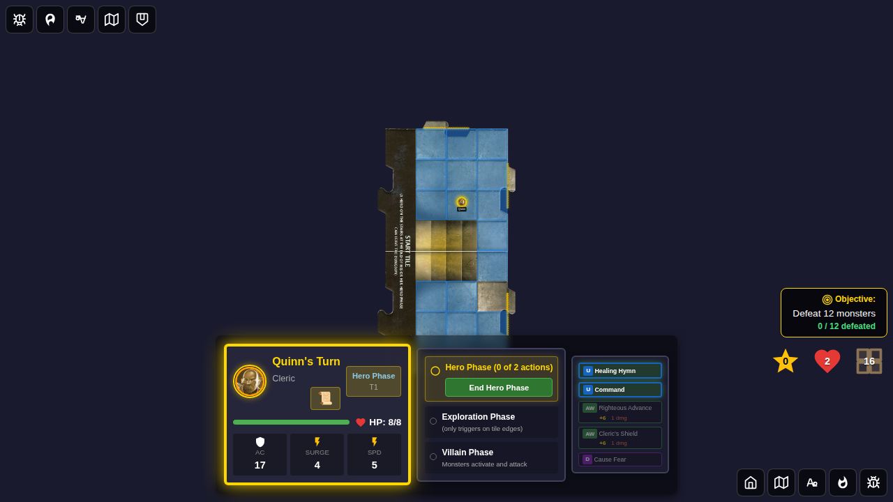
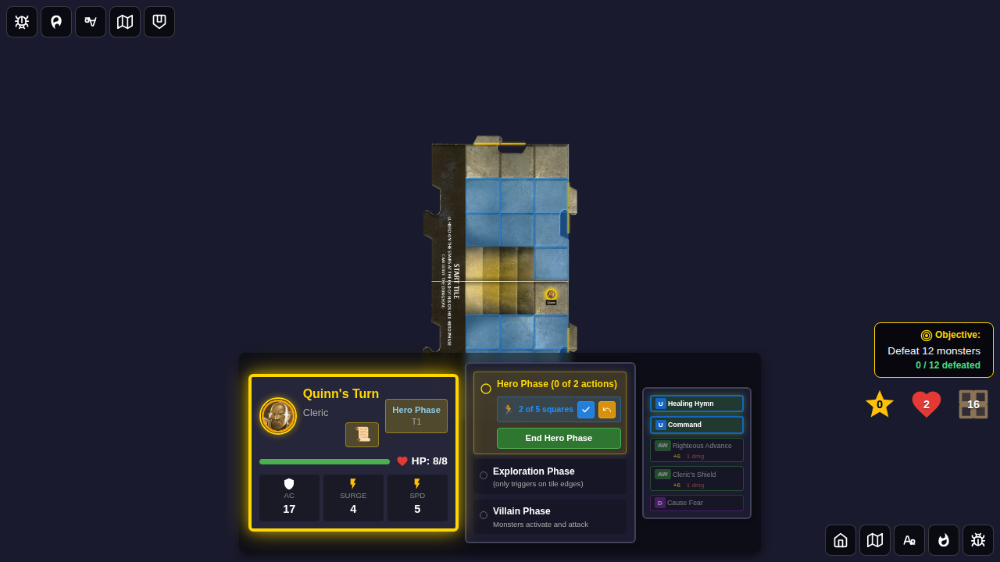
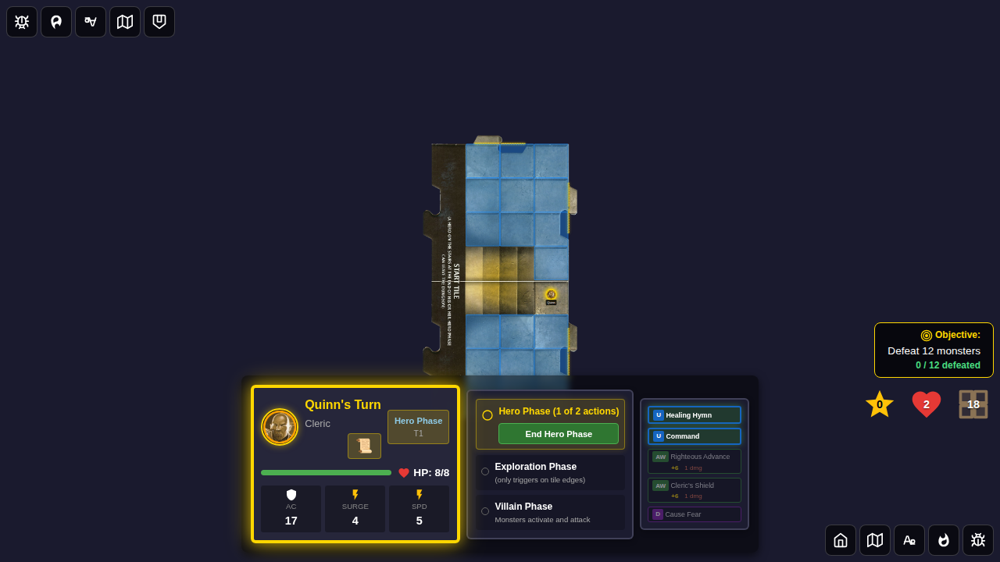
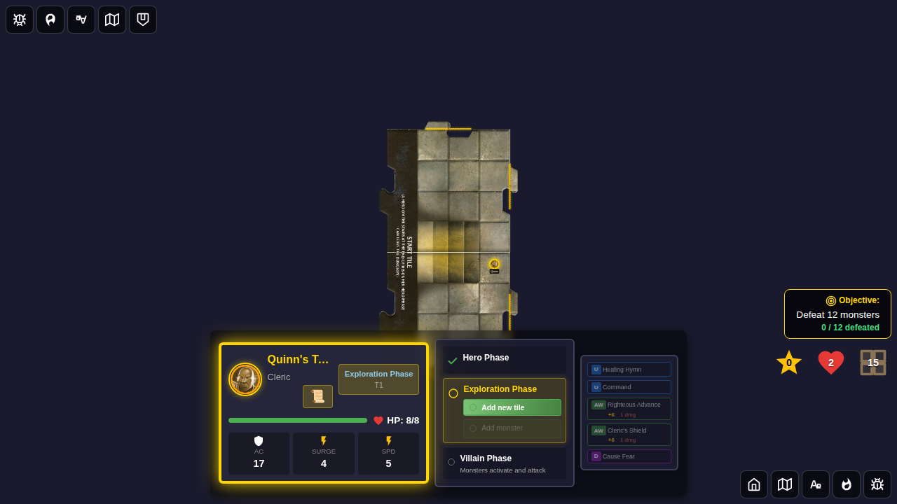

# 061 - Turn Progress Indicator

## User Story

As a player, I want to see a visual indicator that shows me which phase of the turn I'm currently in (Hero Phase, Exploration, or Villain Phase) and what happens in each phase, so that I can understand the game flow and anticipate what's coming next.

## Test Coverage

This E2E test verifies that the Turn Progress Card component:
- Displays next to the active player's dashboard
- Shows all three game phases (Hero Phase, Exploration, Villain Phase)
- Highlights the currently active phase
- Shows "(only triggers on tile edges)" hint under Exploration Phase during hero phase
- Shows movement progress in "X of Y squares" format during incremental movement
- Hides the tile-edges hint when exploration phase becomes active

## Screenshots

### 000 - Hero Phase with Turn Progress Card

**What to verify:**
- Turn Progress Card is visible next to Quinn's player dashboard
- Hero Phase is highlighted with a golden/yellow indicator
- Exploration Phase shows "(only triggers on tile edges)" hint below its name
- Exploration and Villain Phase are shown but not highlighted

### 001 - Hero Phase Movement In Progress

**What to verify:**
- Movement info box is visible in the Hero Phase section
- Movement text shows "X of Y squares" format (e.g. "1 of 5 squares")
- Complete move button is visible

### 002 - Hero Phase After Move

**What to verify:**
- Hero Phase remains highlighted after completing a move
- Turn Progress Card updates dynamically as actions are taken

### 003 - Exploration Phase Active

**What to verify:**
- Exploration phase is now highlighted with active indicator
- The "(only triggers on tile edges)" hint is NOT shown during exploration phase
- Hero Phase is no longer highlighted
- Player dashboard shows "Exploration Phase" badge

## Manual Verification Checklist

- [ ] Turn Progress Card appears next to the active player's dashboard
- [ ] All three phases are listed: Hero Phase, Exploration, Villain Phase
- [ ] During hero phase, Exploration Phase shows "(only triggers on tile edges)" hint
- [ ] During exploration phase, the tile-edges hint disappears
- [ ] Movement progress shows "X of Y squares" (squares moved, not remaining)
- [ ] Active phase is visually highlighted (golden border, active indicator)
- [ ] Active phase indicator animates (pulsing effect)
- [ ] Inactive phases have a subtle, non-highlighted appearance
- [ ] Card styling matches the game's UI design (dark background, consistent colors)
- [ ] Card is positioned correctly and doesn't overlap other UI elements
