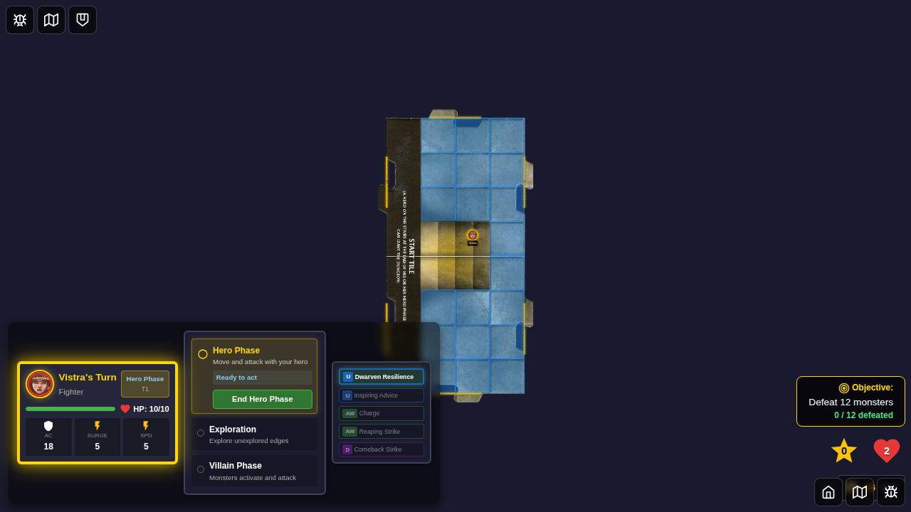
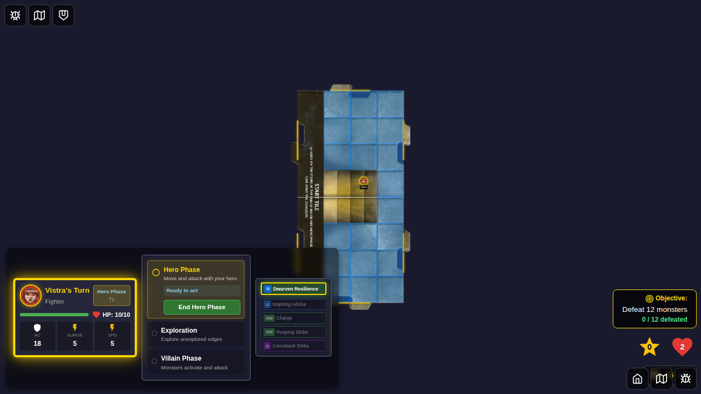
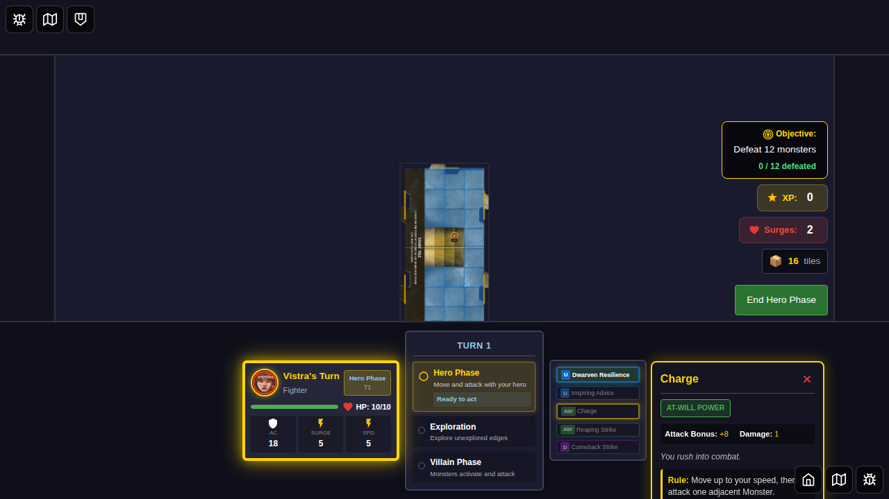
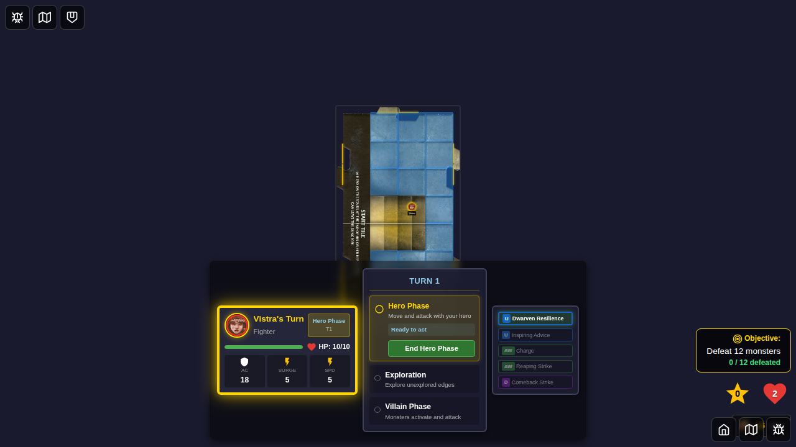
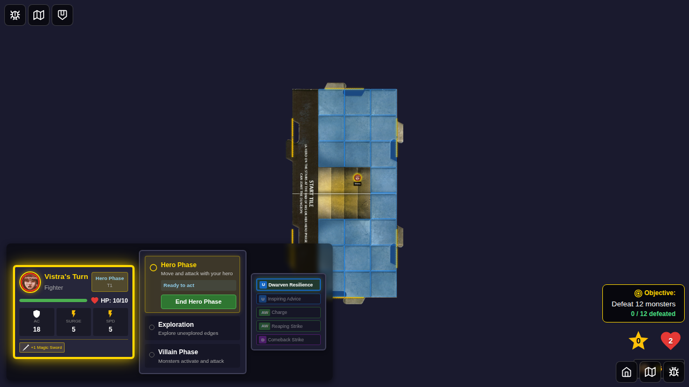
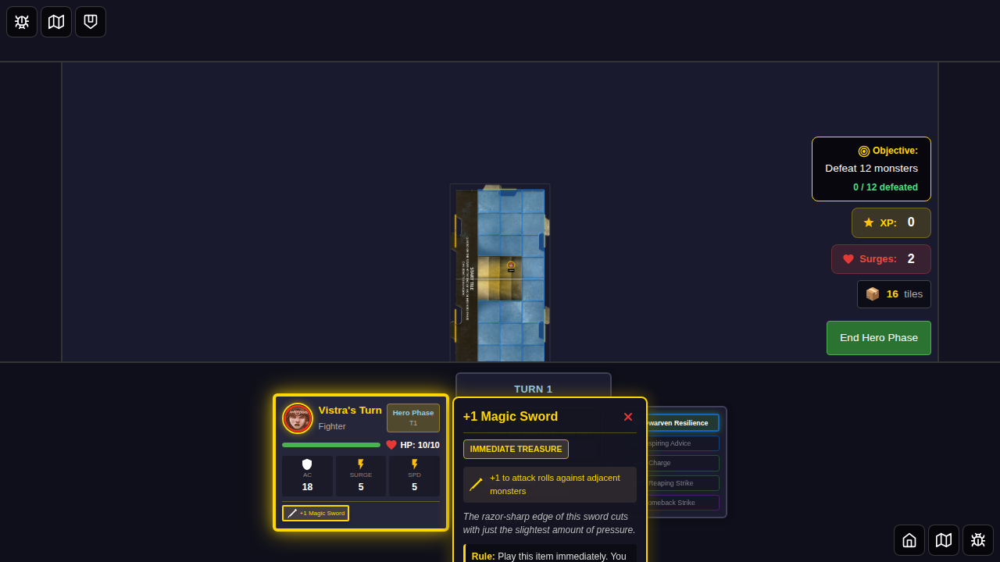
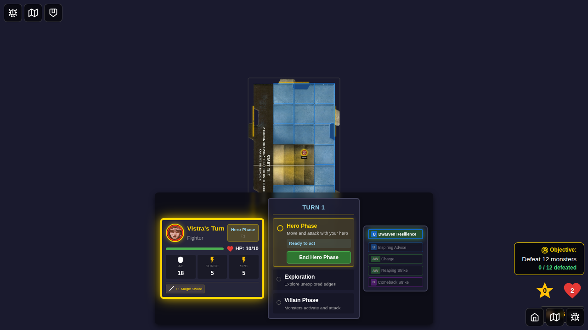

# 062 - Card Detail View

## User Story

As a player, I want to tap on cards in my dashboard to see an enlarged view with detailed information, so that I can better understand each card's capabilities and why certain cards may not be currently usable.

## Test Flow

### Step 1: Hero Selected

The player selects Vistra as their hero from the character selection screen.

### Step 2: Game Started

The game starts and shows Vistra's dashboard with power cards visible on the left.

### Step 3: Power Card Detail Shown

The player taps on "Dwarven Resilience" power card. An enlarged detail view appears to the right showing:
- Card name and type (utility Power)
- Full description: "Your dwarven heritage grants you uncommonly strong health."
- Complete rule text
- Clickability status: "✓ Available to use"

### Step 4: Different Card Detail Shown

The player taps on "Charge" attack card. The detail view replaces the previous content showing:
- Card name: "Charge"
- Card type: at-will Power
- Attack statistics (Bonus: +8, Damage: 1)
- Description and rule text
- Ineligibility reason: "✗ No valid targets in range"

This demonstrates contextual feedback - the player understands why this attack card cannot currently be used.

### Step 5: Detail View Dismissed

The player taps the same "Charge" card again. The detail view is dismissed, returning to the normal dashboard view.

### Step 6: Treasure Item Added

A treasure item (+1 Magic Sword) is added to Vistra's inventory. It appears as a mini-card in the player dashboard.

### Step 7: Treasure Card Detail Shown

The player taps the treasure item. The detail view shows:
- Card name: "+1 Magic Sword"
- Card type: immediate Treasure
- Effect icon and description
- Full rule text
- Clickability status: "✗ Passive effect (always active)"

This informs the player that this is a passive item that doesn't require activation.

### Step 8: Detail Closed via Button

The player clicks the X button on the detail view to close it. The view is dismissed.

## Feature Verification

This test verifies that:
- ✅ Clicking a card shows an enlarged detail view to the right
- ✅ Detail view displays complete card information (name, type, description, rules)
- ✅ Detail view shows clickability status with contextual reasons
- ✅ Clicking a different card replaces the current detail view
- ✅ Clicking the same card again dismisses the detail view
- ✅ Detail view works for all card types (power cards, treasure items)
- ✅ Close button on detail view dismisses it
- ✅ Selected cards show visual feedback (golden border)

## Acceptance Criteria Met

- ✅ Enlarged card appears to the right of mini-card position
- ✅ Shows all card description and information
- ✅ Includes why card is or is not currently clickable
- ✅ Clicking another card replaces enlarged display
- ✅ Clicking mini-card second time dismisses enlarged card
- ✅ Works for status effects, treasure cards, and player action cards
