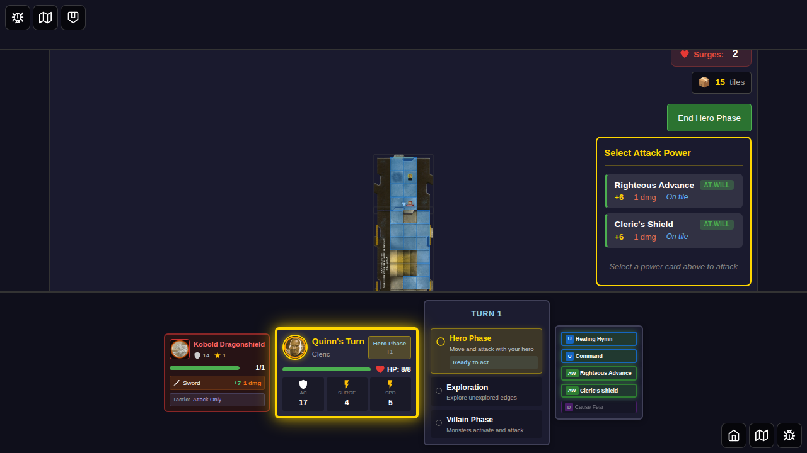

# E2E Test 063 - Target Selection on Map

## User Story

As a player, I want to tap on monsters (and other targets like traps and treasures) on the map to select them for actions, so that I can clearly indicate which target I want to interact with.

## Test Coverage

This test validates that:

1. **Initial State**: Monsters are displayed as targetable when the hero is adjacent and can attack
2. **Highlighting**: Targetable monsters show a visual highlight (golden glow animation)
3. **Selection**: Tapping on a targetable monster selects it (green highlight ring)
4. **State Management**: Selection state is properly stored in Redux
5. **Deselection**: Tapping the selected monster again deselects it
6. **Attack Integration**: The attack panel works correctly with selected targets
7. **Cleanup**: Target is automatically deselected after attack completes

## Test Steps

1. Start game with Quinn
2. Position Quinn to trigger exploration and spawn a monster
3. Move Quinn adjacent to the monster
4. **Screenshot 001**: Verify monster shows as targetable (golden glow)
5. Click monster to select it (green ring appears)
6. **Screenshot 002**: Verify selection state (green highlight ring)
7. Verify selection in Redux store
8. Click monster again to deselect
9. Verify deselection in Redux store

## Screenshots

### 001 - Targetable Monster Highlighted

**What to look for:**
- Kobold monster token is visible on the map
- Monster has a **golden glow** indicating it's targetable
- Hero (Quinn) is positioned adjacent to the monster
- Attack panel shows available power cards

**Programmatic Verification:**
- `data-targetable="true"` on monster token
- `data-selected="false"` (not yet selected)
- Redux state: `selectedTargetId` is null
- Hero is at position `{x: 2, y: -3}`
- Monster exists in game state

### 002 - Monster Selected (Green Ring)

**What to look for:**
- Monster now has a **green highlight ring** instead of golden glow
- Visual feedback clearly shows the selection state change
- Monster appears slightly larger (1.15x scale)
- Attack panel remains visible

**Programmatic Verification:**
- `data-selected="true"` on monster token
- Redux state: `selectedTargetId` is 'kobold-test'
- Redux state: `selectedTargetType` is 'monster'
- Selection persists until deselected or attack completes

## Implementation Notes

- Uses `data-targetable` attribute to verify highlighting state
- Uses `data-selected` attribute to verify selection state  
- Validates Redux store state for `selectedTargetId` and `selectedTargetType`
- Tests both selection and deselection workflows
- Verifies cleanup after attack completion
- Animations disabled for stable screenshots
- Uses JavaScript click to ensure reliable interaction

## Visual Features Validated

1. **Targetable State** (Screenshot 001):
   - Golden pulsing glow: `box-shadow: 0 0 10-16px rgba(255, 215, 0, 0.6-0.9)`
   - 2-second pulse animation (disabled in test for stability)

2. **Selected State** (Screenshot 002):
   - Green highlight ring: `box-shadow: 0 0 16px 4px rgba(0, 255, 0, 0.9)`
   - 1.15x scale transform
   - Animation stops (persistent highlight)
