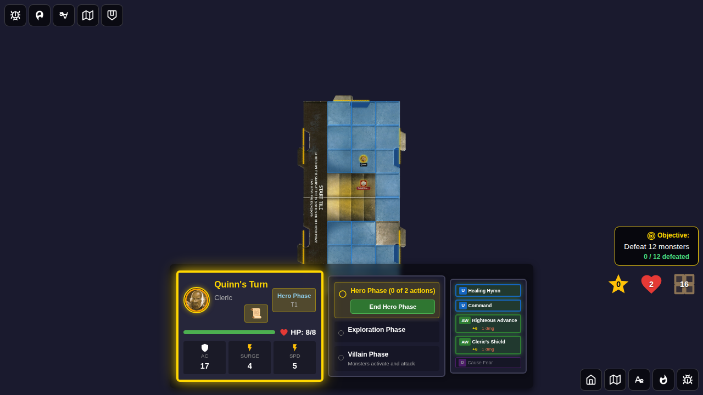
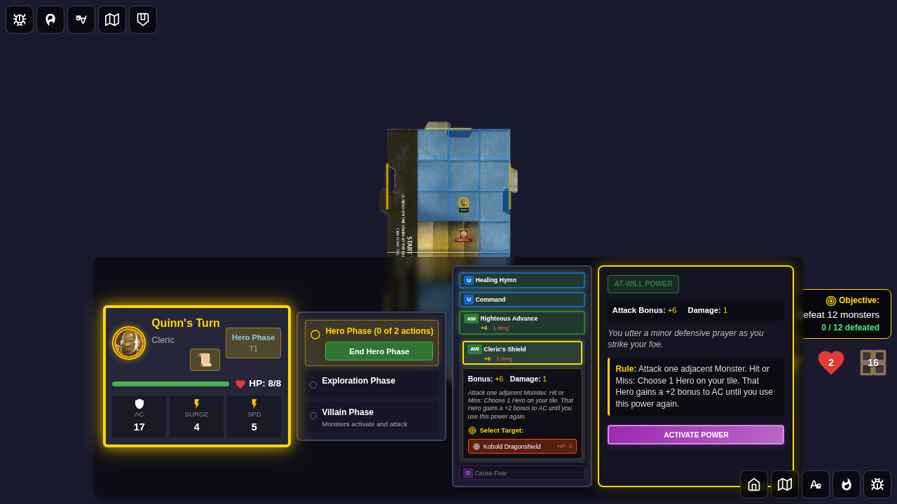
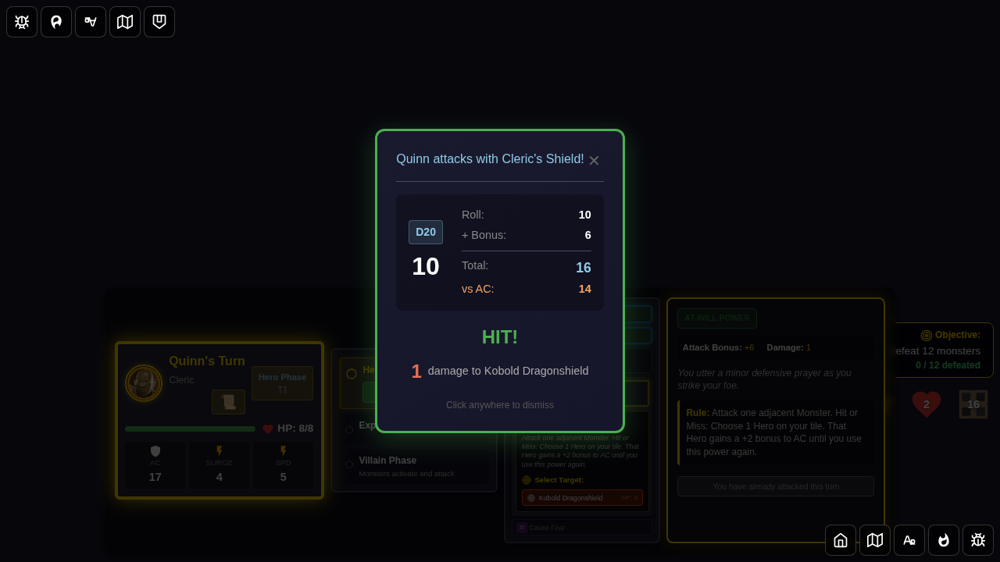

# E2E Test 063 - Target Selection on Map

## User Story

As a player, I want to tap on monsters (and other targets like traps and treasures) on the map to select them for actions, so that I can clearly indicate which target I want to interact with. When I have an attack card expanded in the power panel, tapping the monster on the map should trigger the attack directly.

## Test Coverage

This test validates that:

1. **Initial State**: Monsters are displayed as targetable when the hero is adjacent and can attack
2. **Highlighting**: Targetable monsters show a visual highlight (golden glow animation)
3. **Selection**: Tapping on a targetable monster selects it (green highlight ring)
4. **State Management**: Selection state is properly stored in Redux
5. **Deselection**: Tapping the selected monster again deselects it
6. **Map Click Attack**: Tapping the monster on the MAP while an attack card is expanded triggers the attack directly

## Test Steps

1. Start game with Quinn
2. Position Quinn adjacent to the monster
3. **Screenshot 001**: Verify monster shows as targetable (golden glow)
4. Click monster to select it (green ring appears)
5. **Screenshot 002**: Verify selection state (green highlight ring)
6. Verify selection in Redux store
7. Click monster again to deselect
8. Verify deselection in Redux store
9. Expand an at-will attack card (Cleric's Shield) in the side panel
10. **Screenshot 003**: Verify expanded attack card with "Select Target" shown
11. Click the monster token ON THE MAP (not the side panel button)
12. **Screenshot 004**: Verify the attack was triggered by the map click

## Screenshots

### 001 - Targetable Monster Highlighted

**What to look for:**
- Kobold monster token is visible on the map
- Monster has a **golden glow** indicating it's targetable
- Hero (Quinn) is positioned adjacent to the monster
- Attack panel shows available power cards

**Programmatic Verification:**
- `data-targetable="true"` on monster token
- `data-selected="false"` (not yet selected)
- Redux state: `selectedTargetId` is null

### 002 - Monster Selected (Green Ring)

**What to look for:**
- Monster now has a **green highlight ring** instead of golden glow
- Visual feedback clearly shows the selection state change

**Programmatic Verification:**
- `data-selected="true"` on monster token
- Redux state: `selectedTargetId` is 'kobold-test'
- Redux state: `selectedTargetType` is 'monster'

### 003 - Attack Card Expanded with Select Target

**What to look for:**
- Attack card (Cleric's Shield) is expanded in the side panel
- "Select Target: Kobold" button is visible in the side panel
- Monster on the map is still targetable (golden glow)

**Programmatic Verification:**
- `attack-card-expanded-2` element is visible
- `attack-target-kobold-test` target button is visible in the panel
- Redux state: `attackResult` is null (no attack yet)

### 004 - Attack Triggered by Map Click

**What to look for:**
- Attack result popup is displayed
- The attack was triggered by clicking the monster TOKEN on the map (not the side panel button)

**Programmatic Verification:**
- Redux state: `attackResult` is not null
- Redux state: `attackTargetId` is 'kobold-test'

## Implementation Notes

- Uses `data-targetable` attribute to verify highlighting state
- Uses `data-selected` attribute to verify selection state
- Validates Redux store state for `selectedTargetId` and `selectedTargetType`
- Tests both selection/deselection and the map-click-to-attack flow
- Monster must use `tileId: 'start-tile'` to be found by global coordinate system
- Animations disabled for stable screenshots
- Uses JavaScript click to ensure reliable interaction
