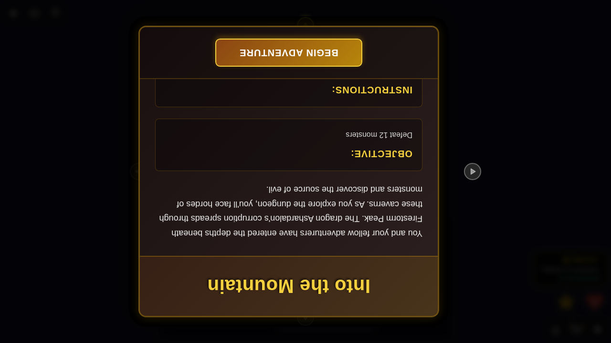
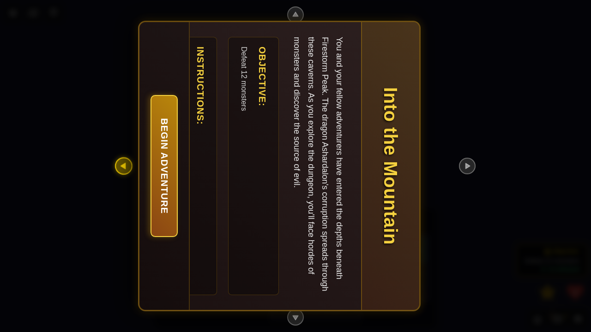
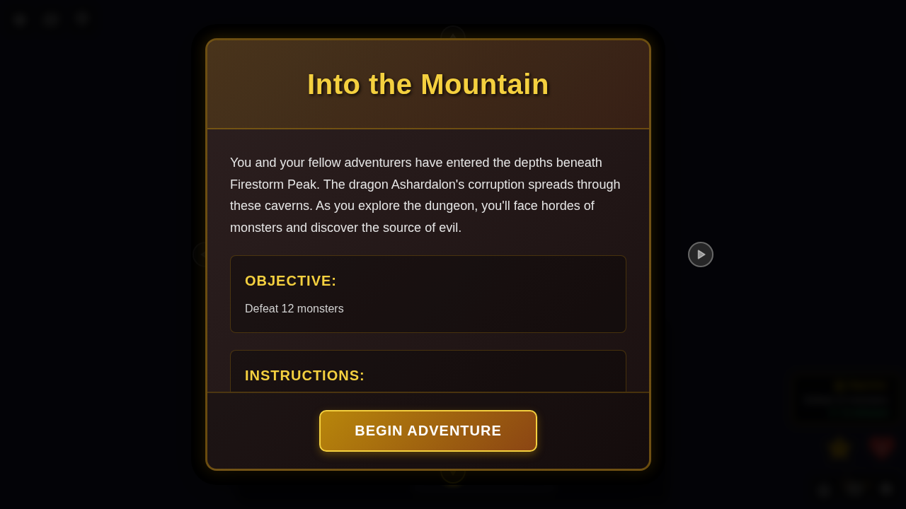

# E2E Test 064 - Scenario Introduction Modal with Rotation Controls

## User Story

**As a player**, when I start a new game and the map loads for the first time, **I want to see an introduction modal** that explains the scenario, objectives, and instructions, **and be able to rotate it to face me**, **so that** I understand what I need to do before beginning my adventure, regardless of which side of the table I'm sitting at.

## Test Description

This test verifies that:
1. The scenario introduction modal appears when the game board is first shown
2. The modal displays the scenario title, description, objective, and instructions
3. **The modal has rotation controls on all four sides (top, right, bottom, left)**
4. **Players can click rotation arrows to rotate the dialog to face them**
5. **The active rotation arrow is highlighted to show current orientation**
6. **Rotation is animated smoothly**
7. The modal can be dismissed by clicking the "Begin Adventure" button
8. The modal can also be dismissed using keyboard shortcuts (Enter, Space, or Escape)
9. Once dismissed, the modal does not appear again during the same game session
10. The game state correctly tracks whether the introduction has been shown

## Screenshot Gallery

### Test 1: Scenario Introduction Modal Display, Rotation, and Dismissal

#### Screenshot 000: Scenario Introduction Shown (Default Bottom Orientation)

**What to verify:**
- ✅ Scenario introduction modal is visible with dark overlay
- ✅ Modal displays "Into the Mountain" as the scenario title
- ✅ Modal shows the scenario description mentioning Ashardalon and Firestorm Peak
- ✅ Objective section displays "Defeat 12 monsters"
- ✅ Instructions section provides guidance on exploring and defeating monsters
- ✅ **Rotation controls are visible on all four sides (top, right, bottom, left)**
- ✅ **Bottom rotation arrow is highlighted/active (default orientation)**
- ✅ "Begin Adventure" button is visible and prominent
- ✅ Game board is visible but dimmed behind the modal
- ✅ Redux store shows `introductionShown: false`

#### Screenshot 001: Scenario Rotated to Top (180° Rotation)

**What to verify:**
- ✅ **Modal is rotated 180 degrees (upside down)**
- ✅ **Top rotation arrow is now highlighted/active**
- ✅ **Bottom rotation arrow is no longer highlighted**
- ✅ All modal content is rotated to face the top of the screen
- ✅ Rotation animation completed smoothly

#### Screenshot 002: Scenario Rotated to Left (90° Rotation)

**What to verify:**
- ✅ **Modal is rotated 90 degrees counter-clockwise**
- ✅ **Left rotation arrow is now highlighted/active**
- ✅ **Top rotation arrow is no longer highlighted**
- ✅ All modal content is rotated to face the left side of the screen
- ✅ Rotation animation completed smoothly

#### Screenshot 003: Scenario Rotated Back to Bottom (0° Rotation)

**What to verify:**
- ✅ **Modal is back to default orientation (0 degrees)**
- ✅ **Bottom rotation arrow is highlighted/active again**
- ✅ **Left rotation arrow is no longer highlighted**
- ✅ All modal content is in standard orientation
- ✅ Rotation animation completed smoothly

**Note:** After clicking "Begin Adventure", the modal dismisses correctly. Programmatic verification confirms the modal is hidden, the game board is visible, and the Redux state is updated to `introductionShown: true`. No screenshot is taken after dismissal due to non-deterministic randomness in background game elements (tile deck shuffle, hero positions).

### Test 2: Keyboard Dismissal

#### Screenshot 000: Keyboard Dismiss Ready

**What to verify:**
- ✅ Scenario introduction modal is visible (with rotation controls)
- ✅ Modal is focused and ready to accept keyboard input
- ✅ Different hero (Vistra) is selected for this test
- ✅ **Rotation controls are visible and functional**

**Note:** After pressing Enter, the modal dismisses correctly. Programmatic verification confirms successful dismissal and state update.

## Manual Verification Steps

### Primary Flow with Rotation
1. Navigate to the application
2. Select a hero (e.g., Quinn) from character selection
3. Complete power card selection
4. Click "Start Game"
5. **Verify:** Scenario introduction modal appears with scenario details
6. **Verify:** Modal shows title, description, objective, and instructions
7. **Verify:** **Rotation control arrows are visible on all four sides**
8. **Verify:** **Bottom arrow is highlighted (active) by default**
9. **Test Rotation:** Click the top arrow
10. **Verify:** **Modal rotates 180° smoothly**
11. **Verify:** **Top arrow is now highlighted**
12. **Test Rotation:** Click the left arrow
13. **Verify:** **Modal rotates to face left (90° counter-clockwise from original)**
14. **Verify:** **Left arrow is now highlighted**
15. **Test Rotation:** Click the right arrow
16. **Verify:** **Modal rotates to face right (270° from original)**
17. **Verify:** **Right arrow is now highlighted**
18. **Test Rotation:** Click the bottom arrow
19. **Verify:** **Modal returns to default orientation**
20. **Verify:** **Bottom arrow is now highlighted**
21. Click "Begin Adventure"
22. **Verify:** Modal dismisses and game board is fully visible
23. **Verify:** Modal does not reappear during gameplay

### Keyboard Interaction
1. Follow steps 1-5 above
2. Press Enter or Escape key
3. **Verify:** Modal dismisses correctly
4. **Verify:** Game board is interactive

### State Persistence
1. Complete the primary flow
2. Interact with the game (move hero, end phase, etc.)
3. **Verify:** Introduction modal never reappears
4. **Verify:** Redux state maintains `introductionShown: true`

## Acceptance Criteria Validation

✅ **AC1:** When a scenario starts and the map is revealed for the first time, show an introduction modal or overlay with scenario details.
- Modal appears immediately when game board loads
- Modal includes scenario details with title, description, objective, and instructions

✅ **AC2:** Introduction should include the scenario title, a brief description, objectives, and any relevant instructions or flavor text.
- Title: "Into the Mountain"
- Description: Story context about Ashardalon and Firestorm Peak
- Objective: "Defeat 12 monsters"
- Instructions: Guidance on exploration and monster encounters

✅ **AC3:** Must be dismissable by the player and not shown again until the map is re-entered or restarted.
- Modal dismisses via button click
- Modal dismisses via keyboard (Enter, Escape)
- Once dismissed, `introductionShown` flag is set to `true`
- Modal never reappears during the same game session

✅ **AC4:** Should support future expansion for additional scenario content or dynamic text.
- Component accepts props for title, description, objective, and instructions
- ScenarioState type includes all necessary fields for scenario metadata
- Modal styling supports longer content with scrolling

✅ **NEW AC5:** Dialog must support rotation for multi-player scenarios where players sit on different sides of the board.
- **Rotation controls appear on all four sides of the dialog**
- **Arrows point away from the center (triangle/arrow icons)**
- **Active arrow is highlighted to show current orientation**
- **Clicking an arrow rotates the dialog content to face that direction**
- **Rotation is animated smoothly (0.3s transition)**
- **All four orientations work: bottom (0°), left (90°), top (180°), right (270°)**

## Implementation Details

### New Components
- `ScenarioIntroduction.svelte`: Modal component for displaying scenario introduction **with rotation support**
- **`RotationControls.svelte`: Reusable component for dialog rotation controls**
- **`RotateArrowIcon.svelte`: Triangle/arrow icon for rotation buttons**

### Rotation Features
- **Four rotation buttons positioned outside the dialog rectangle**
- **Arrows point away from center (up, down, left, right)**
- **Active arrow highlighted with golden glow**
- **Inactive arrows semi-transparent**
- **Smooth CSS rotation animation (transform: rotate())**
- **Rotation state managed locally in component**

### State Changes
- Extended `ScenarioState` interface with:
  - `title: string` - Scenario title
  - `description: string` - Scenario story/context
  - `instructions?: string` - Optional setup instructions
  - `introductionShown: boolean` - Tracks if modal was dismissed

### Redux Actions
- `dismissScenarioIntroduction()` - Marks introduction as shown

### Integration
- Modal renders in `GameBoard.svelte` when `!scenario.introductionShown`
- Z-index of 2100 ensures it displays above other UI elements while maintaining hierarchy
- Keyboard accessible with Escape and Enter keys (consistent with other modals)
- **Rotation controls work alongside all existing modal functionality**
