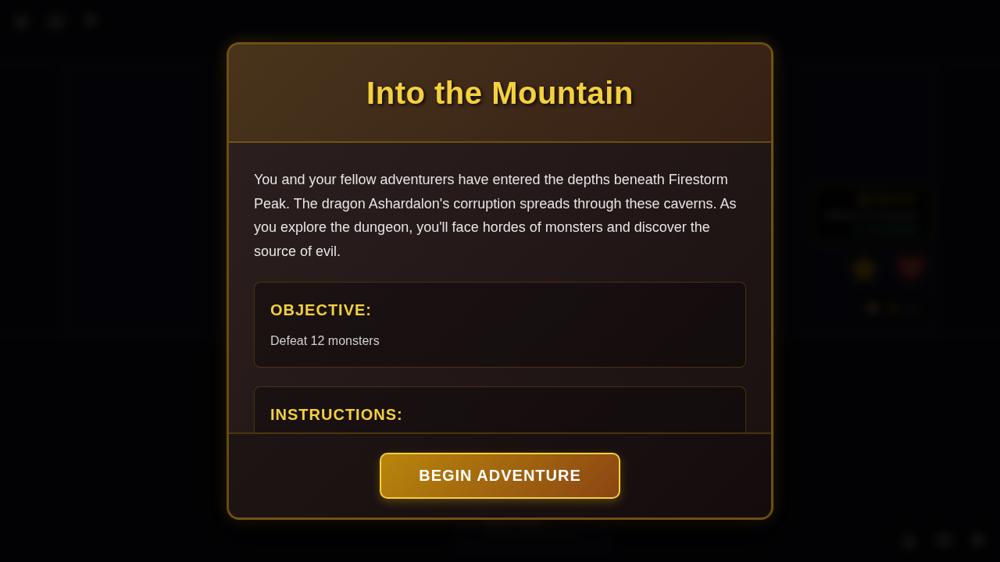

# E2E Test 064 - Scenario Introduction Modal

## User Story

**As a player**, when I start a new game and the map loads for the first time, **I want to see an introduction modal** that explains the scenario, objectives, and instructions, **so that** I understand what I need to do before beginning my adventure.

## Test Description

This test verifies that:
1. The scenario introduction modal appears when the game board is first shown
2. The modal displays the scenario title, description, objective, and instructions
3. The modal can be dismissed by clicking the "Begin Adventure" button
4. The modal can also be dismissed using keyboard shortcuts (Enter, Space, or Escape)
5. Once dismissed, the modal does not appear again during the same game session
6. The game state correctly tracks whether the introduction has been shown

## Screenshot Gallery

### Test 1: Scenario Introduction Modal Display and Dismissal

#### Screenshot 000: Scenario Introduction Shown

**What to verify:**
- ✅ Scenario introduction modal is visible with dark overlay
- ✅ Modal displays "Into the Mountain" as the scenario title
- ✅ Modal shows the scenario description mentioning Ashardalon and Firestorm Peak
- ✅ Objective section displays "Defeat 12 monsters"
- ✅ Instructions section provides guidance on exploring and defeating monsters
- ✅ "Begin Adventure" button is visible and prominent
- ✅ Game board is visible but dimmed behind the modal
- ✅ Redux store shows `introductionShown: false`

**Note:** After clicking "Begin Adventure", the modal dismisses correctly. Programmatic verification confirms the modal is hidden, the game board is visible, and the Redux state is updated to `introductionShown: true`. No screenshot is taken after dismissal due to non-deterministic randomness in background game elements (tile deck shuffle, hero positions).

### Test 2: Keyboard Dismissal

#### Screenshot 000: Keyboard Dismiss Ready

**What to verify:**
- ✅ Scenario introduction modal is visible (same as test 1, screenshot 000)
- ✅ Modal is focused and ready to accept keyboard input
- ✅ Different hero (Vistra) is selected for this test

**Note:** After pressing Enter, the modal dismisses correctly. Programmatic verification confirms successful dismissal and state update.

## Manual Verification Steps

### Primary Flow
1. Navigate to the application
2. Select a hero (e.g., Quinn) from character selection
3. Complete power card selection
4. Click "Start Game"
5. **Verify:** Scenario introduction modal appears with scenario details
6. **Verify:** Modal shows title, description, objective, and instructions
7. **Verify:** "Begin Adventure" button is visible
8. Click "Begin Adventure"
9. **Verify:** Modal dismisses and game board is fully visible
10. **Verify:** Modal does not reappear during gameplay

### Keyboard Interaction
1. Follow steps 1-5 above
2. Press Enter or Escape key
3. **Verify:** Modal dismisses correctly
4. **Verify:** Game board is interactive

### State Persistence
1. Complete the primary flow
2. Interact with the game (move hero, end phase, etc.)
3. **Verify:** Introduction modal never reappears
4. **Verify:** Redux state maintains `introductionShown: true`

## Acceptance Criteria Validation

✅ **AC1:** When a scenario starts and the map is revealed for the first time, show an introduction modal or overlay with scenario details.
- Modal appears immediately when game board loads
- Modal includes scenario details with title, description, objective, and instructions

✅ **AC2:** Introduction should include the scenario title, a brief description, objectives, and any relevant instructions or flavor text.
- Title: "Into the Mountain"
- Description: Story context about Ashardalon and Firestorm Peak
- Objective: "Defeat 12 monsters"
- Instructions: Guidance on exploration and monster encounters

✅ **AC3:** Must be dismissable by the player and not shown again until the map is re-entered or restarted.
- Modal dismisses via button click
- Modal dismisses via keyboard (Enter, Escape)
- Once dismissed, `introductionShown` flag is set to `true`
- Modal never reappears during the same game session

✅ **AC4:** Should support future expansion for additional scenario content or dynamic text.
- Component accepts props for title, description, objective, and instructions
- ScenarioState type includes all necessary fields for scenario metadata
- Modal styling supports longer content with scrolling

## Implementation Details

### New Components
- `ScenarioIntroduction.svelte`: Modal component for displaying scenario introduction

### State Changes
- Extended `ScenarioState` interface with:
  - `title: string` - Scenario title
  - `description: string` - Scenario story/context
  - `instructions?: string` - Optional setup instructions
  - `introductionShown: boolean` - Tracks if modal was dismissed

### Redux Actions
- `dismissScenarioIntroduction()` - Marks introduction as shown

### Integration
- Modal renders in `GameBoard.svelte` when `!scenario.introductionShown`
- Z-index of 2100 ensures it displays above other UI elements while maintaining hierarchy
- Keyboard accessible with Escape and Enter keys (consistent with other modals)
