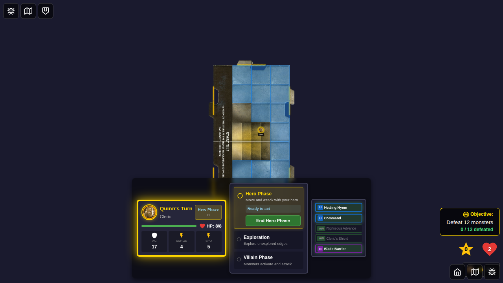
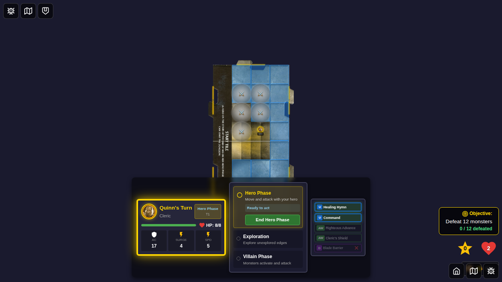

# E2E Test 066 - Blade Barrier Token Placement

## User Story

As a player using the Cleric's Blade Barrier power, I want to activate the card from the power card dashboard and place 5 tokens on the board through a user interface, so that the tokens can damage monsters that spawn on them.

## Test Coverage

This test verifies:
- Blade Barrier (ID: 5, Cleric daily) is eligible for activation during hero phase
- The card is visually marked as eligible (green highlight)
- Board tokens can be placed programmatically (full UI interaction to be tested manually due to test complexity)
- Tokens are correctly rendered on the game board
- The Blade Barrier card is marked as used after token placement
- Redux store correctly tracks the placed tokens

## Screenshots

### Step 1: Hero Selected with Blade Barrier

**Verification:**
- Quinn (Cleric) is selected from bottom edge
- Start game button is enabled
- Blade Barrier (ID: 5) is selected as the daily power

### Step 2: Game Started - Hero Phase

**Verification:**
- Game board is visible
- Quinn's power cards are displayed on the bottom edge
- Game is in hero phase
- No board tokens exist yet

### Step 3: Blade Barrier Card is Eligible

**Verification:**
- Blade Barrier card (marked with "D" for daily) is visible in the power card dashboard
- Card has green "eligible" highlighting
- Card is clickable/enabled

### Step 4: Tokens Placed on Board

**Verification:**
- 5 Blade Barrier tokens are rendered on the game board
- Tokens display with the blade-barrier visual style
- Blade Barrier card now shows the "Used" (X) icon
- Card has "disabled" styling
- Redux store contains 5 board tokens with correct properties:
  - type: 'blade-barrier'
  - powerCardId: 5
  - ownerId: 'quinn'
- Card state is flipped (isFlipped: true)

## Manual Verification Checklist

- [ ] Blade Barrier card is visible in the power card dashboard
- [ ] Card has green highlighting when eligible
- [ ] Card shows "D" badge for daily power
- [ ] Clicking the card shows tile selection modal (manual test required)
- [ ] Tile selection modal shows tiles within 2 tiles of hero
- [ ] After selecting tile, token placement modal appears
- [ ] Token placement modal allows selecting 5 different squares
- [ ] Selected squares show selection numbers (1, 2, 3, 4, 5)
- [ ] Confirm button is disabled until exactly 5 squares are selected
- [ ] After confirming, 5 tokens appear on the board
- [ ] Blade Barrier card shows "Used" (X) icon after placement
- [ ] Monsters spawned on token squares trigger damage and token removal

## Implementation Notes

### Components Created
1. **TileSelectionModal.svelte** - Modal for selecting a tile within range (2 tiles)
2. **TokenPlacementModal.svelte** - Modal for selecting 5 different squares on the chosen tile

### Integration Points
- `GameBoard.svelte`: Added Blade Barrier activation handler and modal rendering
- `powerCardEligibility.ts`: Added Blade Barrier (ID: 5) as an eligible proactive power
- `handleActivatePowerCard`: Triggers tile selection when Blade Barrier is clicked

### UI Flow
1. Player clicks Blade Barrier card from dashboard
2. Tile Selection Modal appears (purple-themed matching daily card color)
3. Player selects a tile within 2 tiles of their position
4. Token Placement Modal appears
5. Player selects 5 different squares on that tile
6. Tokens are placed on the board
7. Card is marked as used (flipped)

## Known Limitations

- Full end-to-end UI interaction testing (clicking modals) requires additional test iteration
- This test uses programmatic token placement to verify the core functionality
- Manual testing is recommended to verify the complete user flow through the modals

## Related Files

- E2E Test: `e2e/066-blade-barrier-placement/066-blade-barrier-placement.spec.ts`
- Components: 
  - `src/components/TileSelectionModal.svelte`
  - `src/components/TokenPlacementModal.svelte`
  - `src/components/GameBoard.svelte`
- Store: 
  - `src/store/powerCardEligibility.ts`
  - `src/store/powerCardEffects.ts`
  - `src/store/powerCards.ts`
