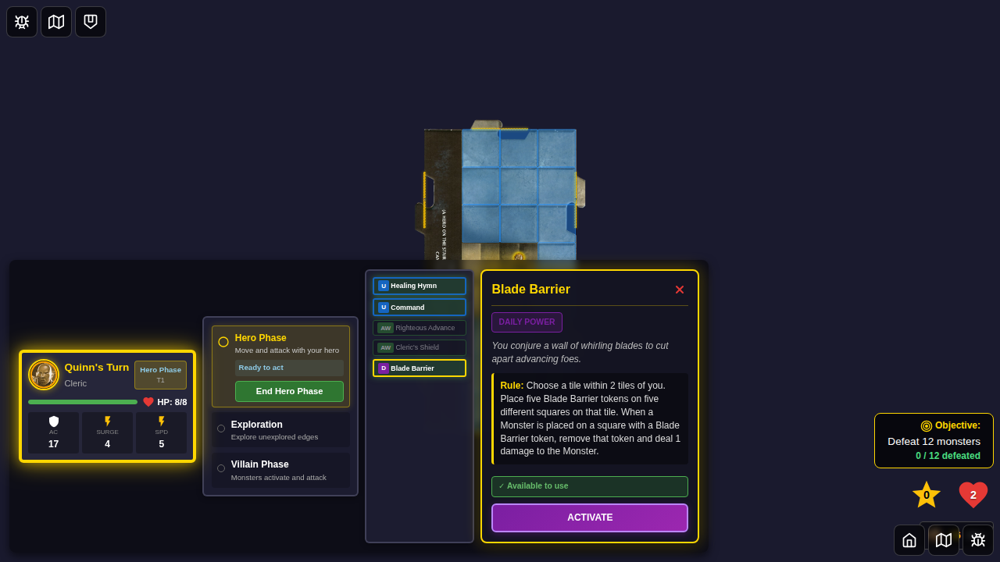

# E2E Test 067: Blade Barrier UI Activation with Inline Control Panel

## Test Purpose

This E2E test demonstrates the complete user interaction flow for activating the Blade Barrier power card with an inline control panel. It validates that users can:

1. Select a hero with Blade Barrier
2. Click the power card to see an inline control panel with description and "Activate" button
3. Activate the power through the inline "Activate" button
4. Select a tile directly on the map with instructions shown in the inline power card panel
5. Select 5 token placement squares on the map with progress shown in the inline power card panel
6. Confirm placement and see results

**Key Feature**: When clicking Blade Barrier, it expands inline to show a control panel with the card description and an "Activate" button. After activation, selection instructions, progress counter, and action buttons are displayed inline in the same panel, ensuring full game board visibility throughout the entire flow. No separate detail view modal or popup is shown.

## Test Story

**User Story:** As a player controlling Quinn the Cleric, I want to activate my Blade Barrier daily power by clicking the card to see an inline control panel with the description and an "Activate" button, maintaining full visibility of the game board throughout the entire selection process.

## Test Steps & Screenshots

### Step 1: Hero Selected with Blade Barrier

**What's verified:**
- Quinn (Cleric) is selected from character screen
- Blade Barrier (ID: 5) is chosen as the daily power
- Start Game button is enabled

**Programmatic checks:**
- Hero has "selected" class
- Start button is enabled

### Step 2: Game Started

**What's verified:**
- Game board is visible
- Power cards panel is rendered
- Blade Barrier card (ID: 5) is visible in the dashboard

**Programmatic checks:**
- `[data-testid="player-power-cards"]` is visible
- `[data-testid="power-card-5"]` is visible

### Step 3: Blade Barrier Control Panel

**What's verified:**
- Clicking the Blade Barrier card shows an inline control panel
- Control panel displays the card description and rule text
- "Activate" button is visible and enabled in the control panel
- Card shows as eligible (green highlight)
- **No separate detail view modal** - everything is inline

**Programmatic checks:**
- Blade Barrier control panel is visible
- Activate button is present in the control panel

**UX Improvement**: Instead of opening a separate detail view popup, the Blade Barrier card now expands inline to show a control panel with the description and an "Activate" button, as requested in the issue.

### Step 4: Tile Selection with Integrated UI

**What's verified:**
- Clicking "Activate" highlights tiles on the map with purple overlay
- Selection instructions appear **in the power card inline panel** (not a blocking modal)
- Instructions show "Select Tile" with helpful text
- Start tile has purple border and is clickable
- **Full map visibility maintained** - no modal blocking the game board
- Cancel button available in the card panel

**Programmatic checks:**
- Blade Barrier selection UI is visible inline in the expanded card area
- Instruction text "Select Tile" is present
- Start tile has `selectable-tile` class
- Cancel button is present in the inline panel

**UX Improvement**: The selection UI is part of the inline power card panel on the left, not a centered modal overlay. This keeps the entire game board visible and clickable.

### Step 5: Square Selection with Progress Display

**What's verified:**
- After clicking tile, squares become clickable directly on the map
- **Card panel updates** to show "Select Squares" instructions
- **Progress counter shows "0 / 5"** in the card panel
- Squares have yellow visual overlays
- Full map visibility maintained
- Cancel button remains accessible in card panel

**Programmatic checks:**
- Blade Barrier selection UI shows square selection mode
- Instruction text "Select Squares" is visible
- Selectable squares are visible on the map
- Progress counter shows "0 / 5"

**UX Improvement**: Progress is tracked and displayed directly in the power card panel, providing immediate feedback without obstructing the board.

### Step 6: Five Squares Selected with Confirm Action

**What's verified:**
- User can click 5 different squares directly on the map
- Each selected square shows a numbered indicator (1-5)
- **Progress counter updates to "5 / 5"** in the card panel
- **"Confirm Placement" button appears** in the card panel
- Selected squares remain visible with their numbers
- Cancel button remains available

**Programmatic checks:**
- Progress shows "5 / 5" in card detail
- Confirm button is visible in card detail
- 5 selection number indicators are present on the map

**UX Improvement**: The confirm action is presented in the same card panel where the user has been tracking progress, creating a cohesive and intuitive flow.

### Step 7: Tokens Placed, Card Used

**What's verified:**
- Card detail panel dismisses after confirming placement
- 5 Blade Barrier tokens appear on the selected squares
- Blade Barrier card shows as "Used" (disabled/flipped state)
- Tokens are visible on the game board

**Programmatic checks:**
- Selection UI is dismissed (card detail closes)
- 5 board tokens exist
- Power card has disabled/flipped class

## UI Interaction Method

This test uses **ONLY UI events** (clicks) to drive the application with **inline card panel control**:
- ✅ Hero selection: `click()`
- ✅ Power selection: `click()`
- ✅ Card expansion: `click()` on Blade Barrier card shows inline control panel with description and "Activate" button
- ✅ Card activation: `click()` on "Activate" button in the inline control panel
- ✅ Tile selection: `click()` directly on tile on the map (instructions shown in inline card panel)
- ✅ Square selection: `click()` directly on 5 squares on the map (progress shown in inline card panel)
- ✅ Confirm placement: `click()` on "Confirm Placement" button (in inline card panel)

**No programmatic workarounds** are used for the core functionality being demonstrated.

## Inline Card Panel Benefits

- **Full Map Visibility:** No modals or separate popups blocking the game board at any point
- **Inline Control Panel:** Clicking Blade Barrier expands it inline to show description and "Activate" button
- **Contextual Instructions:** Selection guidance appears in the expanded card panel inline with other power cards
- **Progress Tracking:** Real-time counter (e.g., "3 / 5") shows selection progress in the inline card panel
- **Consistent Location:** All controls (description, activate button, instructions, progress, cancel, confirm) in the same inline panel location
- **Direct Interaction:** Click tiles and squares directly where they appear on the board
- **Visual Feedback:** Purple overlays, yellow highlights, numbered indicators on the map
- **Integrated Experience:** Everything happens inline - no separate modal or detail view popup
- **Always Cancelable:** Cancel button accessible in the inline card panel at every step
- **Immersive Gameplay:** Maintains focus on the game board while providing clear guidance

## Test Metadata

- **Test ID:** 067
- **Category:** Power Card Activation
- **Complexity:** High (multi-step selection flow with inline control panel)
- **User Actions:** 10+ clicks
- **Screenshots:** 7
- **Selection Method:** Inline control panel (no separate detail view modal or popup)
- **UI Pattern:** Inline power card expansion with control panel and embedded selection controls

## Future Enhancements

- Test Blade Barrier tokens triggering damage when monsters move onto them
- Test canceling at each step (tile selection, token placement)
- Test edge cases (selecting same square twice, deselecting squares)
- Test with multiple tiles in range
- Test toggling the control panel (clicking card again to collapse)

## Related Files

- Test: `e2e/067-blade-barrier-ui-activation/067-blade-barrier-ui-activation.spec.ts`
- Components:
  - `src/components/PlayerPowerCards.svelte` (Inline control panel and selection UI)
  - `src/components/PlayerPowerCards.svelte` (Card panel and state management)
  - `src/components/GameBoard.svelte` (On-map selection logic, removed modal overlay)
