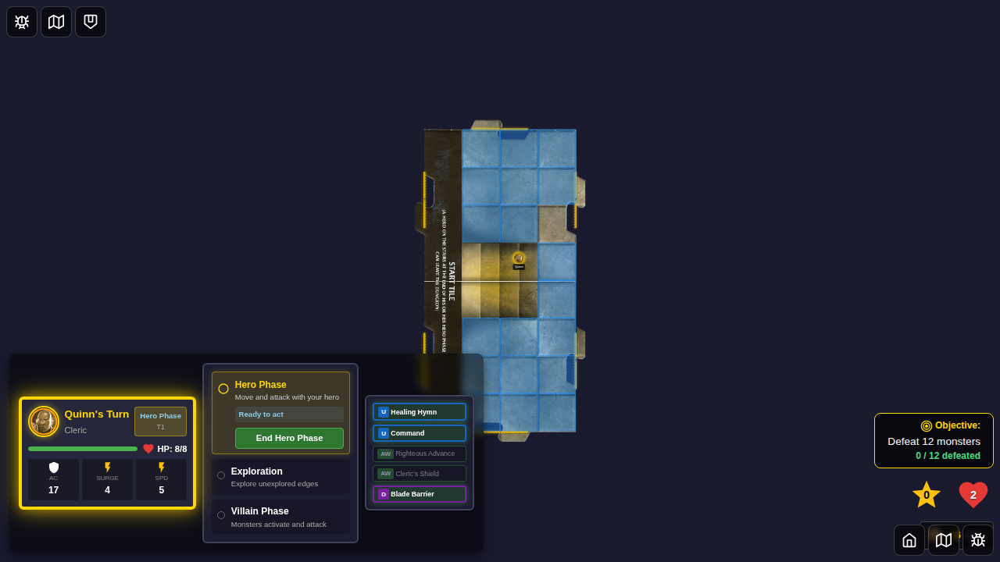
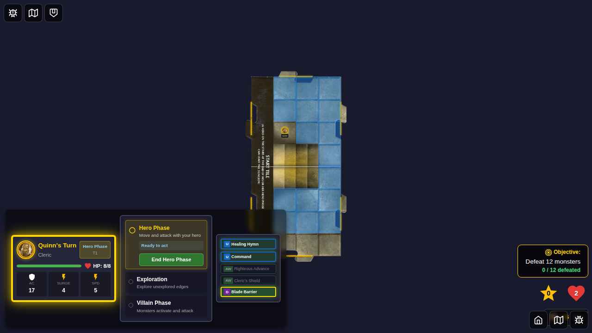
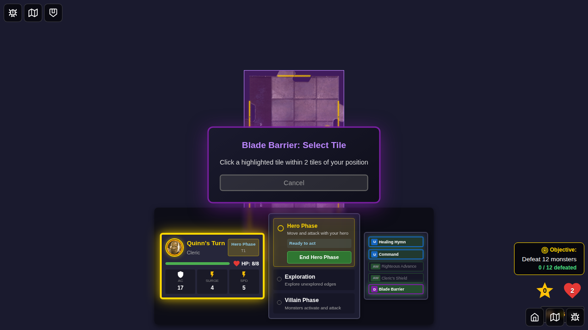
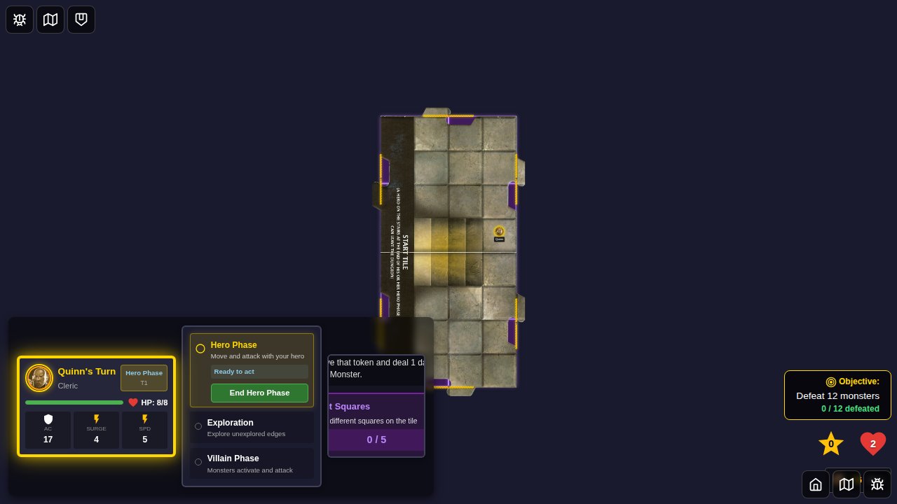
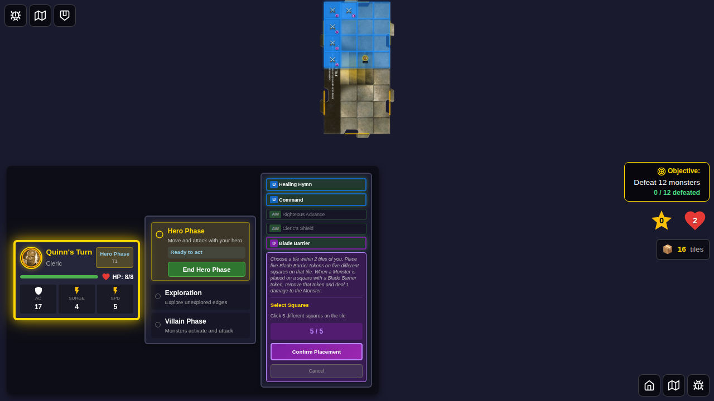
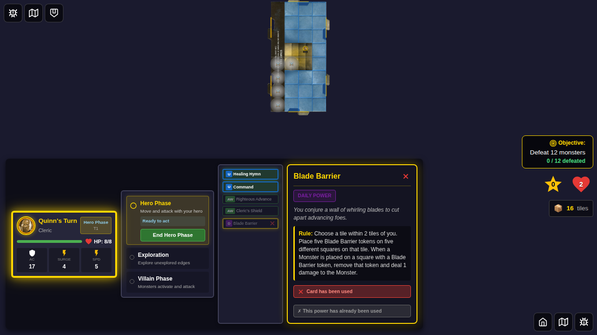

# E2E Test 067: Blade Barrier UI Activation with On-Map Selection

## Test Purpose

This E2E test demonstrates the complete user interaction flow for activating the Blade Barrier power card through UI clicks with on-map tile and square selection. It validates that users can:

1. Select a hero with Blade Barrier
2. Access and click the power card
3. Activate the power through a button click
4. Select a tile directly on the map (no modal)
5. Select 5 token placement squares directly on the map (no modal)
6. Confirm placement and see results

## Test Story

**User Story:** As a player controlling Quinn the Cleric, I want to activate my Blade Barrier daily power by clicking through the UI, selecting a tile within range by clicking directly on the map, and choosing 5 squares for token placement by clicking directly on the tile.

## Test Steps & Screenshots

### Step 1: Hero Selected with Blade Barrier

**What's verified:**
- Quinn (Cleric) is selected from character screen
- Blade Barrier (ID: 5) is chosen as the daily power
- Start Game button is enabled

**Programmatic checks:**
- Hero has "selected" class
- Start button is enabled

### Step 2: Game Started

**What's verified:**
- Game board is visible
- Power cards panel is rendered
- Blade Barrier card (ID: 5) is visible in the dashboard

**Programmatic checks:**
- `[data-testid="player-power-cards"]` is visible
- `[data-testid="power-card-5"]` is visible

### Step 3: Blade Barrier Detail View

**What's verified:**
- Clicking the Blade Barrier card opens the detail view
- Card details are displayed (name, type, description, rule)
- "Activate Power" button is visible and enabled
- Card shows as eligible (green highlight)

**Programmatic checks:**
- Card detail view is visible
- Rule text contains "Blade Barrier"
- Activate button is present and enabled

### Step 4: Tile Selection On-Map

**What's verified:**
- Clicking "Activate Power" highlights tiles on the map with purple overlay
- Floating instruction panel shows "Blade Barrier: Select Tile"
- Start tile has purple border and is clickable
- Full map visibility maintained (no modal blocking view)
- Cancel button available

**Programmatic checks:**
- Instruction text is visible
- Start tile has `selectable-tile` class
- Cancel button is present

### Step 5: Square Selection On-Map

**What's verified:**
- After clicking tile, squares become clickable directly on the map
- Instruction panel updates to "Blade Barrier: Select 5 Squares"
- Progress counter shows "0 / 5"
- Squares have visual overlays
- Full map visibility maintained

**Programmatic checks:**
- Instruction text updated
- Selectable squares are visible
- Progress shows "0 / 5"

### Step 6: Five Squares Selected On-Map

**What's verified:**
- User can click 5 different squares directly on the map
- Each selected square shows a numbered indicator (1-5)
- Progress counter updates to "5 / 5"
- "Confirm Placement" button appears in instruction panel
- Selected squares remain visible with their numbers

**Programmatic checks:**
- Progress shows "5 / 5"
- Confirm button is visible
- 5 selection number indicators are present

### Step 7: Tokens Placed, Card Used

**What's verified:**
- Instruction panel disappears after confirming placement
- 5 Blade Barrier tokens appear on the selected squares
- Blade Barrier card shows as "Used" (disabled/flipped state)
- Tokens are visible on the game board

**Programmatic checks:**
- Instruction panel is gone
- 5 board tokens exist
- Power card has disabled/flipped class

## UI Interaction Method

This test uses **ONLY UI events** (clicks) to drive the application with on-map selection:
- ✅ Hero selection: `click()`
- ✅ Power selection: `click()`
- ✅ Card activation: `click()` on card then `click()` on "Activate Power" button
- ✅ Tile selection: `click()` directly on tile on the map (no modal)
- ✅ Square selection: `click()` directly on 5 squares on the map (no modal)
- ✅ Confirm placement: `click()` on "Confirm Placement" button

**No programmatic workarounds** are used for the core functionality being demonstrated.

## On-Map Selection Benefits

- **Full Map Visibility:** No modals blocking the game board
- **Direct Interaction:** Click tiles and squares directly where they appear
- **Visual Feedback:** Purple overlays, numbered indicators, pulsing borders
- **Integrated Experience:** Selection feels part of the game, not separate dialog
- **Cancelable:** Cancel button in floating panel at any step

## Test Metadata

- **Test ID:** 067
- **Category:** Power Card Activation
- **Complexity:** High (multi-step on-map selection flow)
- **User Actions:** 10+ clicks
- **Screenshots:** 7
- **Selection Method:** On-map (no modals)

## Future Enhancements

- Test Blade Barrier tokens triggering damage when monsters move onto them
- Test canceling at each step (tile selection, token placement)
- Test edge cases (selecting same square twice, deselecting squares)
- Test with multiple tiles in range
- Test pointer-events handling for instruction panel

## Related Files

- Test: `e2e/067-blade-barrier-ui-activation/067-blade-barrier-ui-activation.spec.ts`
- Components:
  - `src/components/CardDetailView.svelte` (Activate button)
  - `src/components/PlayerPowerCards.svelte` (Card display)
  - `src/components/GameBoard.svelte` (On-map selection logic)
