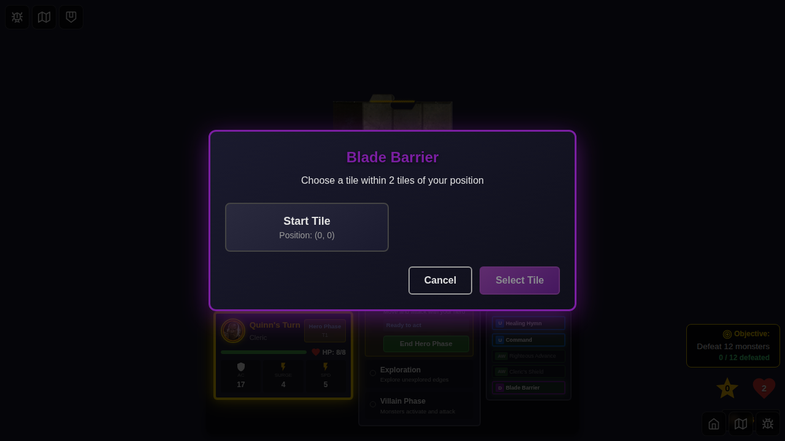
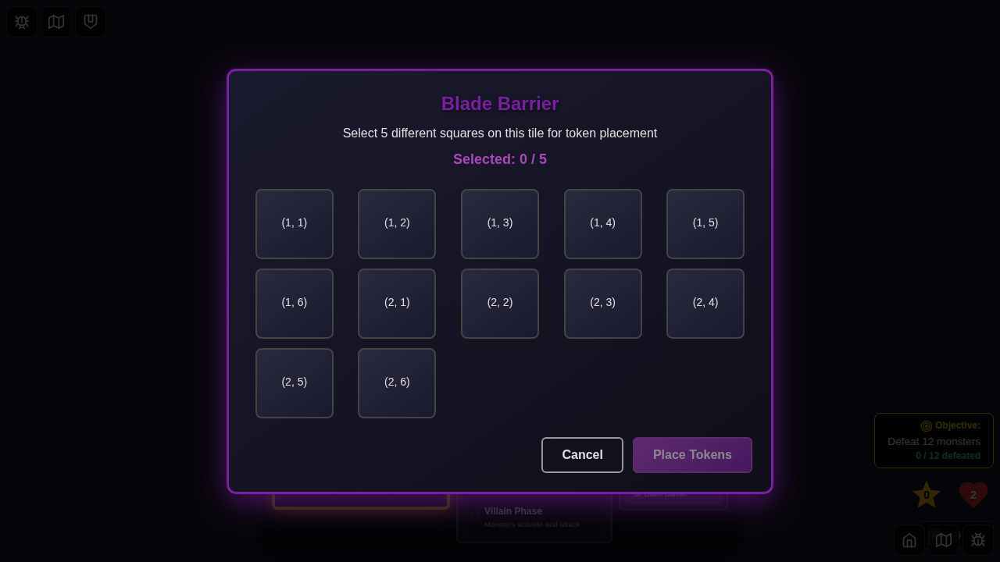
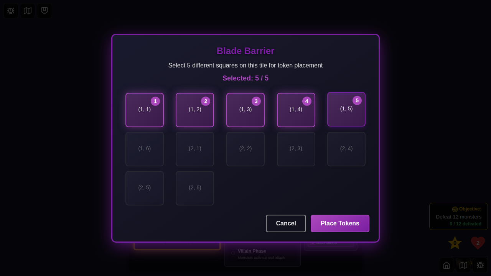

# E2E Test 067: Blade Barrier UI Activation

## Test Purpose

This E2E test demonstrates the complete user interaction flow for activating the Blade Barrier power card through UI clicks, without any programmatic workarounds. It validates that users can:

1. Select a hero with Blade Barrier
2. Access and click the power card
3. Activate the power through a button click
4. Select a tile via modal UI
5. Select token placement squares via modal UI
6. Confirm placement and see results

## Test Story

**User Story:** As a player controlling Quinn the Cleric, I want to activate my Blade Barrier daily power by clicking through the UI, selecting a tile within range, and choosing 5 squares for token placement.

## Test Steps & Screenshots

### Step 1: Hero Selected with Blade Barrier

**What's verified:**
- Quinn (Cleric) is selected from character screen
- Blade Barrier (ID: 5) is chosen as the daily power
- Start Game button is enabled

**Programmatic checks:**
- Hero has "selected" class
- Start button is enabled

###Step 2: Game Started

**What's verified:**
- Game board is visible
- Power cards panel is rendered
- Blade Barrier card (ID: 5) is visible in the dashboard

**Programmatic checks:**
- `[data-testid="player-power-cards"]` is visible
- `[data-testid="power-card-5"]` is visible

### Step 3: Blade Barrier Detail View

**What's verified:**
- Clicking the Blade Barrier card opens the detail view
- Card details are displayed (name, type, description, rule)
- "Activate Power" button is visible and enabled
- Card shows as eligible (green highlight)

**Programmatic checks:**
- Card detail view is visible
- Rule text contains "Blade Barrier"
- Activate button is present and enabled

### Step 4: Tile Selection Modal

**What's verified:**
- Clicking "Activate Power" opens the tile selection modal
- Modal shows tiles within range (2 tiles of player position)
- Start tile is available for selection
- Purple theme matches daily card type

**Programmatic checks:**
- Modal is visible
- At least 1 selectable tile is available

### Step 5: Token Placement Modal

**What's verified:**
- Selecting a tile opens the token placement modal
- Modal shows all valid squares on the selected tile
- Progress counter shows "0 / 5"
- Instructions are clear

**Programmatic checks:**
- Token placement modal is visible
- Progress shows "0 / 5"

### Step 6: Five Squares Selected

**What's verified:**
- User can click 5 different squares
- Each selected square shows a selection number (1-5)
- Progress counter updates to "5 / 5"
- "Place Tokens" button becomes enabled

**Programmatic checks:**
- Progress shows "5 / 5"
- Confirm button is enabled

### Step 7: Tokens Placed, Card Used (In Progress)
**Expected:**
- Modal closes after clicking "Place Tokens"
- 5 Blade Barrier tokens appear on the board
- Blade Barrier card shows as "Used" (disabled state)

**Current Status:** ⚠️ Modal not closing - investigating

## UI Interaction Method

This test uses **ONLY UI events** (clicks) to drive the application:
- ✅ Hero selection: `click()`
- ✅ Power selection: `click()`
- ✅ Card activation: `click()` on card then `click()` on "Activate Power" button
- ✅ Tile selection: `click()` on tile then `click()` on "Select Tile" button
- ✅ Square selection: `click()` on 5 squares then `click()` on "Place Tokens" button

**No programmatic workarounds** are used for the core functionality being demonstrated.

## Test Metadata

- **Test ID:** 067
- **Category:** Power Card Activation
- **Complexity:** High (multi-step modal flow)
- **User Actions:** 10+ clicks
- **Screenshots:** 7 (6 captured, 1 in progress)

## Known Issues

1. **Modal Close Timing:** Token placement modal doesn't close immediately after placement. Investigating whether this is a test timing issue or actual bug in the modal dismissal logic.

## Future Enhancements

- Test Blade Barrier tokens triggering damage when monsters move onto them
- Test canceling at each step (tile selection, token placement)
- Test edge cases (selecting same square twice, selecting more than 5)
- Test with multiple tiles in range

## Related Files

- Test: `e2e/067-blade-barrier-ui-activation/067-blade-barrier-ui-activation.spec.ts`
- Components:
  - `src/components/CardDetailView.svelte`
  - `src/components/PlayerPowerCards.svelte`
  - `src/components/TileSelectionModal.svelte`
  - `src/components/TokenPlacementModal.svelte`
  - `src/components/GameBoard.svelte`
