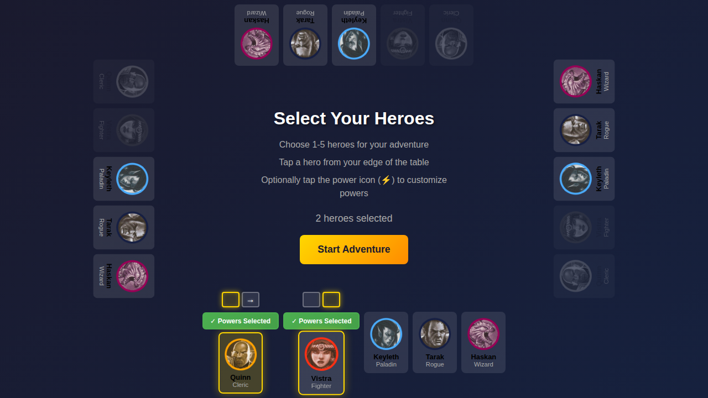
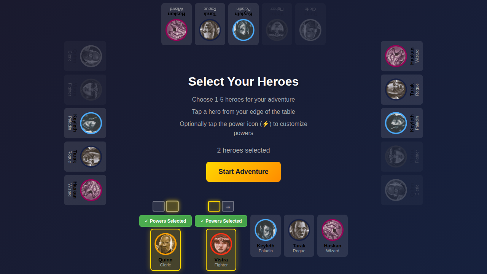
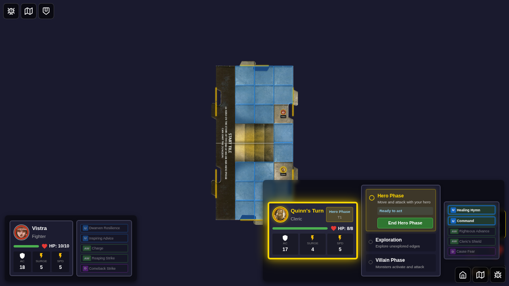

# 068 - Two Players on Same Side

## User Story

**As players at a tabletop**, when two of us select heroes from the same side of the screen, we want to position our controls side-by-side so we can see and manage our heroes without overlap.

## Test Flow

This test verifies the side preference feature for heroes on the same edge:

1. Navigate to character selection screen
2. Select first hero (Quinn) from bottom edge - no side indicator appears yet
3. Select second hero (Vistra) from bottom edge - side indicators appear for both
4. Click the swap button to swap their side preferences
5. Start the game and verify panels are positioned side-by-side on the game board

## Screenshots

### Step 1: Initial Character Selection Screen

The player sees all 5 available heroes at each edge of the screen.

### Step 2: One Hero Selected - No Side Indicator

After selecting Quinn from the bottom edge, the hero is highlighted but no side indicator appears (only 1 hero on this edge).

### Step 3: Two Heroes Selected - Side Indicators Appear

After selecting Vistra from the bottom edge, side indicators appear above both heroes. Quinn shows left position (highlighted square) and Vistra shows right position (highlighted square).

### Step 4: Sides Swapped

After clicking the arrow button, Quinn is now on the right and Vistra is on the left. The indicators update to show the new positions.

### Step 5: Game Board with Side-by-Side Positioning

On the game board, Quinn's panel is positioned at the right side of the bottom edge and Vistra's panel is at the left side, with proper spacing between them.

## Verification Checklist

- [x] Side indicators only appear when 2+ heroes are on the same edge
- [x] Side indicator shows two squares (left and right positions)
- [x] Selected side square has yellow glow
- [x] Unselected side square shows arrow for swapping
- [x] Clicking arrow swaps side preferences for all heroes on that edge
- [x] First hero defaults to left side, second hero defaults to right side
- [x] Game board positions player panels side-by-side based on side preferences
- [x] Player panels on game board are positioned at screen edges (not centered)
- [x] Side preferences persist from character selection to game board

## Redux State Verification

The test verifies Redux store state at each step:

1. **Initial**: No heroes selected
2. **One hero**: `heroes.selectedHeroes` contains Quinn, no `heroSidePreferences` needed yet
3. **Two heroes**: `heroes.selectedHeroes` contains [Quinn, Vistra], `heroes.heroSidePreferences` shows `{ quinn: 'left', vistra: 'right' }`
4. **After swap**: `heroes.heroSidePreferences` shows `{ quinn: 'right', vistra: 'left' }`
5. **Game board**: Panel elements have `data-side-preference` attributes matching the Redux state

## Accessibility

The side indicator component includes ARIA labels for screen readers:

- Left square: `"Left side position (selected)"` or `"Left side position"`
- Right square: `"Right side position (selected)"` or `"Swap to right side"`
