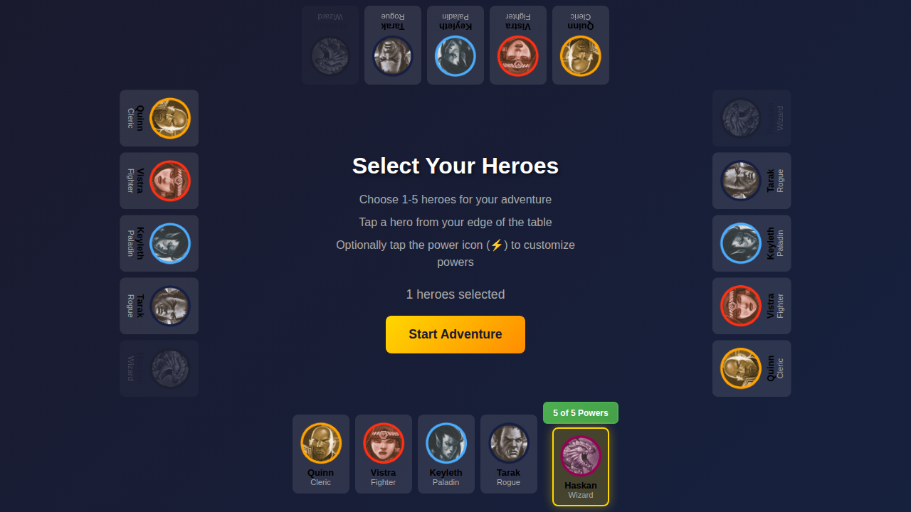
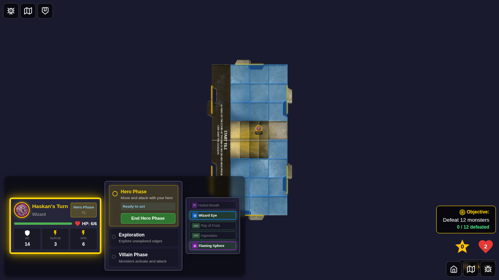
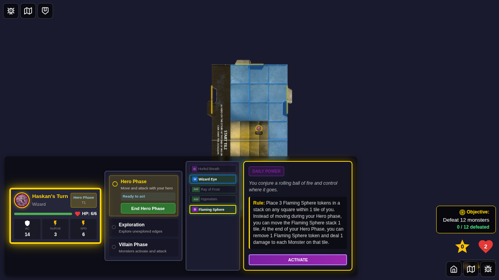
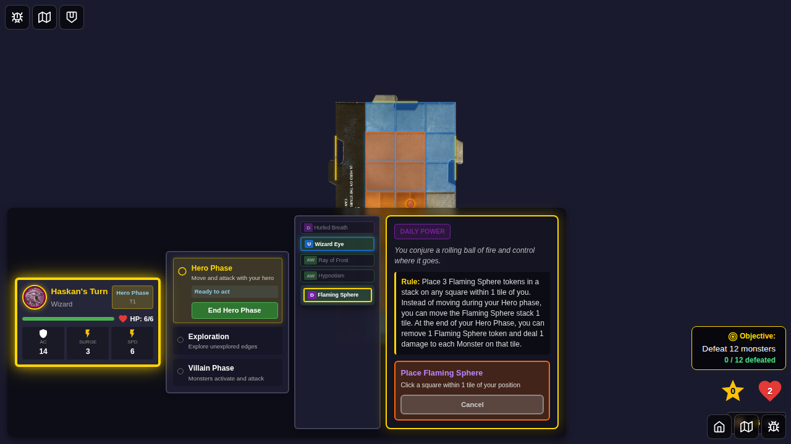
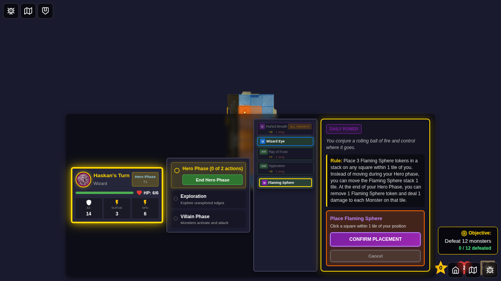
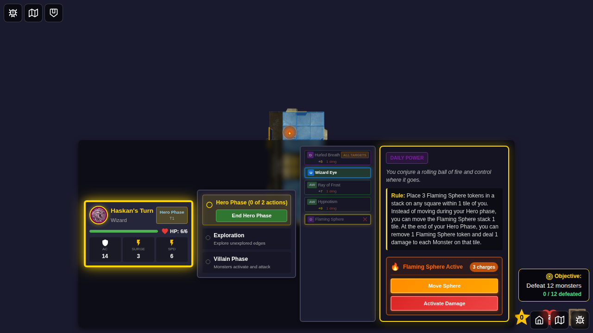

# 069 - Flaming Sphere Token Placement UI

## User Story

As a wizard player using Flaming Sphere (Daily power, ID: 45), I want to place the Flaming Sphere token on the board through a UI flow similar to Blade Barrier, so that I can control its initial placement within 1 tile of my position.

## Test Coverage

This E2E test verifies:
- Flaming Sphere card (ID: 45) is selectable and eligible during hero phase
- UI for activating Flaming Sphere is accessible
- Square selection interface appears within 1 tile range of the hero
- Single square can be selected for token placement
- Confirm button becomes available after square selection
- Token is correctly placed on the board with 3 charges and `canMove: true`
- Power card is marked as used after placement
- Token renders visually on the board with fire emoji (🔥)

## Test Flow

### Step 1: Hero Selection with Flaming Sphere

**What's verified:**
- Haskan (Wizard) is selected with Flaming Sphere as daily power
- Power card selection is correctly stored in Redux
- Start game button is enabled

**Programmatic checks:**
- Hero card has `selected` class
- `powerCardSelections.haskan.daily` equals 45 (Flaming Sphere)
- Start game button is enabled

### Step 2: Game Started

**What's verified:**
- Game board is visible
- Player power cards are rendered
- Hero phase has started
- No board tokens exist yet

**Programmatic checks:**
- Game board is visible
- Player power cards panel is visible
- Current phase is 'hero-phase'
- Board tokens array is empty

### Step 3: Flaming Sphere Card Selected

**What's verified:**
- Power Card Details Panel appears when card is clicked
- "ACTIVATE" button is visible for Flaming Sphere
- Card is highlighted as selected

**Programmatic checks:**
- Details panel is visible
- Activate button exists with correct test ID
- Power card has `selected` class

### Step 4: Square Selection UI

**What's verified:**
- Selectable squares appear within 1 tile of hero
- Orange-themed selection UI (matching fire aesthetic)
- Flaming Sphere selection panel shows instructions
- Cancel button is available

**Programmatic checks:**
- Flaming Sphere selection panel is visible
- At least one selectable square exists
- Cancel button is present

### Step 5: Square Selected

**What's verified:**
- Selected square is highlighted with fire emoji preview
- Confirm placement button appears
- Visual feedback for selection

**Programmatic checks:**
- Confirm button is visible and enabled
- At least one square has `selected` class

### Step 6: Token Placed on Board

**What's verified:**
- Flaming Sphere token renders on board with fire emoji (🔥)
- Token has charge counter badge showing "3"
- Power card is marked as used (flipped)
- Token is movable (has border indicator)

**Programmatic checks:**
- Redux store has 1 board token
- Token type is 'flaming-sphere'
- Token has powerCardId: 45, ownerId: 'haskan'
- Token has charges: 3 and canMove: true
- 1 board token is rendered in DOM
- Token has correct data-token-type attribute
- Power card is marked as flipped/disabled
- Card state in Redux shows isFlipped: true

## Manual Verification Checklist

- [ ] Flaming Sphere card shows fire emoji (🔥) on board
- [ ] Token has orange/red glow matching fire theme
- [ ] Charge counter badge displays "3"
- [ ] Token has white border indicating it's movable
- [ ] Selectable squares have orange tint and border
- [ ] Selected square shows fire emoji preview
- [ ] Power card is visually marked as used after placement
- [ ] Details panel shows orange-themed selection UI
- [ ] Confirm button is disabled until a square is selected

## Implementation Notes

This test validates the Flaming Sphere placement UI that was added as part of the comprehensive Flaming Sphere implementation. The interface follows the same pattern as Blade Barrier but is adapted for Flaming Sphere's specific requirements:

- **Range**: 1 tile (not 2 like Blade Barrier)
- **Token count**: Single token with 3 charges (not 5 separate tokens)
- **Theme**: Orange/fire aesthetic (not purple like Blade Barrier)
- **Movement**: Token is movable after placement (has `canMove: true`)

### Card Rule (ID: 45)
> Place 3 Flaming Sphere tokens in a stack on any square within 1 tile of you.
> Instead of moving during your Hero phase, you can move the Flaming Sphere stack 1 tile.
> At the end of your Hero Phase, you can remove 1 Flaming Sphere token and deal 1 damage to each Monster on that tile.

### Future Test Coverage
- Test 070: Moving the Flaming Sphere during hero phase
- Test 071: Activating Flaming Sphere damage and charge consumption
