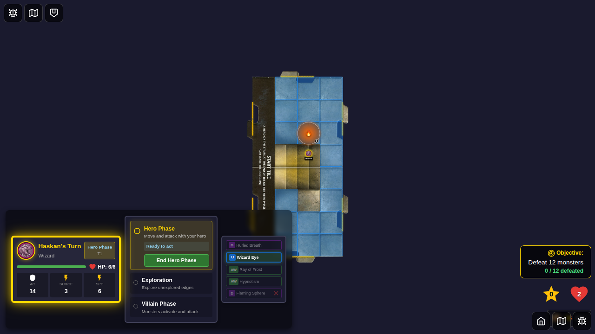
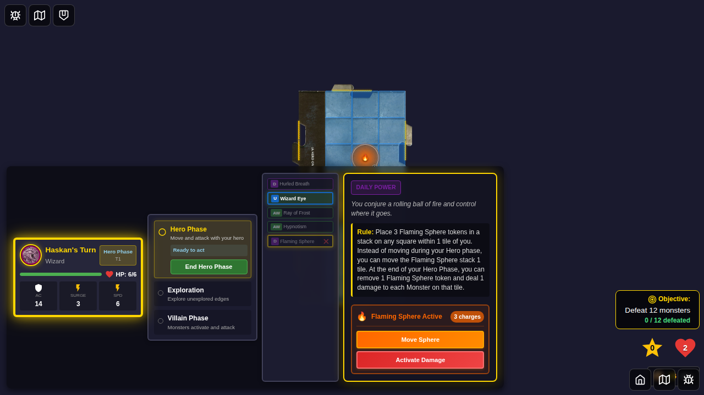
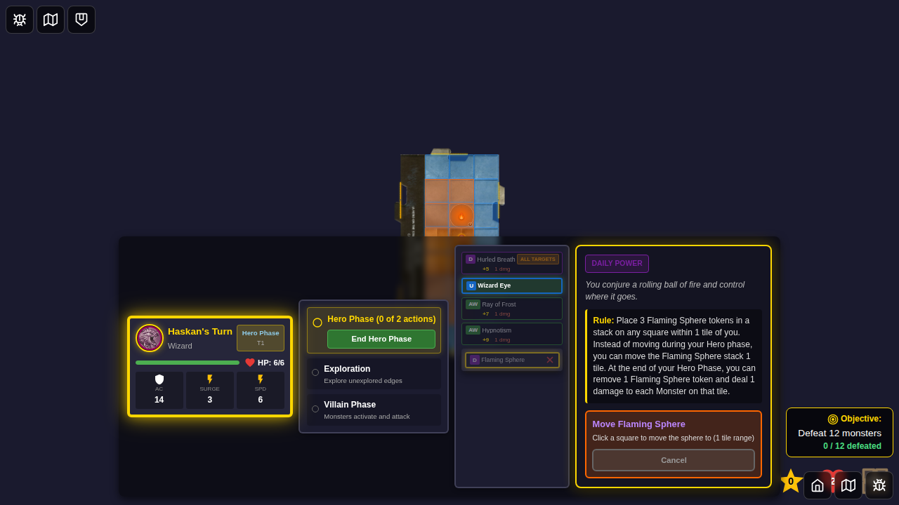

# 070 - Flaming Sphere Movement UI

## User Story

As a wizard player with an active Flaming Sphere token, I want to move the sphere instead of my hero during the hero phase, so that I can reposition the sphere for tactical advantage while forfeiting my hero's movement.

## Test Coverage

This E2E test verifies:
- Control panel appears during hero phase when Flaming Sphere is active
- "Move Sphere" button is enabled when hero hasn't moved yet
- Clicking "Move Sphere" initiates square selection within 1 tile of current token position
- Selectable squares have orange/fire theme styling
- Clicking a square auto-confirms and moves the token
- Hero's movement action is recorded in Redux
- "Move Sphere" button is disabled after movement

## Test Flow

### Step 1: Flaming Sphere Placed

**What's verified:**
- Flaming Sphere token is programmatically placed with 3 charges
- Token is visible and has `canMove: true`
- Power card is marked as used

**Programmatic checks:**
- 1 board token exists with correct properties
- Token type is 'flaming-sphere' with charges: 3
- Token position is set correctly

### Step 2: Control Panel Visible

**What's verified:**
- Control panel appears in bottom-right corner
- "Move Sphere" button is visible and enabled
- Button is not disabled (hero hasn't moved yet)

**Programmatic checks:**
- Control panel testid is visible
- Move button testid exists and is enabled

### Step 3: Movement Selection Started

**What's verified:**
- Selectable squares appear after clicking "Move Sphere"
- Squares have orange/fire theme (flaming-sphere-square class)
- Squares are within 1 tile of current token position

**Programmatic checks:**
- Multiple selectable squares exist
- Squares have flaming-sphere-square CSS class

### Step 4: Token Moved

**What's verified:**
- Token position changed after square selection
- Charges remain at 3 (movement doesn't consume charges)
- Hero's move action was recorded in Redux
- Token is still visible on board

**Programmatic checks:**
- Token position is different from initial (2, 2)
- Charges still equal 3
- heroTurnActions.actionsTaken contains 'move'
- 1 board token still exists

### Step 5: Move Button Disabled

**What's verified:**
- Control panel still visible
- "Move Sphere" button is now disabled (hero already moved)

**Programmatic checks:**
- Control panel remains visible
- Move button is disabled

## Manual Verification Checklist

- [ ] Control panel has orange/fire theme matching Flaming Sphere
- [ ] Move button clearly indicates it forfeits hero movement
- [ ] Selectable squares have visible orange tint
- [ ] Token smoothly updates position after selection
- [ ] Button disabled state is visually distinct
- [ ] No confirm button needed (auto-confirms on square click)

## Implementation Notes

### Movement Auto-Confirmation
Unlike placement (which requires explicit confirmation via PowerCardDetailsPanel), movement initiated from the control panel auto-confirms when a square is clicked. This provides a streamlined UX since:
- Movement is a simpler action (single square, no multi-select)
- Control panel is already an explicit interaction
- Reduces clicks for a common tactical action

### Action Recording
The movement uses a new Redux action `game/recordFlamingSphereMovement` to:
- Record 'move' in heroTurnActions.actionsTaken
- Prevent hero from moving afterward
- Respect Dazed status effects

### Card Rule (ID: 45)
> Instead of moving during your Hero phase, you can move the Flaming Sphere stack 1 tile.

This test validates that the sphere can be moved as an alternative to hero movement.

## Related Tests
- Test 069: Flaming Sphere placement UI
- Test 071: Flaming Sphere damage activation and charge consumption
