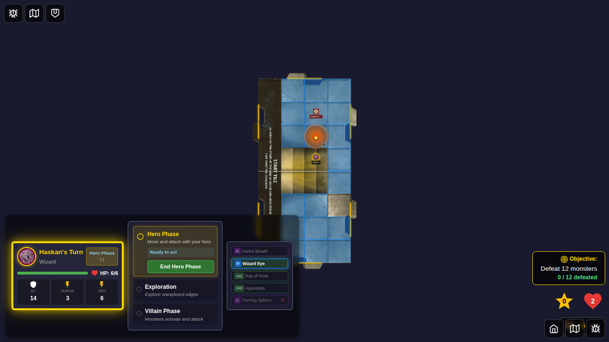
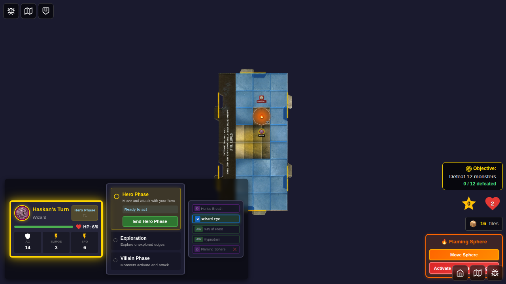
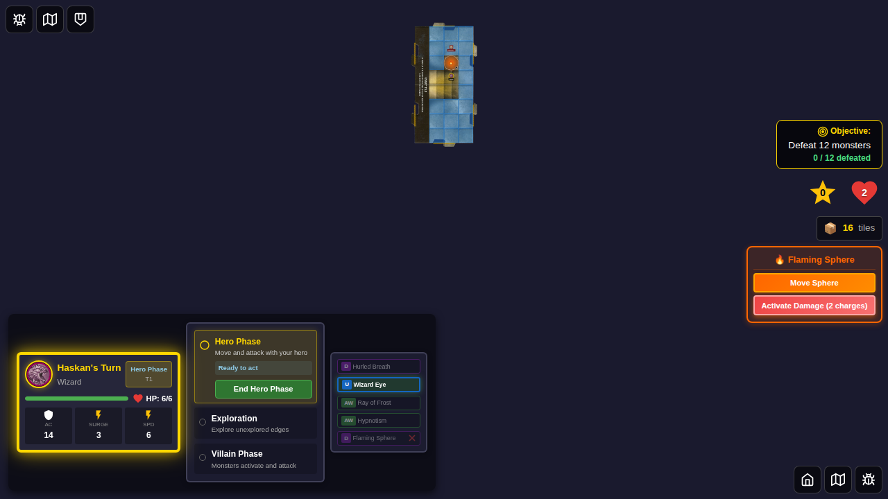
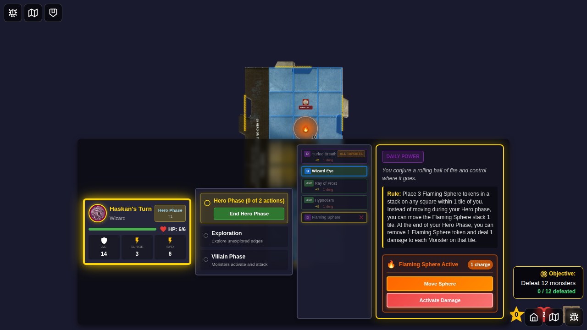
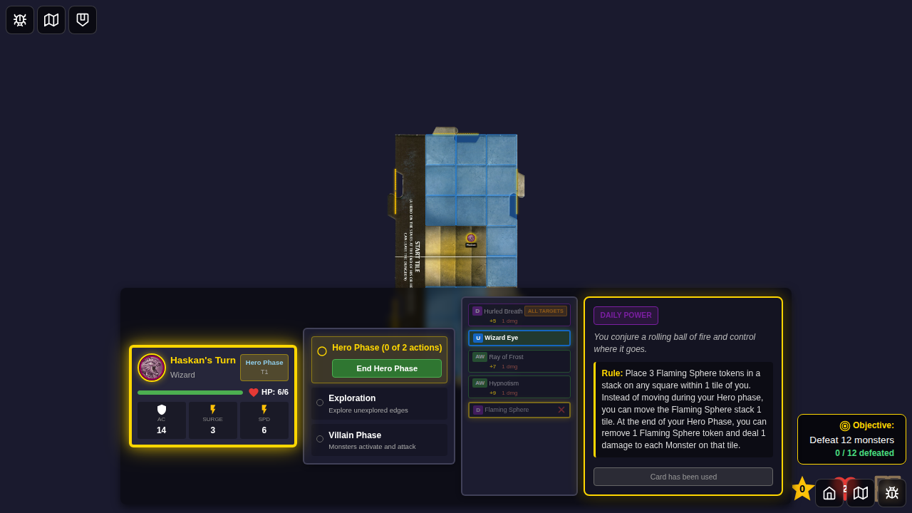

# 071 - Flaming Sphere Damage Activation

## User Story

As a wizard player with an active Flaming Sphere token, I want to activate its damage ability to harm all monsters on the same tile, consuming one charge each use, so that I can deal area damage strategically during the hero phase.

## Test Coverage

This E2E test verifies:
- Control panel shows "Activate Damage" button with current charge count
- Clicking damage button applies 1 damage to all monsters on sphere's tile
- Each activation decrements charge counter by 1
- Token is automatically removed when charges reach 0
- Control panel disappears when token is removed
- Defeated monsters are removed from the board

## Test Flow

### Step 1: Sphere and Monsters Placed


**What's verified:**
- Flaming Sphere token placed with 3 charges
- Two monsters placed on same tile as sphere
- Monsters have initial HP (Kobold: 3, Goblin: 4)

**Programmatic checks:**
- 1 board token with 3 charges
- 2 monsters in Redux store with correct HP

### Step 2: Damage Button Available


**What's verified:**
- Control panel visible with damage button
- Button shows charge count (3 charges)
- Button is enabled and ready to activate

**Programmatic checks:**
- Damage button visible and enabled
- Button text contains '3'

### Step 3: Damage Applied, Charge Decremented


**What's verified:**
- Both monsters took 1 damage (Kobold: 3→2, Goblin: 4→3)
- Charge counter decreased from 3 to 2
- Token still exists
- Button now shows 2 charges

**Programmatic checks:**
- Token has 2 charges remaining
- Monster HP reduced by 1 each
- Button text now contains '2'

### Step 4: Second Activation


**What's verified:**
- Another activation applies more damage
- Monsters now at reduced HP (Kobold: 2→1, Goblin: 3→2)
- Charge counter at 1

**Programmatic checks:**
- Token has 1 charge remaining
- Monster HP further reduced

### Step 5: Token Removed After Final Charge


**What's verified:**
- Final activation consumed last charge
- Token removed from board (0 charges)
- One monster defeated and removed (Kobold reached 0 HP)
- One monster survives with 1 HP (Goblin)
- Control panel no longer visible

**Programmatic checks:**
- Board tokens array is empty
- Only 1 monster remains in Redux
- Surviving monster has 1 HP
- Control panel not visible
- No board token DOM elements

## Manual Verification Checklist

- [ ] Damage button has red gradient (destructive action)
- [ ] Charge counter updates immediately after activation
- [ ] Token removal is instantaneous when charges reach 0
- [ ] Control panel smoothly disappears with token
- [ ] Defeated monster removal is clean (no visual artifacts)
- [ ] Button clearly shows remaining charges

## Implementation Notes

### Tile-Based Damage Calculation
The damage logic:
1. Determines which tile the Flaming Sphere is on (using 4x4 grid for normal tiles, 4x8 for start tile)
2. Finds all monsters on the same tile
3. Applies 1 damage to each monster
4. Removes defeated monsters (currentHp <= 0)

### Charge Management
- Each activation decrements charges by 1
- When charges reach 0, token is filtered out via `boardTokens` update
- Filter logic: `token.charges !== undefined && token.charges <= 0`

### State Updates
Uses `game/setMonsters` to update all monster HP atomically:
```javascript
const updatedMonsters = monsters.map(monster => 
  isOnTile ? { ...monster, currentHp: monster.currentHp - 1 } : monster
).filter(monster => monster.currentHp > 0);
```

### Card Rule (ID: 45)
> At the end of your Hero Phase, you can remove 1 Flaming Sphere token and deal 1 damage to each Monster on that tile.

Note: In this implementation, damage can be activated any time during hero phase (not just at end), which provides more tactical flexibility.

## Related Tests
- Test 069: Flaming Sphere placement UI
- Test 070: Flaming Sphere movement during hero phase
