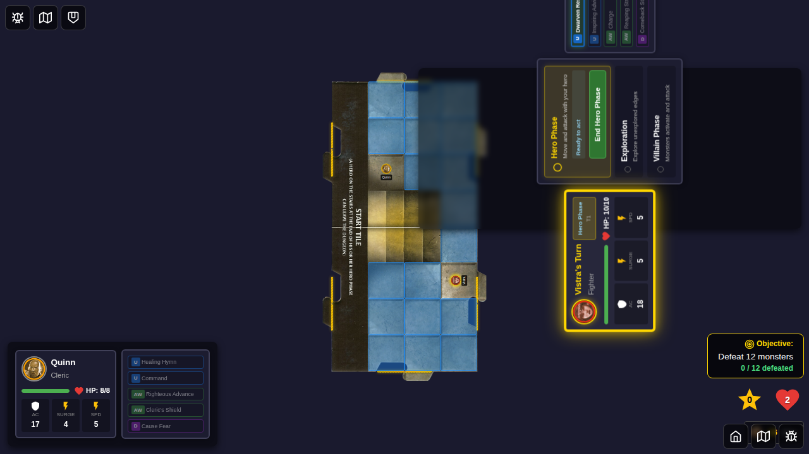
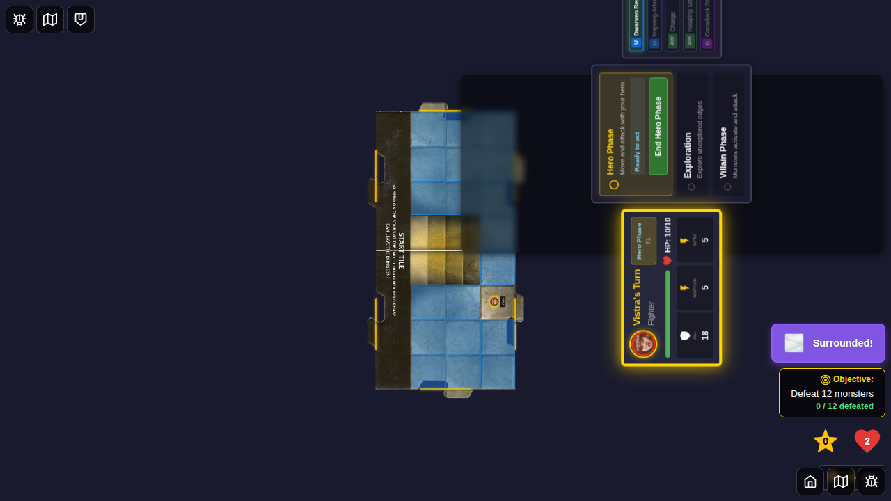
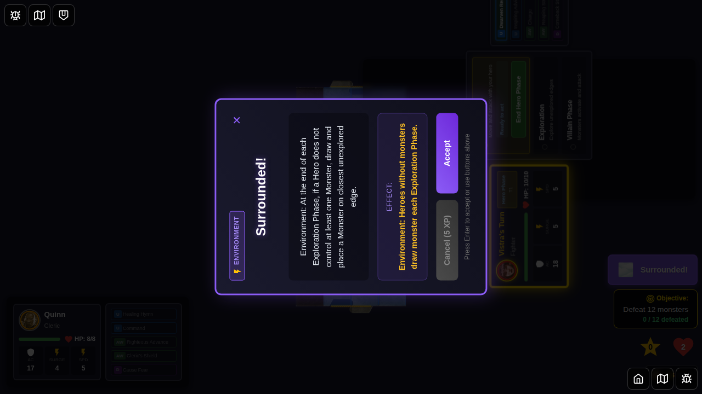
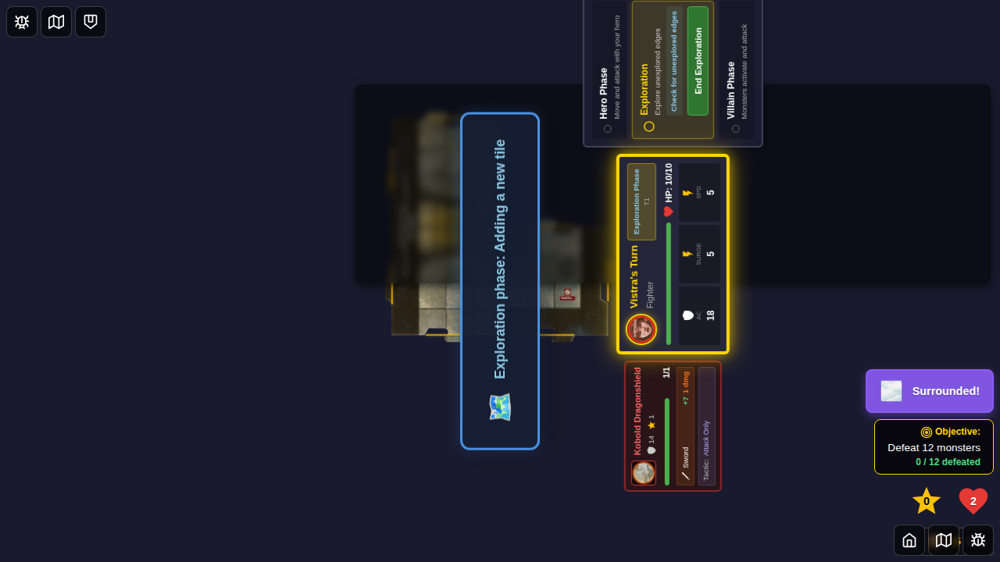
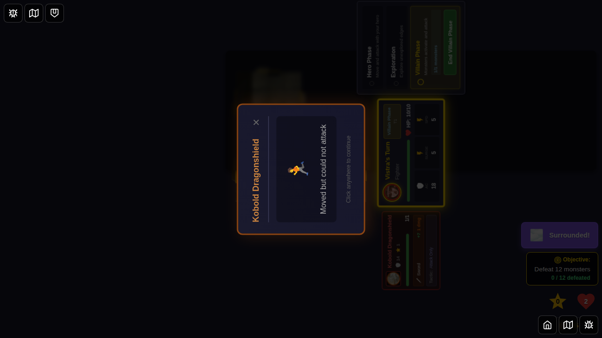

# Test 073: Surrounded Environment Activation

## Purpose

This test verifies that the "Surrounded!" environment card correctly spawns monsters for heroes that don't control at least one monster at the end of each exploration phase. It also tests that the environment indicator is clickable and displays the card detail.

## User Story

As a player, when the "Surrounded!" environment is active, I want:
1. The environment indicator to be visible and clickable
2. Clicking the indicator to show the full card details
3. At the end of each exploration phase, if I don't control at least one monster, a new monster should be drawn and placed on the closest unexplored edge
4. The card detail popup to remain visible until I dismiss it

## Test Scenario

This test demonstrates the complete activation flow of the "Surrounded!" environment:

1. **Character Selection**: Start with character select screen
2. **Game Start**: Select Vistra and start game
3. **Environment Activation**: Programmatically activate "Surrounded!" environment
4. **Environment Indicator Click**: Click the environment indicator to show card details
5. **Exploration Phase**: Progress through hero phase to exploration phase
6. **Monster Spawning**: End exploration phase triggers Surrounded effect if hero has no monsters
7. **Verification**: Confirm monster was spawned and controlled by the hero

## Key Validation Points

- Environment indicator displays "Surrounded!" when environment is active
- Clicking environment indicator shows card detail popup
- Card detail popup displays environment card information
- Card detail popup remains visible until dismissed
- At end of exploration phase, if hero doesn't control a monster, one is spawned
- Spawned monster is controlled by the hero who doesn't have one
- Monster is placed on an unexplored edge

## Test Steps & Screenshots

### Step 1: Character Selection

- Character selection screen
- **Verification**: Character select UI is visible

### Step 2: Game Started - Initial State

- Game board with Vistra positioned on start tile
- No environment indicator visible
- Hero phase active
- **Verification**: 
  - activeEnvironmentId is null
  - currentPhase is 'hero-phase'
  - Environment indicator not visible

### Step 3: Surrounded Environment Active

- "Surrounded!" environment indicator appears in purple badge
- Positioned at top of game state panel
- **Verification**: 
  - activeEnvironmentId is 'surrounded'
  - Environment indicator visible and contains "Surrounded"

### Step 4: Environment Card Detail Shown

- Card detail popup appears after clicking environment indicator
- Shows "Surrounded!" card with full description
- Displays environment type icon and text
- **Verification**: 
  - Encounter card popup visible
  - Contains "Surrounded" text
  - Contains "Environment" label

### Step 5: Exploration Phase Started

- Hero phase ended, exploration phase started
- Card detail dismissed
- **Verification**: 
  - currentPhase is 'exploration-phase'

### Step 6: After Exploration Phase Ended

- Exploration phase ended, villain phase started
- Surrounded effect triggered
- **Verification**: 
  - currentPhase is 'villain-phase'
  - Monster count increased if hero didn't control any monsters before

### Step 7: Surrounded Monster Spawned

- Monster spawned on unexplored edge
- Hero now controls at least one monster
- **Verification**: 
  - Hero controls at least one monster
  - Total monster count matches expectation

## Implementation Notes

- Test uses programmatic Redux dispatch to activate environment (no manual gameplay)
- Validates both visual display and functional behavior of Surrounded environment
- Tests the complete flow: indicator display → card detail → monster spawning
- Verifies that monsters are only spawned for heroes without controlled monsters

## Related Issues

- User Feedback - December 16, 2025 - Surrounded isn't implemented
- Original requirements:
  - Execute at the end of every exploration phase
  - Check which heroes don't control monsters
  - Spawn monster on closest unexplored edge for each such hero
  - Make environment indicator clickable to show card detail
  - Card detail should stay until dismissed

## Game Rules Implementation

The "Surrounded!" environment card states:

> "At the end of each Exploration Phase, if a Hero does not control at least one Monster, draw and place a Monster on closest unexplored edge."

This test verifies all aspects of this rule:
1. Timing: End of exploration phase
2. Condition: Hero must not control at least one monster
3. Action: Draw and place a monster on closest unexplored edge
4. Assignment: Monster is controlled by the hero who needed it
