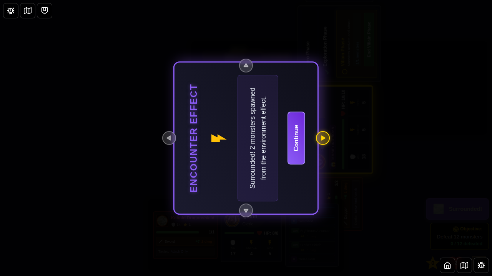
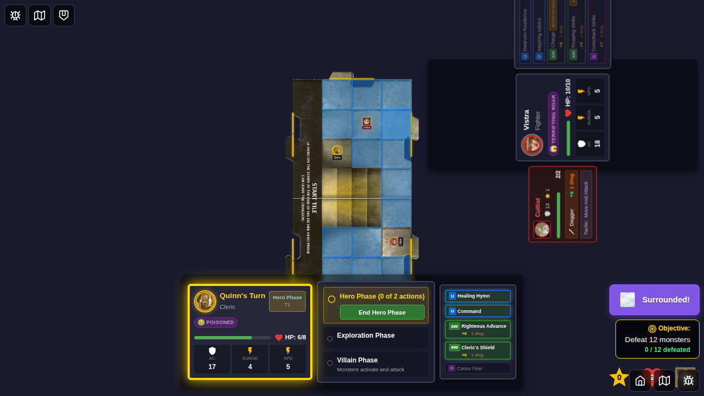

# Test 073: Surrounded Environment Activation

## Purpose

This test verifies that the "Surrounded!" environment card correctly spawns monsters for heroes that don't control at least one monster at the end of each exploration phase. It also tests that the environment indicator is clickable and displays the card detail, and that an informational modal notifies the player when monsters are spawned.

## User Story

As a player, when the "Surrounded!" environment is active, I want:
1. The environment indicator to be visible and clickable
2. Clicking the indicator to show the full card details
3. At the end of each exploration phase, if I don't control at least one monster, a new monster should be drawn and placed on the closest unexplored edge
4. An informational modal to appear notifying me that monsters have been spawned
5. The card detail popup and notification to remain visible until I dismiss them

## Test Scenario

This test demonstrates the complete activation flow of the "Surrounded!" environment with two heroes:

1. **Character Selection**: Start with character select screen
2. **Game Start**: Select Vistra and Quinn (two heroes) and start game
3. **Environment Activation**: Programmatically activate "Surrounded!" environment
4. **Environment Indicator Click**: Click the environment indicator to show card details
5. **Exploration Phase**: Progress through hero phase to exploration phase
6. **Clear Quinn's Monsters**: Ensure Quinn doesn't control any monsters
7. **Surrounded Notification**: End exploration phase triggers notification modal
8. **Villain Phase**: Verify monster was spawned and controlled by Quinn
9. **Final Verification**: Confirm Quinn now controls at least one monster

## Key Validation Points

- Environment indicator displays "Surrounded!" when environment is active
- Clicking environment indicator shows card detail popup
- Card detail popup displays environment card information
- Card detail popup remains visible until dismissed
- At end of exploration phase, if a hero doesn't control a monster, one is spawned
- **Informational notification modal displays when monsters are spawned**
- **Notification shows count of monsters spawned (e.g., "Surrounded! 1 monster spawned...")**
- **Notification faces current player with rotation support**
- **Notification requires manual dismissal**
- Spawned monster is controlled by the hero who doesn't have one
- Monster is placed on an unexplored edge

## Test Steps & Screenshots

### Step 1: Character Selection

- Character selection screen
- **Verification**: Character select UI is visible

### Step 2: Game Started - Initial State (Two Heroes)

- Game board with Vistra and Quinn positioned on start tile
- Two heroes visible in the game
- No environment indicator visible
- Hero phase active
- **Verification**: 
  - activeEnvironmentId is null
  - currentPhase is 'hero-phase'
  - Environment indicator not visible

### Step 3: Surrounded Environment Active

- "Surrounded!" environment indicator appears in purple badge
- Positioned at top of game state panel
- **Verification**: 
  - activeEnvironmentId is 'surrounded'
  - Environment indicator visible and contains "Surrounded"

### Step 4: Environment Card Detail Shown

- Card detail popup appears after clicking environment indicator
- Shows "Surrounded!" card with full description
- Displays environment type icon and text
- **Verification**: 
  - Encounter card popup visible
  - Contains "Surrounded" text
  - Contains "Environment" label

### Step 5: Exploration Phase Started

- Hero phase ended, exploration phase started
- Card detail dismissed
- **Verification**: 
  - currentPhase is 'exploration-phase'

### Step 6: Surrounded Notification Modal Shown

- **Informational modal appears showing "Surrounded!" effect**
- Notification displays "Surrounded! 1 monster spawned from the environment effect."
- Modal has purple/blue gradient with "Encounter Effect" title
- Lightning bolt icon visible
- "Continue" button for dismissal
- **Verification**: 
  - encounterEffectMessage is set and contains "Surrounded"
  - Notification component is visible
  - Message displays correctly with monster count

### Step 7: After Exploration Phase Ended

- Notification dismissed
- Exploration phase ended, villain phase started
- Surrounded effect completed
- **Verification**: 
  - currentPhase is 'villain-phase'
  - Monster count increased from Surrounded effect

### Step 8: Surrounded Monster Spawned

- Monster spawned on unexplored edge
- Quinn (second hero) now controls at least one monster
- **Verification**: 
  - Quinn controls at least one monster
  - Monster placed on closest unexplored edge

## Implementation Notes

- Test uses two heroes (Vistra and Quinn) to ensure Surrounded effect can be properly tested
- Programmatically clears Quinn's monsters before ending exploration to guarantee effect triggers
- Validates both visual display (notification modal) and functional behavior of Surrounded environment
- Tests the complete flow: indicator display → card detail → monster spawning → notification → verification
- Notification modal uses existing EncounterEffectNotification component with rotation support

## Related Issues

- User Feedback - December 16, 2025 - Surrounded isn't implemented
- Original requirements:
  - Execute at the end of every exploration phase
  - Check which heroes don't control monsters
  - Spawn monster on closest unexplored edge for each such hero
  - Make environment indicator clickable to show card detail
  - Card detail should stay until dismissed
  - **Add informational modal to notify player when monsters are spawned**

## Game Rules Implementation

The "Surrounded!" environment card states:

> "At the end of each Exploration Phase, if a Hero does not control at least one Monster, draw and place a Monster on closest unexplored edge."

This test verifies all aspects of this rule:
1. Timing: End of exploration phase
2. Condition: Hero must not control at least one monster
3. Action: Draw and place a monster on closest unexplored edge
4. Assignment: Monster is controlled by the hero who needed it
5. **Notification: Player is informed when monsters are spawned**
