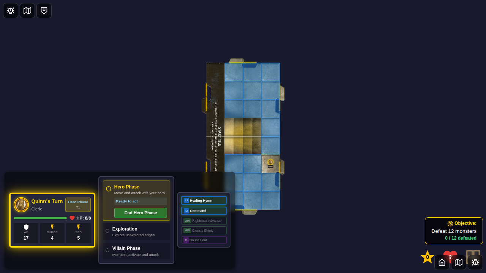
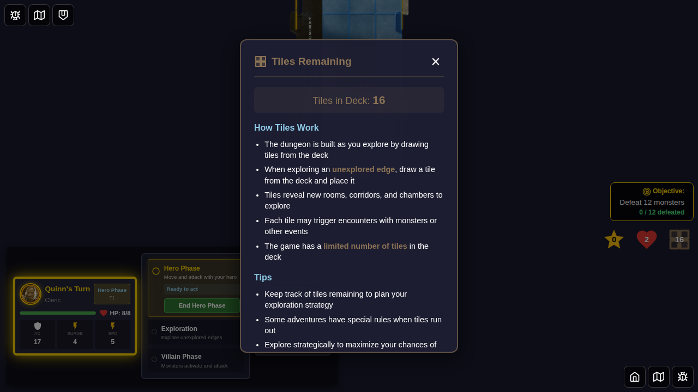
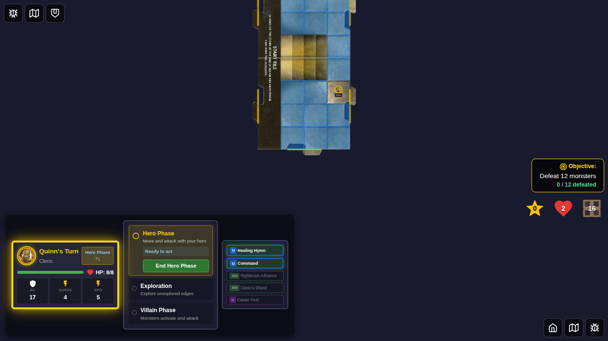

# E2E Test 074 - Tiles Counter Popup

## User Story

> As a player, I want to see the number of tiles remaining displayed as an icon with a badge (similar to XP and Healing Surges), and be able to click it to see detailed information about how tiles work in the game.

## Test Scenario

This test verifies that the tiles counter:
1. Displays as an iconized counter with a numeric badge showing the tile count
2. Is positioned in the party resources area alongside XP and Healing Surges counters
3. Opens a popup modal when clicked, showing detailed information about tiles
4. Can be closed using the close button

## Test Steps

1. Navigate to character selection and select Quinn
2. Start the game with deterministic seed
3. **Verify tiles counter displays as icon with badge**
   - Counter shows as a grid icon with "16" badge
   - Counter is positioned with XP (⭐) and Healing Surges (❤️)
4. **Click tiles counter to open popup**
   - Popup displays with "Tiles Remaining" header
   - Shows current tile count: "Tiles in Deck: 16"
   - Explains how tiles work in the game
   - Provides tips for tile management
5. **Close popup using close button**
   - Popup closes
   - Counter remains visible

## Screenshots

### 074-00: Tiles Counter Icon Displayed

**What to verify:**
- ⭐ XP counter shows "0"
- ❤️ Healing Surges counter shows "2"
- 🔲 Tiles counter shows "16" (NEW iconized format)
- All three counters are grouped together in bottom-right

### 074-01: Tiles Popup Displayed

**What to verify:**
- Popup modal is displayed with grid icon
- Header shows "Tiles Remaining"
- Current count: "Tiles in Deck: 16"
- "How Tiles Work" section explains tile mechanics
- "Tips" section provides strategic advice
- Close button (×) is visible in top-right

### 074-02: Tiles Popup Closed

**What to verify:**
- Popup is no longer visible
- Tiles counter icon remains visible
- Game board is fully visible again

## Verification Checklist

- [x] Tiles counter displays as icon with numeric badge (similar to XP/Healing Surges)
- [x] Counter is positioned in party resources container
- [x] Counter shows correct tile count (16)
- [x] Clicking counter opens popup modal
- [x] Popup displays "Tiles Remaining" header
- [x] Popup shows current tile count
- [x] Popup explains how tiles work (exploration mechanics)
- [x] Popup includes tips section
- [x] Close button closes the popup
- [x] Counter remains visible after popup closes
- [x] All programmatic checks verify Redux store state

## Related Features

- Party resources display (XP, Healing Surges, Tiles)
- Icon-based counter pattern
- Popup modal interaction
- Game information tooltips

## Notes

- This test demonstrates the new iconized tiles counter feature
- The counter matches the visual style of XP and Healing Surges counters
- The popup provides educational content about tile mechanics
- Test uses deterministic game initialization for consistent screenshots
