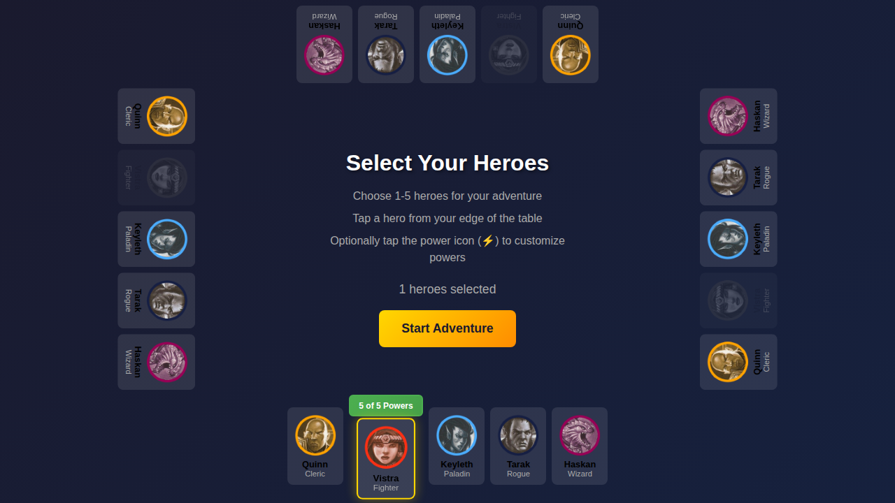
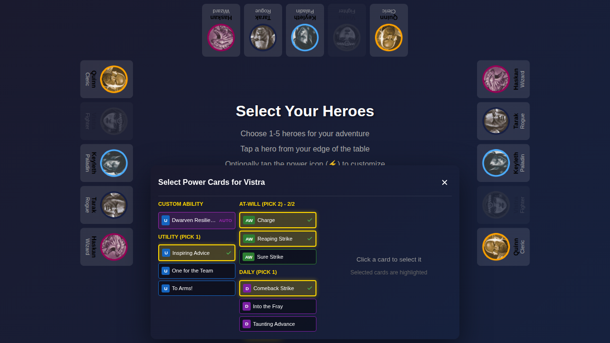

# E2E Test 075 - Power Selection UX

## User Story

As a player selecting heroes in the lobby screen, I want an improved power selection UX so that:
1. I can see the exact power count (e.g., "5 of 5 Powers") instead of just a checkmark
2. I can click on any power card to select it, even when at max capacity (which will auto-swap)
3. I can close the power selection modal using only the X button (Done button removed as redundant)

## Test Flow

This test validates the three key UX improvements to power selection:

### 1. Initial Screen

- Character selection screen is displayed
- Start game button is disabled (no heroes selected)

### 2. Hero Selected - Power Count Display

- Vistra (Fighter) is selected from the bottom edge
- **NEW**: Power button shows "5 of 5 Powers" instead of "✓ Powers Selected"
- **NEW**: Tooltip "Click to change powers" appears on hover
- Start button is enabled (powers are auto-selected)

### 3. Power Modal Opened - All Powers Clickable

- Power selection modal is opened
- Custom ability (Dwarven Resilience) is displayed
- At-Will section shows "2/2" powers selected
- **NEW**: All at-will powers are clickable (no disabled state), including the third power

### 4. Power Swapped - Auto-Swap Behavior

- **NEW**: Clicking an unselected at-will power auto-deselects the first selected power
- Still exactly 2 at-will powers are selected after the swap
- This allows players to easily try different power combinations

### 5. No Done Button

- **NEW**: Done button is removed (redundant with X button)
- Close button (X) is present in the modal header
- Players can click X to close the modal

### 6. Modal Closed

- Modal is closed
- Power count still shows "5 of 5 Powers"
- Start button remains enabled

## Verification Checklist

Manual verification should confirm:

- [ ] Power button text shows "X of 5 Powers" format
- [ ] Tooltip "Click to change powers" appears on hover
- [ ] All power cards are clickable in the modal (no disabled state)
- [ ] Clicking an unselected at-will when at 2/2 capacity auto-deselects the first selected power
- [ ] Done button is not present in the power selection modal
- [ ] X button closes the modal successfully
- [ ] Power count updates correctly as powers are selected/deselected

## Related Requirements

This test addresses the following requirements from issue:
1. Show "5 of 5 Powers" instead of "✓ Powers Selected" with tooltip on hover
2. All powers clickable at capacity with auto-swap behavior (deselect topmost power)
3. Remove redundant Done button (use X button instead)
