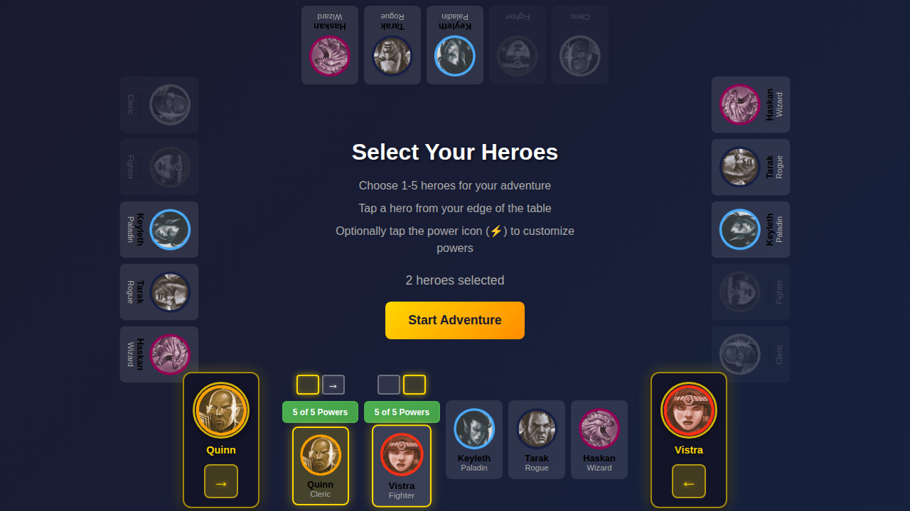
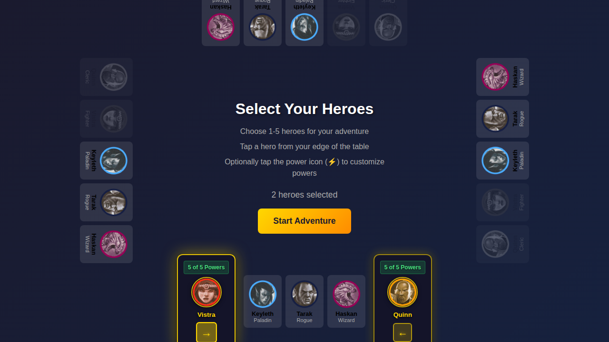

# 076 - Duplicate Character Panels

## User Story

**As players at a tabletop**, when two of us select heroes from the same side of the screen, we want to see prominent duplicate character panels on either side of the hero selection row, clearly showing which hero is positioned on which side, with easy-to-use arrows to swap our positions.

## Test Flow

This test verifies the duplicate character panel feature for multi-player on the same edge:

1. Navigate to character selection screen - no duplicate panels initially
2. Select first hero (Quinn) from bottom edge - no duplicate panels yet (only 1 hero)
3. Select second hero (Vistra) from bottom edge - duplicate panels appear, original cards hidden
4. Click swap arrow to swap their positions - panels update to show new positions

## Screenshots

### Step 1: Initial Character Selection Screen

The player sees all 5 available heroes at each edge of the screen. No duplicate panels are visible.

### Step 2: One Hero Selected - No Duplicate Panels

After selecting Quinn from the bottom edge, the hero is highlighted with a power selection button, but no duplicate panels appear (only 1 hero on this edge).

### Step 3: Two Heroes Selected - Duplicate Panels Appear

After selecting Vistra from the bottom edge, duplicate character panels appear on the left and right sides of the hero row. The original hero cards for Quinn and Vistra are hidden. Quinn's panel shows on the left with "5 of 5 Powers" at the top and a right arrow (→), and Vistra's panel shows on the right with "5 of 5 Powers" and a left arrow (←).

### Step 4: Positions Swapped

After clicking Quinn's swap arrow, the positions swap. Vistra's panel is now on the left with "5 of 5 Powers" and a left arrow (←), and Quinn's panel is on the right with "5 of 5 Powers" and a right arrow (→).

## Verification Checklist

- [x] Duplicate panels only appear when 2+ heroes are on the same edge
- [x] Original hero cards are hidden when duplicate panels appear
- [x] Panels are not shown when only 1 hero is selected on an edge
- [x] Each panel shows "X of 5 Powers" count at the top
- [x] Each panel shows hero portrait and name
- [x] Hero images are smaller (64px) compared to original panels
- [x] Panels are positioned on left and right sides of the hero row
- [x] Left-side panel shows right arrow (→) for swapping
- [x] Right-side panel shows left arrow (←) for swapping
- [x] Arrow buttons are smaller (40px) compared to original
- [x] Clicking arrow swaps side preferences for both heroes
- [x] Panels update to reflect new positions after swap
- [x] Panels disappear and original cards reappear when number of heroes on edge drops below 2
- [x] Panels have attractive golden borders matching the game theme
- [x] Power count displays in green badge at top of panel

## Redux State Verification

The test verifies Redux store state at each step:

1. **Initial**: No heroes selected, no duplicate panels
2. **One hero**: `heroes.selectedHeroes` contains Quinn, no duplicate panels
3. **Two heroes**: `heroes.selectedHeroes` contains [Quinn, Vistra], `heroes.heroSidePreferences` shows `{ quinn: 'left', vistra: 'right' }`, duplicate panels visible
4. **After swap**: `heroes.heroSidePreferences` shows `{ quinn: 'right', vistra: 'left' }`, panels swapped
5. **One hero again**: `heroes.selectedHeroes` contains only Quinn, no duplicate panels

## Accessibility

The duplicate character panels include:
- ARIA labels on swap buttons: `"Swap {heroName} to {oppositeSide} side"`
- Proper button semantics for keyboard navigation
- Visual feedback on hover and active states
- Clear visual indicators of current side positioning

## Design Notes

The duplicate character panels feature:
- **Position**: Absolutely positioned on left (-140px) and right (-140px) of hero row
- **Hero Portrait**: 64px circular image (reduced from 80px for better fit)
- **Arrow Buttons**: 40px square buttons (reduced from 48px)
- **Power Count**: Green badge at top showing "X of 5 Powers"
- **Colors**: Golden borders (#FFD700) on dark background (rgba(20, 20, 40, 0.95))
- **Effects**: Box shadow with golden glow, hover scale effect
- **Rotation**: Properly rotated for each screen edge (0°, 90°, 180°, 270°)
- **Behavior**: Original hero cards are hidden when panels appear (2+ heroes on same edge)
