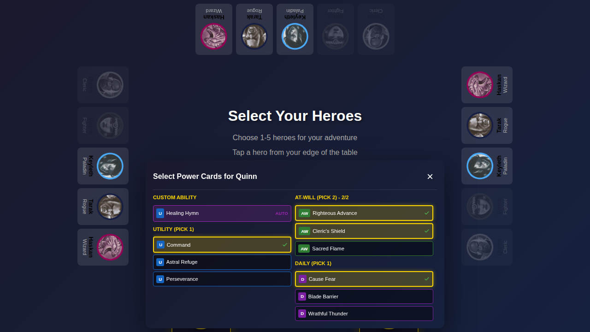
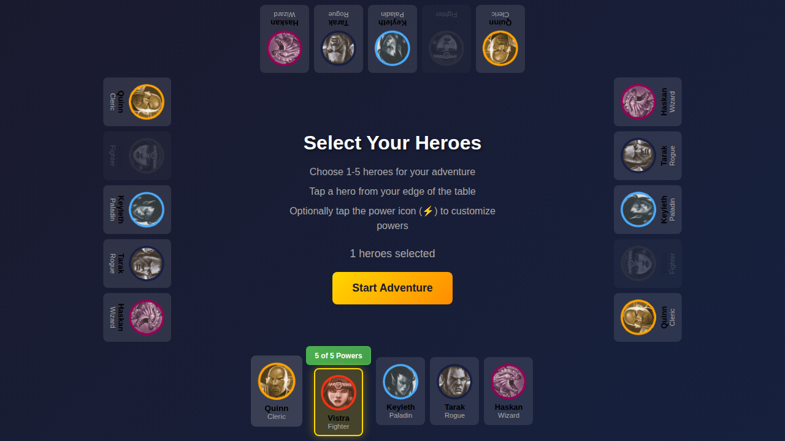
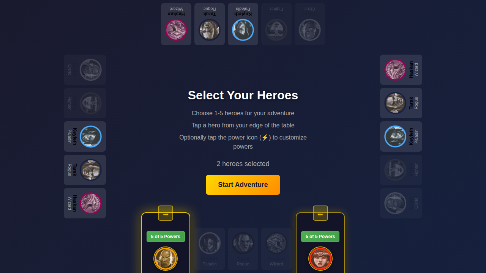

# 077 - Lobby Two Character Interaction

## User Story

**As players at a tabletop**, when two of us select heroes from the same edge of the screen, we want to:
1. Click the power button on the duplicate character panel to modify our powers
2. Click on the character image to deselect that hero
3. Be prevented from selecting a third hero on the same edge (which would break the system)

## Test Flow

This test verifies the interactive elements of the duplicate character panels:

1. Navigate to character selection screen
2. Select two heroes (Quinn and Vistra) from the bottom edge - duplicate panels appear
3. Click the power button on Quinn's panel - power selection modal opens
4. Close the power modal - modal closes and panels remain
5. Click on Quinn's character image - Quinn is deselected, panels disappear
6. Re-select Quinn - verify third hero selection is disabled

## Screenshots

### Step 1: Initial Character Selection Screen

The player sees all 5 available heroes at each edge of the screen.

### Step 2: Two Heroes Selected - Duplicate Panels with Interactive Elements

After selecting Quinn and Vistra from the bottom edge, duplicate character panels appear with:
- **Power button** (green "5 of 5 Powers") - clickable to open power selection
- **Character image with name** - clickable to deselect the hero
- **Swap arrow** - to swap positions
- **Third heroes disabled** - Keyleth, Tarak, and Haskan are grayed out and disabled

### Step 3: Power Modal Opened from Panel Button

Clicking the power button opens the power selection modal for that hero.

### Step 4: Power Modal Closed

After closing the modal with the X button, the duplicate panels remain visible.

### Step 5: Hero Deselected by Clicking Character

Clicking on Quinn's character image deselects that hero:
- Duplicate panels disappear (only 1 hero on edge)
- Quinn becomes available again
- Other heroes (Keyleth, Tarak, Haskan) become enabled
- Vistra's power button appears above the card

### Step 6: Third Hero Disabled

After re-selecting Quinn, the remaining heroes (Keyleth, Tarak, Haskan) are disabled and cannot be selected.

## Verification Checklist

- [x] Power button appears in duplicate character panels
- [x] Clicking power button opens power selection modal
- [x] Power selection modal can be closed with X button
- [x] Character image in panel is clickable for deselection
- [x] Clicking character image deselects that hero
- [x] Duplicate panels disappear when only 1 hero remains on edge
- [x] Third hero selection is disabled when 2 heroes on same edge
- [x] Disabled heroes are visually grayed out
- [x] Disabled hero cards cannot be clicked
- [x] Character name is displayed in the panel
- [x] Power count shows "5 of 5 Powers" format
- [x] All interactive elements work across all four edges

## Requirements Addressed

This test verifies the following requirements:

1. **Power button in panel**: Tapping the power button allows players to modify their powers
2. **Character deselection**: Tapping on the character image deselects that player
3. **Third player disabled**: Clicking on a third player is disabled (prevents system breakage)
4. **Character name in panel**: ✓ Already implemented and verified

## Design Notes

The duplicate character panels now include:
- **Power Button**: Styled like the power button above single hero cards (green when complete, orange otherwise)
- **Deselect Button**: Character image area is clickable with hover effect (red highlight) to indicate deselection
- **Visual Feedback**: Hover states provide clear indication of clickable areas
- **Disabled State**: Third hero cards are grayed out and disabled when 2 heroes already on edge
- **Character Name**: Displayed below the hero portrait in golden text
