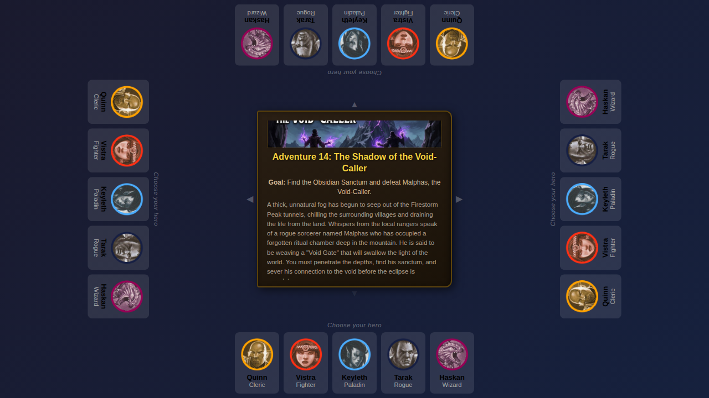
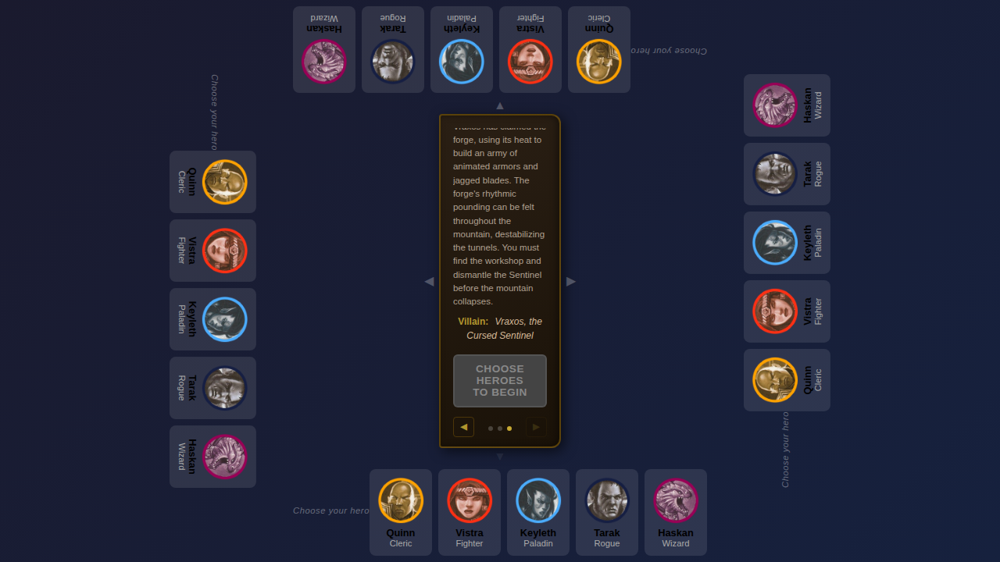
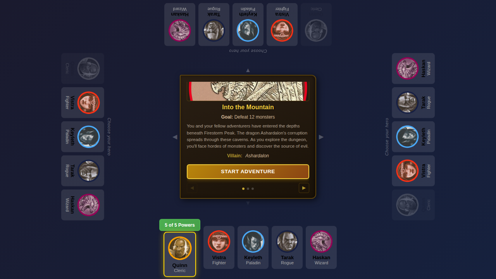
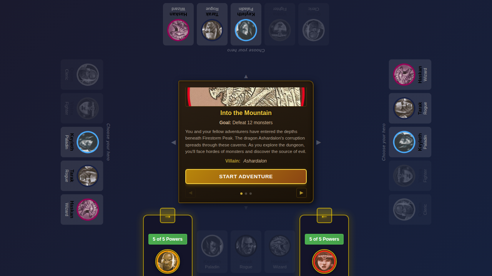
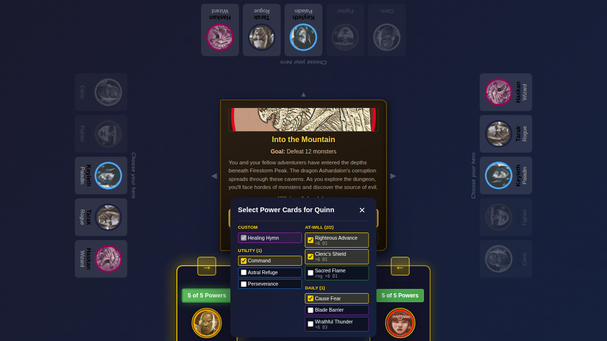
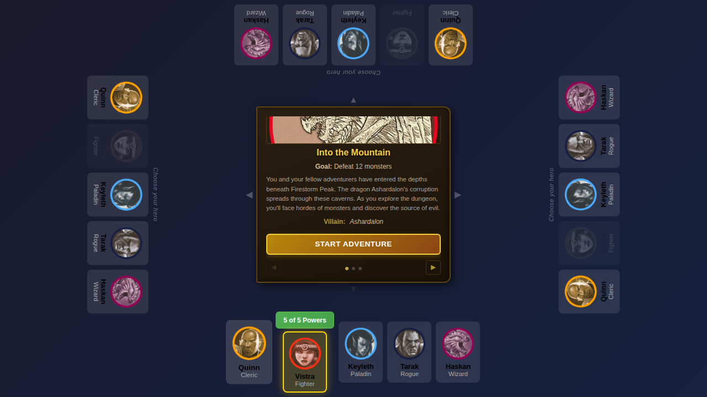

# 077 - Lobby Scenario Book & Two Character Interaction

## User Story

**As players at a tabletop**, we want to:
1. See a scenario "book" in the center of the lobby so we can browse and select an adventure
2. See a "Choose your hero" label above each hero line that disappears once we've picked our hero
3. Interact with two-player character panels (power selection, deselection)

## Test Flow

1. Navigate to character selection — scenario book is visible, "Choose your hero" on all four edges
2. Navigate to Adventure 14 (next page) — title/villain/Redux state updated
3. Navigate to Adventure 15 (last page) — next button disabled
4. Navigate back to default scenario
5. Select Quinn from bottom edge — "Choose your hero" label disappears on bottom edge only
6. Select Vistra (second hero, same edge) — duplicate panels appear, third hero disabled
7. Open Quinn's power selection modal from the panel button, then close it
8. Deselect Quinn via the duplicate panel — panels disappear, Quinn re-enabled

## Screenshots

### Step 1: Initial Lobby – Scenario Book Centered

All four edges show "Choose your hero". The scenario book shows *Into the Mountain* with villain Ashardalon, and the start button is disabled.

### Step 2: Adventure 14 Selected in Book

Navigating forward shows Adventure 14 data (Malphas, the Void-Caller).

### Step 3: Adventure 15 (Last Page)

Next button is disabled on the last page.

### Step 4: Hero Selected – "Choose Your Hero" Label Hidden on Bottom Edge

After selecting Quinn, the label disappears on the bottom edge but remains on the other three.

### Step 5: Two Heroes Selected – Duplicate Panels

Both Quinn and Vistra show duplicate panels. Third hero is disabled.

### Step 6: Power Modal Opened

Clicking the power button in the duplicate panel opens power selection.

### Step 7: Hero Deselected

After deselecting Quinn, all heroes re-enabled on the bottom edge.

## Verification Checklist

- [x] Scenario book is visible in lobby center (no static title text)
- [x] Scenario book navigation works (prev/next)
- [x] Correct scenario metadata shown per page (title, goal, villain)
- [x] Redux `selectedScenarioId` updates when navigating
- [x] Prev disabled on first page, next disabled on last page
- [x] Start button disabled until heroes are ready
- [x] "Choose your hero" label visible on all edges initially
- [x] Label disappears on an edge when a hero is selected there
- [x] Labels on other edges remain visible
- [x] Power button in duplicate panel opens power selection modal
- [x] Deselect button removes hero and collapses duplicate panels
- [x] Third hero disabled when two heroes on same edge
