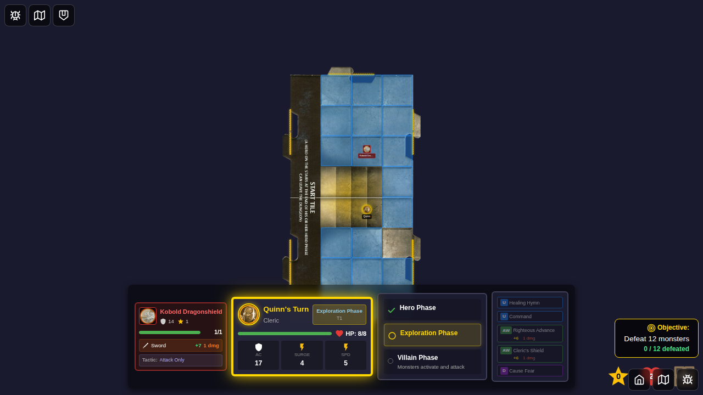
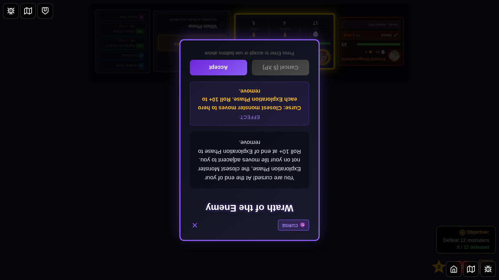
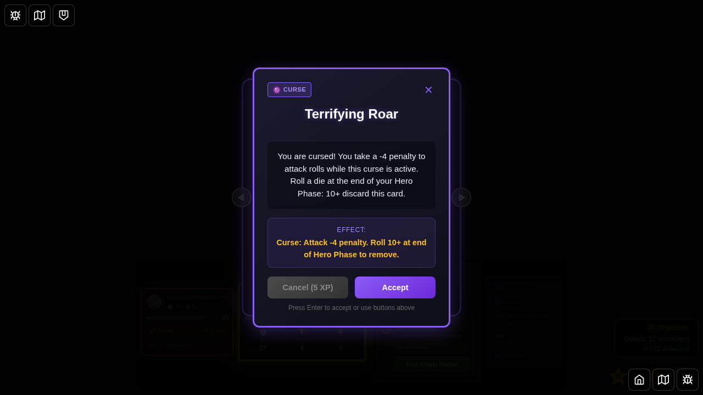

# 078 - Wrath of the Enemy Curse Mechanical Effect

## User Story

As a player who receives the "Wrath of the Enemy" curse, I want the closest monster not on my tile to move adjacent to me at the end of Exploration Phase, so that the curse has actual mechanical impact on gameplay beyond just displaying text.

## Test Scenario

This E2E test demonstrates that:
1. The Wrath of the Enemy curse card applies a status effect to the hero
2. At the end of Exploration Phase, the curse triggers its mechanical effect
3. The closest monster NOT on the hero's tile moves adjacent to the cursed hero
4. The curse effect works with the existing monster movement AI

## Test Steps & Screenshots

### Step 1: Character Selection

- Character selection screen displayed
- Quinn is available for selection from bottom edge (for text orientation towards viewer)
- **Verification**: Character select UI is visible

### Step 2: Game Setup - Monster on Different Tile

- Quinn positioned on start tile at (2, 4)
- Adjacent tile-1 placed to the east
- Kobold monster spawned on tile-1 (different tile from Quinn)
- **Verification**: Quinn is on start-tile, monster is on tile-1

### Step 3: Wrath of the Enemy Curse Displayed

- Encounter card "Wrath of the Enemy" is displayed
- Card shows curse description about monster movement
- Card type is identified as "curse"
- **Verification**: Encounter card visible with correct description

### Step 4: Curse Applied to Quinn

- Encounter card dismissed after acceptance
- Curse effect applied to Quinn
- **Verification**: Quinn now has `curse-wrath-of-enemy` status effect in statuses array

### Step 5: Monster Moved Adjacent After Exploration Phase

- Exploration phase ended
- Curse effect triggered automatically
- Monster moved closer/adjacent to Quinn
- **Verification**: Monster position changed to be adjacent or very close to Quinn (distance <= 2)

## Key Mechanics Tested

### Wrath of the Enemy Curse
- ✅ Curse applies as status effect when encounter card is accepted
- ✅ Curse is tracked in hero's `statuses` array with type `curse-wrath-of-enemy`
- ✅ At end of Exploration Phase, curse triggers mechanical effect
- ✅ Effect finds closest monster NOT on hero's tile
- ✅ Monster moves adjacent to cursed hero using existing AI pathfinding
- ✅ Multiple tiles and monster positions are handled correctly

### Expected Mechanical Behavior
1. **Trigger Timing**: End of Exploration Phase (before Villain Phase)
2. **Monster Selection**: Finds closest monster using Manhattan distance that is NOT on hero's tile
3. **Movement**: Uses `findPositionAdjacentToHero` from monsterAI to find valid adjacent position
4. **Validation**: Monster must end up adjacent (distance = 1) or very close to hero

## Manual Verification Checklist

- [ ] Curse card displays with correct description
- [ ] Accepting curse applies status effect to active hero
- [ ] Status effect persists in hero state
- [ ] At end of Exploration Phase, monster moves toward/adjacent to cursed hero
- [ ] Monster does not move if already on hero's tile
- [ ] Monster does not move if no valid adjacent position exists
- [ ] Curse effect works with multiple monsters (selects closest)
- [ ] Game transitions properly to Villain Phase after curse effect triggers

## Implementation Details

**Implementation File**: `src/store/gameSlice.ts` (endExplorationPhase reducer)

**New Functions**:
- `findClosestMonsterNotOnTile()` in `src/store/monsterAI.ts` - Finds closest monster NOT on hero's tile using Manhattan distance

**Effect Trigger Location**: 
- Triggered in `endExplorationPhase` after Surrounded! environment check
- Loops through all heroes checking for `curse-wrath-of-enemy` status
- For each cursed hero, finds closest monster and moves it adjacent

**Limitations**:
- None - all card mechanics are now fully implemented
  - ✅ Roll 10+ to remove curse is implemented
  - ✅ Notification shown when monster can't move to valid adjacent position
  - ✅ Notification shown when no monster is found off-tile

## Cards Made Functional

**Wrath of the Enemy** - Now fully implements the monster movement mechanic
