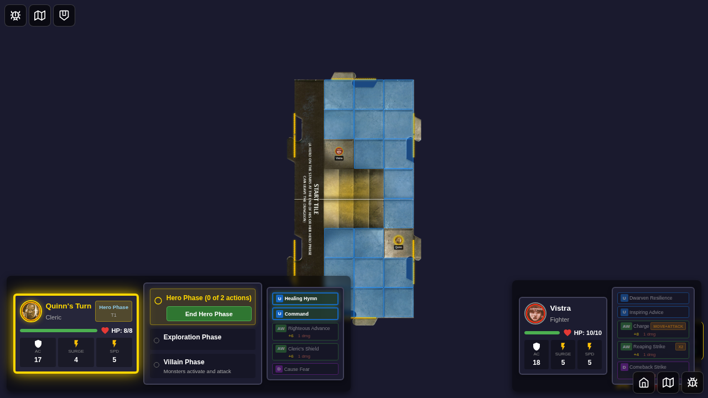
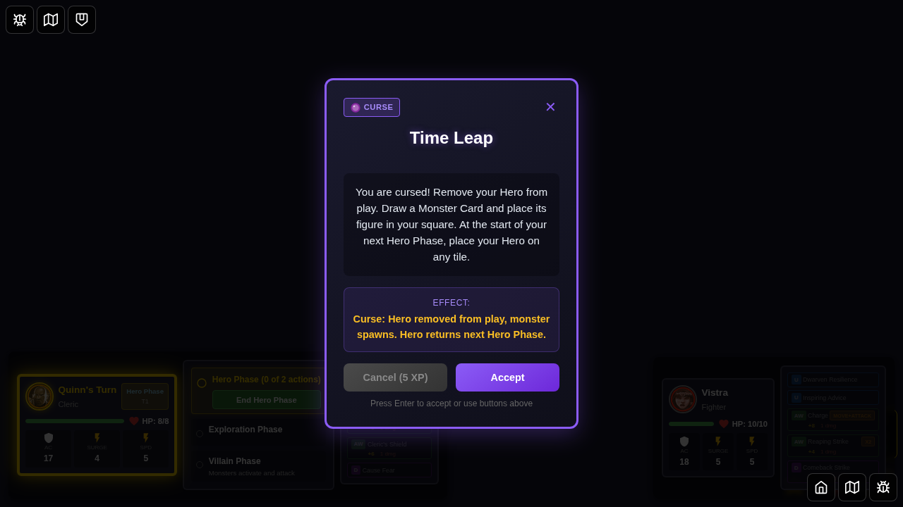
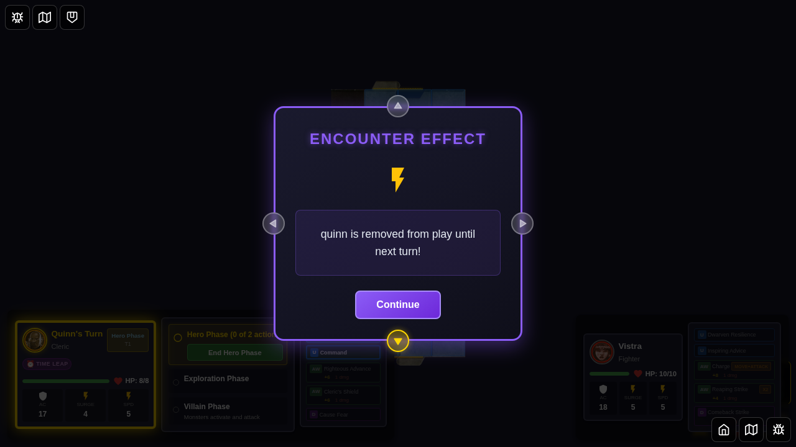
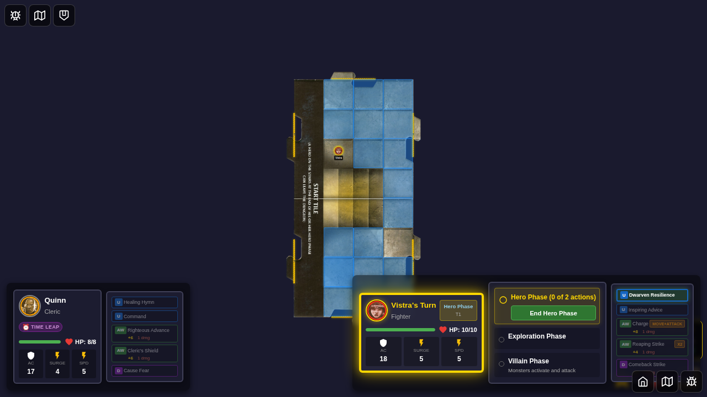
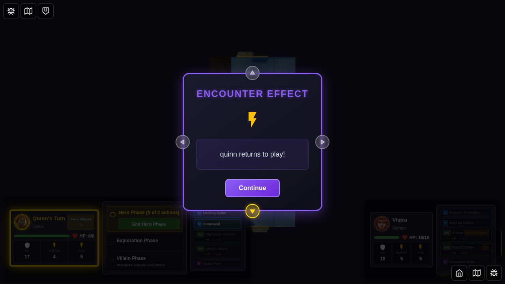
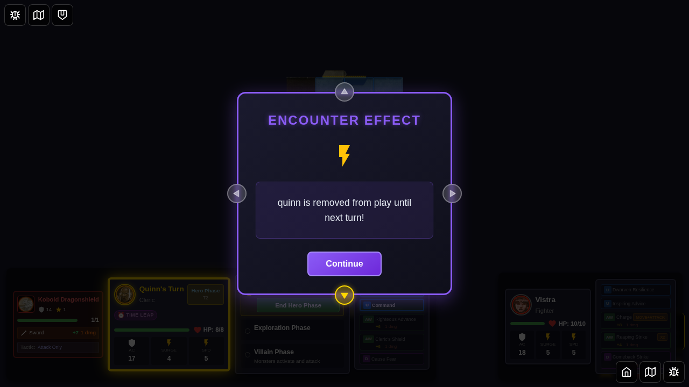

# 079 - Time Leap Curse Mechanical Effect

## User Story

As a player who receives the "Time Leap" curse, I want to be removed from play for one full turn cycle and then automatically restored at the start of my next turn, so that the curse has actual mechanical impact beyond just displaying text.

## Test Scenario

This E2E test demonstrates that:
1. The Time Leap curse card applies a status effect to the hero
2. The hero is immediately marked as `removedFromPlay`
3. The hero remains removed during other heroes' turns
4. At the start of the hero's next turn, they are automatically restored
5. The Time Leap curse status is removed upon restoration
6. Monsters ignore removed heroes when selecting targets

## Test Steps & Screenshots

### Step 1: Character Selection

- Character selection screen displayed
- Ready to select heroes from bottom edge
- **Verification**: Character select UI is visible

### Step 2: Two Heroes Selected

- Quinn and Vistra selected from bottom edge
- Power cards automatically pre-selected
- Ready to start game
- **Verification**: 2 heroes are selected

### Step 3: Game Started - Quinn's Turn

- Game board is displayed
- It's Quinn's turn (hero index 0)
- Start tile and heroes are positioned
- **Verification**: Quinn is the current hero

### Step 4: Time Leap Curse Displayed

- Encounter card "Time Leap" is displayed
- Card shows curse description about removal from play
- Card type is identified as "curse"
- **Verification**: Encounter card visible with "Time Leap" text

### Step 5: Curse Applied - Quinn Removed from Play (Notification Shown)

- Encounter card dismissed after acceptance
- Curse effect applied to Quinn
- Encounter effect notification displayed showing removal message
- Quinn is now marked as removed from play
- **Verification**: 
  - Quinn has `removedFromPlay = true`
  - Quinn has `curse-time-leap` status effect
  - Notification visible with "removed from play" message

### Step 6: Vistra's Turn - Quinn Still Removed

- Encounter effect notification dismissed
- Turn advanced to Vistra (hero index 1)
- Quinn remains removed from play
- **Quinn's hero token is hidden from the map** (removed from play UI)
- Game continues normally for active heroes
- Vistra's player panel is now the active one
- **Verification**: 
  - Current hero is Vistra
  - Quinn still has `removedFromPlay = true`
  - No notification popup is visible
  - Quinn's token is not visible on the map

### Step 7: Quinn's Turn Returns - Curse Removed

- Turn cycled back to Quinn (hero index 0)
- Quinn automatically restored to play
- Time Leap curse removed from status effects
- Notification message shows restoration
- **Verification**: 
  - Current hero is Quinn
  - Quinn has `removedFromPlay = false`
  - Quinn no longer has `curse-time-leap` status
  - Encounter effect message contains "returns to play"

### Step 8: Monster Targeting Verification

- Time Leap curse applied to Quinn again
- Encounter effect notification dismissed
- Monster spawned on board
- **Quinn's hero token is hidden from the map** (removed from play UI)
- Filtering logic excludes Quinn from targeting
- **Verification**: 
  - Quinn has `removedFromPlay = true`
  - Monster exists on board
  - Only Vistra is in the active hero tokens list (Quinn filtered out)
  - Quinn's token is not visible on the map
  - No notification popup is visible

## Key Mechanics Tested

### Time Leap Curse
- ✅ Curse applies as status effect when encounter card is accepted
- ✅ Hero is immediately marked with `removedFromPlay = true`
- ✅ Curse is tracked in hero's `statuses` array with type `curse-time-leap`
- ✅ Hero remains removed through other heroes' turns
- ✅ **Hero token is hidden from the map while removed** (UI feedback)
- ✅ At start of hero's next turn, restoration is automatic
- ✅ `removedFromPlay` flag is cleared
- ✅ `curse-time-leap` status is removed
- ✅ Restoration notification is displayed
- ✅ Monsters ignore removed heroes during targeting
- ✅ **Hero token reappears on map when restored**

### Expected Mechanical Behavior
1. **Application**: When curse card is dismissed, hero gets `removedFromPlay = true` and `curse-time-leap` status
2. **Duration**: Hero stays removed for the entire turn cycle (through all other heroes' turns)
3. **Restoration**: At `endVillainPhase` when cycling to hero's turn, automatic restoration occurs
4. **Monster Targeting**: During `activateMonster`, removed heroes are filtered out before passing to AI
5. **UI**: Hero token is hidden from the map when removed, reappears when restored

## Manual Verification Checklist

- [x] Curse card displays with correct description
- [x] Accepting curse applies status effect to active hero
- [x] Hero is marked as removed from play
- [x] Status effect persists through other heroes' turns
- [x] At start of hero's next turn, automatic restoration occurs
- [x] Curse status is removed upon restoration
- [x] Notification message shows restoration
- [x] Monsters cannot target removed heroes
- [x] Game transitions properly through turn phases

## Implementation Details

**Implementation Files**:
- `src/store/types.ts` - Added `removedFromPlay?: boolean` to `HeroHpState`
- `src/store/gameSlice.ts` - Modified `dismissEncounterCard` and `endVillainPhase` reducers
- `src/store/gameSlice.ts` - Modified `activateMonster` to filter removed heroes

**Key Changes**:
1. **Curse Application** (`dismissEncounterCard`):
   - Detects Time Leap curse by ID
   - Sets `removedFromPlay = true` when curse is applied
   - Displays notification

2. **Hero Restoration** (`endVillainPhase`):
   - Checks if current hero has `removedFromPlay = true` and `curse-time-leap` status
   - Clears `removedFromPlay` flag
   - Removes `curse-time-leap` status effect
   - Displays restoration notification
   - Preserves flag through status effect processing

3. **Monster Targeting** (`activateMonster`):
   - Filters hero tokens to exclude those with `removedFromPlay = true`
   - Passes filtered list to `executeMonsterTurn`

4. **UI Rendering** (`GameBoard.svelte`):
   - Hero tokens with `removedFromPlay = true` are hidden from the map
   - Token reappears when hero is restored

**Effect Trigger Locations**: 
- **Application**: `dismissEncounterCard` in hero phase
- **Restoration**: `endVillainPhase` at start of hero's turn
- **Targeting Filter**: `activateMonster` during villain phase
- **UI Rendering**: `GameBoard.svelte` hero token rendering

**Bug Fixed**:
- Initial implementation overwrote `removedFromPlay` flag during status processing
- Fixed by preserving the flag explicitly when updating hero state

## Limitations

- **UI Panel Indication**: Hero's player panel doesn't show a visual marker
  - Panel doesn't have a "removed from play" indicator (similar to downed indicator)
  - Hero's name and stats remain visible in their panel
  - This is a minor limitation - the map correctly hides the token
  - Future enhancement could add visual indicator on the panel

## Cards Made Functional

**Time Leap** - Now fully implements the hero removal and restoration mechanic:
- ✅ Hero removed from play when curse is applied
- ✅ Hero restored at start of next turn
- ✅ Curse status automatically removed
- ✅ Monsters ignore removed heroes
