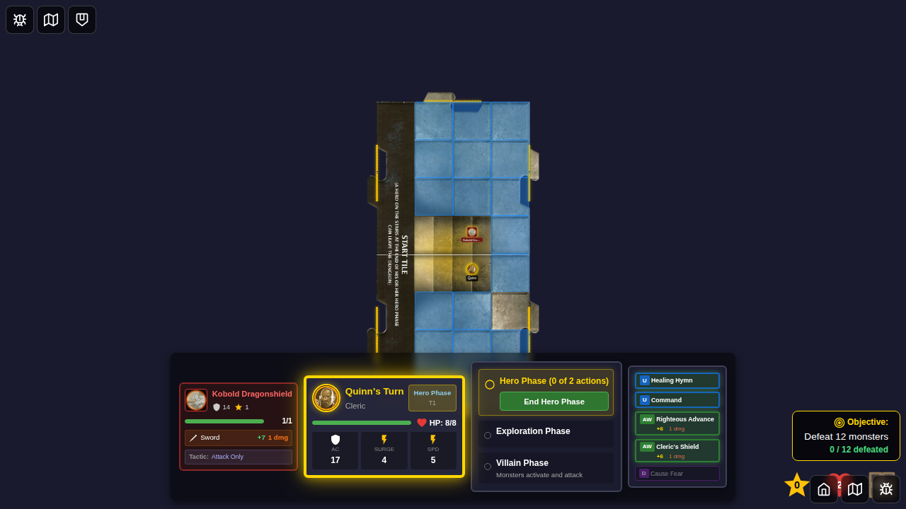
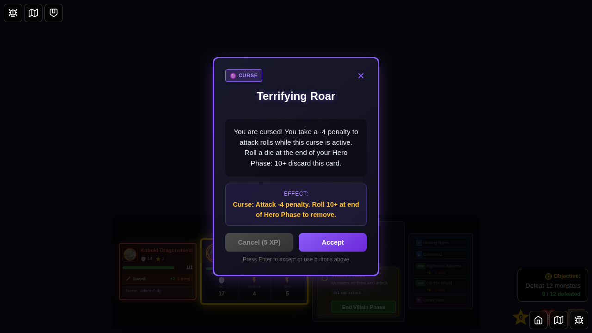
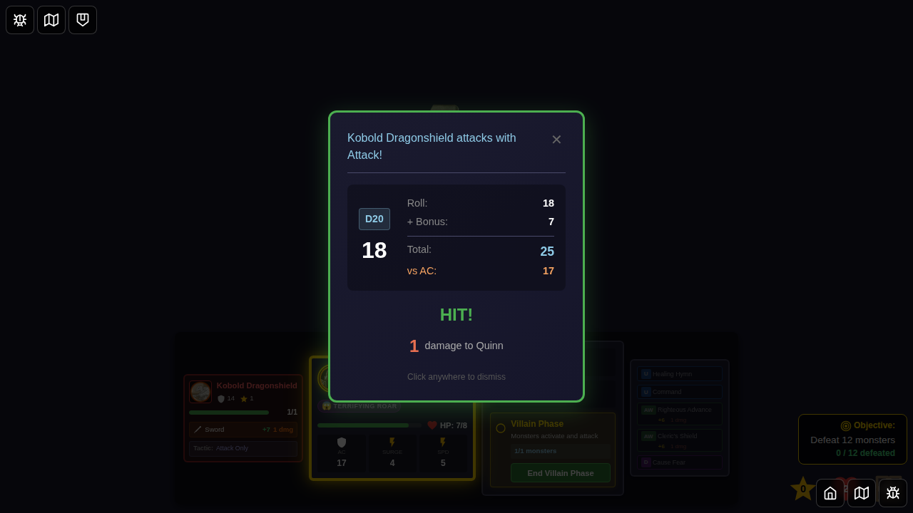
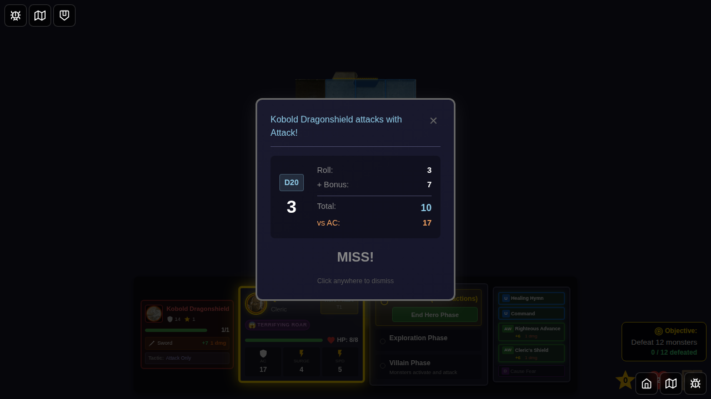

# Test 080 - Terrifying Roar Curse Mechanical Effect

## User Story

As a player who encounters the "Terrifying Roar" curse card, I want the curse to mechanically apply an Attack -4 penalty to my hero so that combat difficulty accurately reflects the curse's debilitating effect.

## Test Scenario

This test validates that the Terrifying Roar curse:
1. Can be drawn and applied to a hero as a status effect
2. Reduces the hero's attack bonus by 4 points when attacking monsters
3. Persists as a visible status icon on the hero
4. Correctly integrates with the attack resolution system

## Screenshot Sequence

### 000 - Character Select Screen

**User Action:** Player navigates to the game and sees the character selection screen.
**Expected State:** Character selection screen is visible with available heroes.

### 001 - Game Setup with Monster Adjacent

**User Action:** Game starts with Quinn positioned on the start tile with a Kobold monster adjacent.
**Expected State:** 
- Quinn is at position (2, 4)
- Kobold monster is at position (2, 3), adjacent to Quinn
- Game is in hero phase

### 002 - Quinn Without Curse

**User Action:** Initial state before curse is applied.
**Expected State:**
- Quinn has base attack bonus of +6 (level 1)
- No curse status effects present
- Hero panel shows normal status

### 003 - Terrifying Roar Curse Card Displayed

**User Action:** During villain phase, the Terrifying Roar encounter card is drawn.
**Expected State:**
- Encounter card modal displays "Terrifying Roar"
- Card shows curse type and description
- Accept button is available

### 004 - Curse Applied to Quinn

**User Action:** Player accepts the curse encounter.
**Expected State:**
- Curse status effect is added to Quinn's status list
- Status type is 'curse-terrifying-roar'
- Source is 'terrifying-roar'
- Encounter card is dismissed

### 005 - Ready to Attack with Curse

**User Action:** Game transitions back to hero phase with Quinn able to act.
**Expected State:**
- Current phase is hero-phase
- Quinn's actions are reset (can move and attack)
- Curse status is still active on Quinn
- Kobold monster is still adjacent

### 006 - Attack Bonus Calculation Verified

**User Action:** System calculates Quinn's modified attack bonus.
**Expected State:**
- Base attack bonus: +6
- Curse penalty: -4
- Modified attack bonus: +2 (6 - 4)
- Curse is confirmed present in status list

### 007 - Curse Status Icon Displayed

**User Action:** Visual confirmation of curse in player panel.
**Expected State:**
- Quinn has at least one status effect visible
- Status icon represents the Terrifying Roar curse
- Player can see they are affected by the curse

## Verification Points

### Mechanical Implementation
- ✅ Curse is properly stored as a status effect
- ✅ Attack bonus is reduced by exactly 4 points
- ✅ `getModifiedAttackBonusWithCurses` function is called during attack resolution
- ✅ Modified attack bonus is used in combat calculations

### Integration Points
- ✅ Curse application via encounter card system
- ✅ Status effect persistence across phase transitions
- ✅ Attack bonus modification in GameBoard.svelte
- ✅ Visual representation in hero status display

## Technical Details

**Modified Files:**
- `src/store/statusEffects.ts` - Contains `getModifiedAttackBonusWithCurses` function
- `src/store/statusEffects.test.ts` - Unit tests for curse effect
- `src/components/GameBoard.svelte` - Integrates curse modifier into attack resolution

**Key Functions:**
- `getModifiedAttackBonusWithCurses(statuses, baseAttackBonus)` - Applies -4 penalty when curse present
- `applyItemBonusesToAttack()` - Adds item bonuses before curse modifiers
- `resolveAttack()` - Uses the final modified attack bonus

**Attack Bonus Calculation Flow:**
1. Base attack from power card (+6 for Quinn)
2. Add item bonuses (if any)
3. Apply curse modifiers (-4 for Terrifying Roar)
4. Final attack bonus used in roll (+2 in this test)

## Notes

- The curse persists until removed (DC 10+ roll)
- Multiple curse penalties can stack if hero has multiple curses
- The UI displays the base attack value; actual rolls use the modified value
- This test validates the mechanical effect, not the visual display of modified stats
