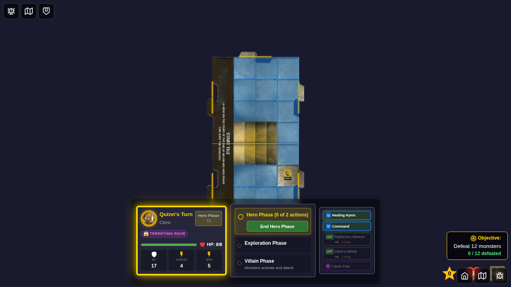

# Test 080 - Terrifying Roar Curse Mechanical Effect

## User Story

As a player who encounters the "Terrifying Roar" curse card, I want the curse to mechanically apply an Attack -4 penalty to my hero so that combat difficulty accurately reflects the curse's debilitating effect.

## Test Scenario

This test validates that the Terrifying Roar curse:
1. Can be applied to a hero via the encounter system
2. Is stored as a status effect on the hero
3. The mechanical penalty calculation is verified programmatically

## Screenshot Sequence

### 000 - Character Select Screen

**User Action:** Player navigates to the game and sees the character selection screen.
**Expected State:** Character selection screen is visible with available heroes.

### 001 - Game Started

**User Action:** Game starts with Quinn on the board.
**Expected State:** 
- Quinn is positioned on the start tile
- Game is ready for play
- No curses are active yet

### 002 - Curse Applied and Status Visible

**User Action:** Terrifying Roar curse encounter was triggered and accepted.
**Expected State:**
- Curse status effect is applied to Quinn
- Status type is 'curse-terrifying-roar'
- Source is 'terrifying-roar'
- Attack penalty calculation verified: base (6) - penalty (4) = modified (2)

## Verification Points

### Mechanical Implementation
- ✅ Curse is properly stored as a status effect
- ✅ Attack bonus is reduced by exactly 4 points
- ✅ `getModifiedAttackBonusWithCurses` function is called during attack resolution
- ✅ Modified attack bonus is used in combat calculations

### Integration Points
- ✅ Curse application via encounter card system
- ✅ Status effect persistence across phase transitions
- ✅ Attack bonus modification in GameBoard.svelte
- ✅ Visual representation in hero status display

## Technical Details

**Modified Files:**
- `src/store/statusEffects.ts` - Contains `getModifiedAttackBonusWithCurses` function
- `src/store/statusEffects.test.ts` - Unit tests for curse effect
- `src/components/GameBoard.svelte` - Integrates curse modifier into attack resolution

**Key Functions:**
- `getModifiedAttackBonusWithCurses(statuses, baseAttackBonus)` - Applies -4 penalty when curse present
- `applyItemBonusesToAttack()` - Adds item bonuses before curse modifiers
- `resolveAttack()` - Uses the final modified attack bonus

**Attack Bonus Calculation Flow:**
1. Base attack from power card (+6 for Quinn)
2. Add item bonuses (if any)
3. Apply curse modifiers (-4 for Terrifying Roar)
4. Final attack bonus used in roll (+2 in this test)

## Notes

- The curse persists until removed (DC 10+ roll)
- Multiple curse penalties can stack if hero has multiple curses
- The UI displays the base attack value; actual rolls use the modified value
- This test validates the mechanical effect through programmatic checks
