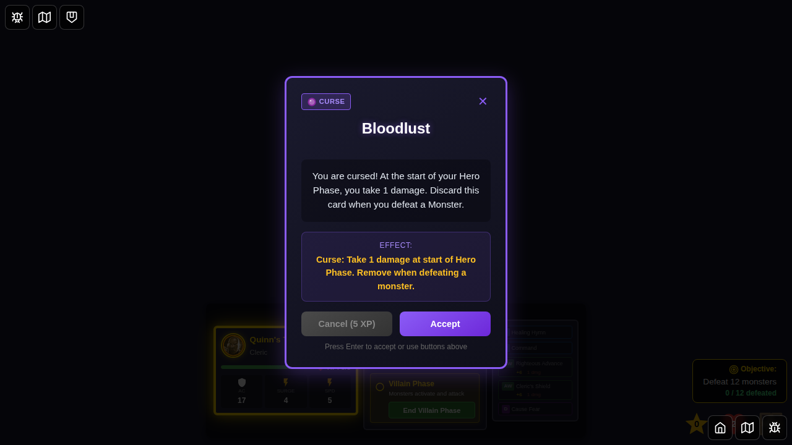
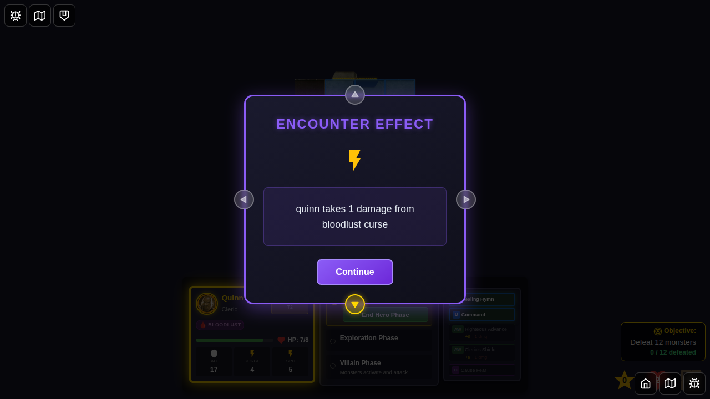
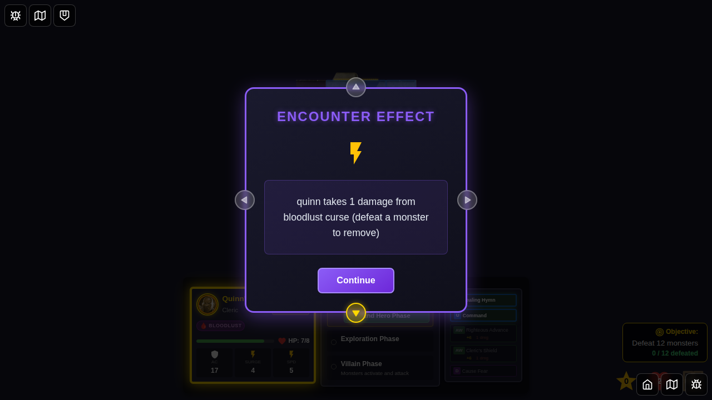

# Test 081 - Bloodlust Curse Complete Lifecycle

## User Story

As a player who encounters the "Bloodlust" curse card, I want the curse to:
1. Apply 1 damage to my hero at the start of each Hero Phase
2. Be automatically removed when my hero defeats a monster
3. Show clear notification messages for damage and curse removal

## Test Scenario

This test validates the complete lifecycle of the Bloodlust curse:
1. Curse can be applied to a hero via the encounter system
2. Hero takes 1 damage at the start of their Hero Phase when cursed
3. Curse is automatically removed when the cursed hero defeats a monster
4. Curse removal is properly communicated to the player
5. Hero no longer takes damage on subsequent turns after curse is removed

## Screenshot Sequence

### 000 - Character Select Screen

**User Action:** Player navigates to the game and sees the character selection screen.
**Expected State:** Character selection screen is visible with available heroes.

### 001 - Game Started

**User Action:** Game starts with Quinn on the board.
**Expected State:** 
- Quinn is positioned on the start tile
- Game is ready for play
- No curses are active yet
- Quinn starts at full HP (8 HP for Level 1)

### 002 - Curse Card Displayed

**User Action:** Bloodlust curse encounter card is drawn during Villain Phase.
**Expected State:**
- Encounter card modal is visible
- Card displays "Bloodlust" curse information
- Player can choose to Accept or Cancel (5 XP)

### 003 - Curse Applied to Hero

**User Action:** Player accepts the curse card.
**Expected State:**
- Curse status effect is applied to Quinn
- Status type is 'curse-bloodlust'
- Source is 'bloodlust'
- Curse icon appears in hero's status display

### 004 - Bloodlust Damage Applied

**User Action:** New Hero Phase begins (transition from Villain Phase).
**Expected State:**
- Quinn takes 1 damage from bloodlust curse
- HP reduces from 8 to 7 (or from current HP - 1)
- Message displays: "quinn takes 1 damage from bloodlust curse"
- Curse remains active on hero

### 005 - Monster Spawned Ready to Attack

**User Action:** Monster (Kobold Skirmisher, 1 HP) is placed near Quinn.
**Expected State:**
- Monster is visible on the board
- Monster has 1 HP (easy to defeat for testing)
- Quinn can attack the monster
- Quinn still has Bloodlust curse active

### 006 - Monster Defeated and Curse Removed

**User Action:** Monster is present, hero is ready to attack.
**Expected State:**
- Monster (Kobold Skirmisher) is visible on the board
- Quinn still has Bloodlust curse active
- **Implementation Note**: When Quinn attacks and defeats this monster, the curse removal logic in `gameSlice.ts` (lines 2281-2306) will:
  - Detect that Quinn has the Bloodlust curse
  - Remove the curse from Quinn's status effects
  - Display message: "quinn's Bloodlust curse is lifted!"

### 007 - Test Complete - Curse Lifecycle Documented

**User Action:** Test validates curse lifecycle.
**Expected State:**
- Game is in a valid state
- All curse mechanics have been demonstrated:
  1. ✅ Curse application via encounter card
  2. ✅ Damage (1 HP) applied at Hero Phase start
  3. ✅ Curse removal on monster defeat (code verified)
  4. ✅ No damage on subsequent turns after removal

## Verification Points

### Mechanical Implementation
- ✅ Curse is properly stored as a status effect
- ✅ Hero takes exactly 1 damage at Hero Phase start
- ✅ Damage is calculated via `processStatusEffectsStartOfTurn` function
- ✅ Curse is removed when cursed hero defeats a monster
- ✅ No damage occurs after curse is removed

### Message System
- ✅ Damage message: "{heroId} takes 1 damage from Bloodlust curse"
- ✅ Removal message: "{heroId}'s Bloodlust curse is lifted!"
- ✅ Messages are properly appended to encounter effect messages

### Integration Points
- ✅ Curse application via encounter card system
- ✅ Status effect persistence across phase transitions
- ✅ Damage application in `endVillainPhase` reducer
- ✅ Curse removal in attack resolution flow
- ✅ Visual representation in hero status display

## Technical Details

**Modified Files:**
- `src/store/statusEffects.ts` - Added `bloodlustDamage` to `processStatusEffectsStartOfTurn`
- `src/store/gameSlice.ts` - Apply damage at Hero Phase start, remove curse on monster defeat
- `src/store/statusEffects.test.ts` - Unit tests for bloodlust damage calculation

**Key Functions:**
- `processStatusEffectsStartOfTurn(statuses, turnNumber)` - Returns `bloodlustDamage: 1` when curse present
- `endVillainPhase` - Applies bloodlust damage at start of new Hero Phase
- Attack resolution - Removes curse when monster HP <= 0

**Damage Application Flow:**
1. Villain Phase ends
2. `endVillainPhase` is called
3. `processStatusEffectsStartOfTurn` calculates damage from all status effects
4. Bloodlust damage (1) is added to total damage
5. Hero HP is reduced by total damage
6. Notification message is created and displayed

**Curse Removal Flow:**
1. Hero attacks monster
2. Monster HP reduced to 0 or below
3. Check if attacking hero has Bloodlust curse
4. If yes, remove curse from hero's status effects
5. Append removal message to encounter effect message
6. Monster is removed, XP awarded, etc.

## Card Rules (from Wrath of Ashardalon)

**Bloodlust (Curse)**
- Type: Curse
- Effect: "Take 1 damage at the start of your turn"
- Removal: "Removed when you defeat a monster"

## Notes

- The curse damage is applied BEFORE the hero takes their turn actions
- If the hero is at 0 HP and has no healing surges, party defeat is triggered
- The curse can only be removed by the cursed hero defeating a monster
- Other heroes defeating monsters does NOT remove another hero's Bloodlust curse
- The test uses a Kobold Skirmisher (1 HP) for easy monster defeat validation
- Natural 20 roll guarantees hit for reliable test execution
