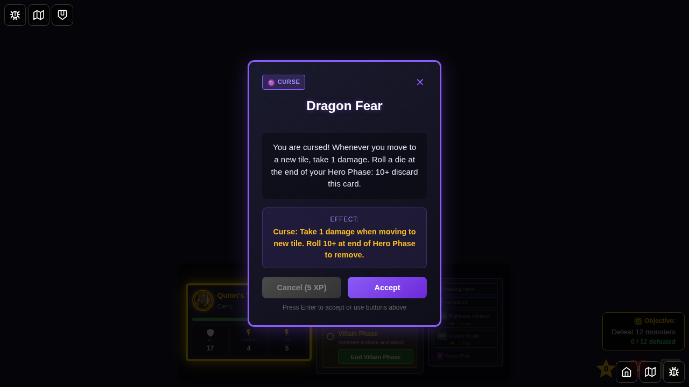
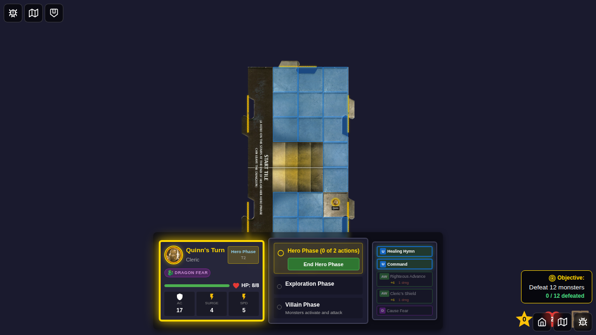
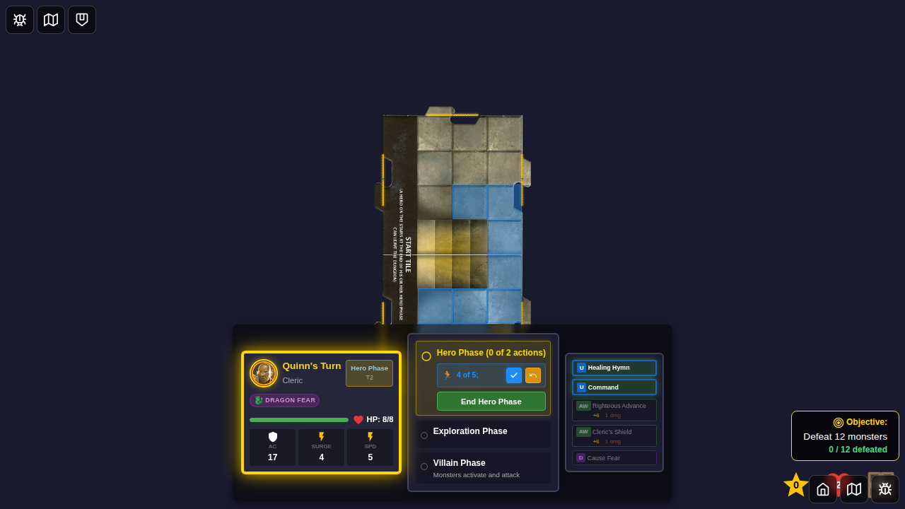
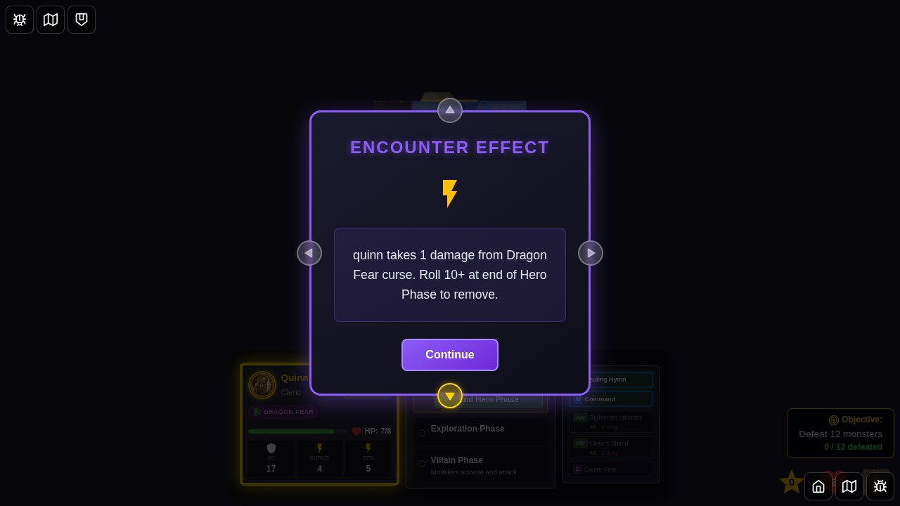
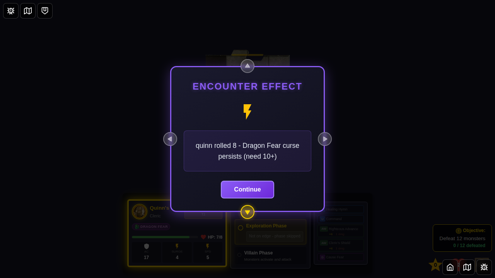

# 082 - Dragon Fear Curse Movement Damage

## User Story

As a player with the Dragon Fear curse, I want to take 1 damage when I move to a new tile and receive automatic curse removal attempts at the end of my Hero Phase so that the curse mechanic functions according to the game rules.

## Test Scenario

This test demonstrates the Dragon Fear curse effect:
1. Player accepts the Dragon Fear curse encounter card
2. Curse is applied to the hero
3. Hero moves within the same sub-tile (no damage)
4. Hero moves to a different sub-tile (takes 1 damage from Dragon Fear)
5. Damage message includes removal instructions
6. At end of Hero Phase, automatic curse removal attempt occurs
7. Player receives notification about curse status (removed or persists)

## Screenshots

*Starting screen with character selection*

*Game board loaded, hero phase begins*

*Dragon Fear curse encounter card shown to player*

*Curse status added to hero after accepting the encounter*

*Hero phase resumes with curse active, ready to demonstrate movement damage*

*Movement overlay displays valid squares for hero movement*

*Hero moves within the same sub-tile, no Dragon Fear damage applied*

*Hero crosses sub-tile boundary, taking 1 damage from Dragon Fear curse with removal instructions*

*At end of Hero Phase, automatic curse removal roll occurs with notification of result*

## Verification Checklist

- [x] Dragon Fear encounter card displayed correctly
- [x] Curse applied to hero after accepting encounter
- [x] Hero HP tracked before and during movement
- [x] Moving within same tile/sub-tile does NOT trigger damage
- [x] Moving to different tile/sub-tile DOES trigger 1 damage
- [x] Damage message displayed correctly with curse name
- [x] Damage message includes removal instructions (Roll 10+ at end of Hero Phase)
- [x] Automatic curse removal attempt occurs at end of Hero Phase
- [x] Hero receives notification about curse removal result (removed or persists)
- [x] Hero can continue actions with curse active

## Implementation Notes

### Dragon Fear Effect Logic

The Dragon Fear curse applies 1 damage when a hero moves to a new tile. The implementation:

1. **Tile Change Detection**: Uses `areOnSameTile()` function to compare old and new positions
2. **Damage Application**: Applied in `moveHero` reducer when crossing tile boundaries
3. **Start Tile Sub-Tiles**: The start tile has two sub-tiles (north y:0-3, south y:4-7) that count as different tiles
4. **Message Display**: Damage message shows hero name, damage amount, curse name, and removal instructions
5. **Curse Removal**: At end of Hero Phase, automatic d20 roll attempts curse removal (10+ removes it)
6. **Removal Notification**: Player receives clear notification about curse status after roll

### Code Location

- **Damage Logic**: `src/store/gameSlice.ts` (moveHero reducer, lines ~1010-1045)
- **Curse Removal Logic**: `src/store/gameSlice.ts` (endHeroPhase reducer, lines ~1309-1336)
- **Curse Definition**: `src/store/statusEffects.ts` (STATUS_EFFECT_DEFINITIONS)
- **Tile Comparison**: `src/store/encounters.ts` (areOnSameTile function)
- **Removal Utility**: `src/store/statusEffects.ts` (attemptCurseRemoval function)
- **Unit Tests**: `src/store/gameSlice.test.ts` (Dragon Fear tests)

### Related Issue

This implementation addresses issue [egirard/Ashardalon#55](https://github.com/egirard/Ashardalon/issues/55).

## Testing Notes

- Test uses deterministic game seed for consistent screenshot comparison
- Hero starts at position determined by random seed
- Test dynamically determines whether hero is in north or south sub-tile
- Movement to different sub-tile verified by HP reduction and message display
- Curse removal attempt automatically occurs at end of Hero Phase
- Removal notification message is captured in final screenshot
- Test demonstrates both damage application and removal mechanics
