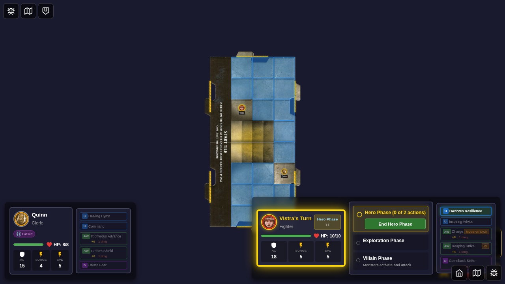
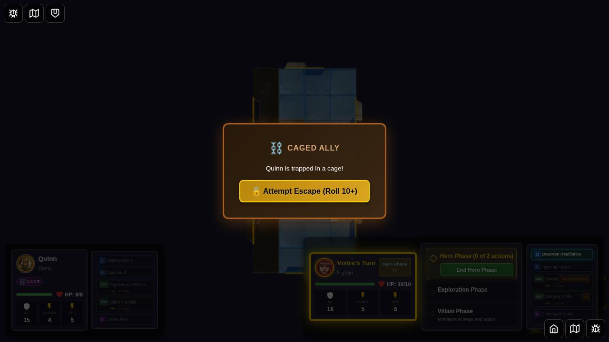
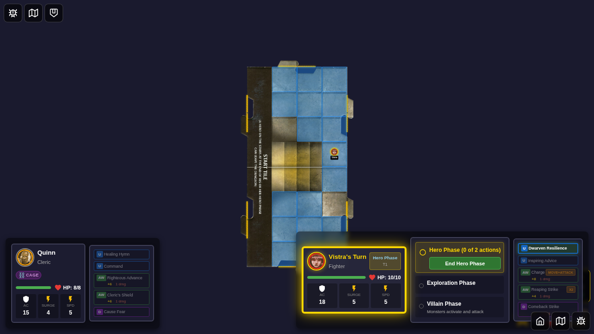
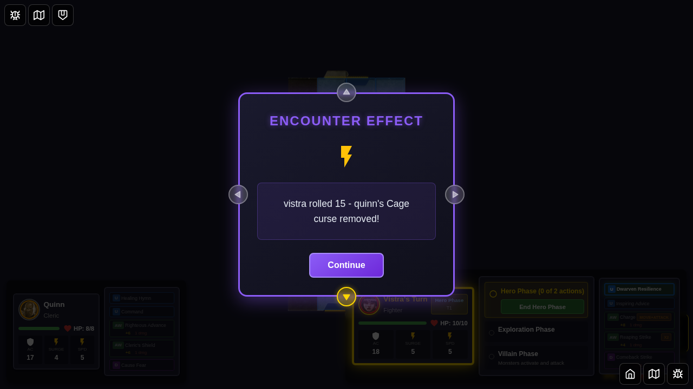
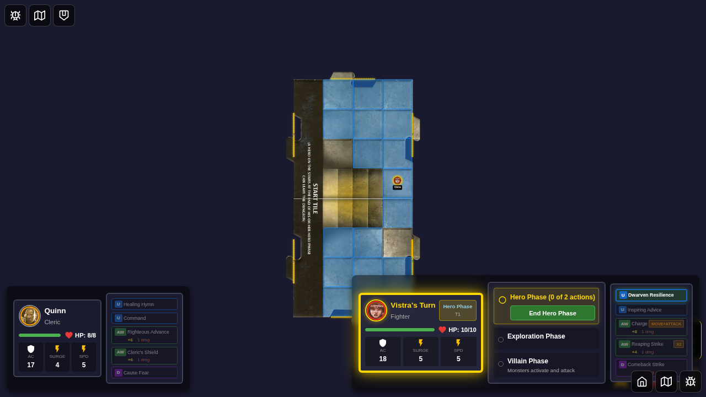

# E2E Test 083: Cage Curse Complete Lifecycle

## User Story

As a player, when my hero is afflicted with the "Cage" curse:
1. My hero's AC is reduced by 2
2. My hero cannot move
3. Another hero on the same tile can attempt to free me by rolling 10+ on a d20
4. When freed, my AC returns to normal and I can move again

## Test Steps

### Step 1: Character Selection

- Navigate to character selection
- Select Quinn and Vistra from the bottom edge

### Step 2: Game Start

- Game starts with deterministic seed
- Both heroes are on the board

### Step 3: Cage Curse Card Displayed

- Encounter card "Cage" is drawn
- Card describes the curse effect

### Step 4: Curse Applied

- Quinn receives the Cage curse
- Quinn's AC is reduced from 17 to 15 (-2 penalty)
- Status icon appears on player panel

### Step 5: Movement Prevented

- Quinn has the cage curse active
- Movement is prevented (validated in code, UI would show disabled movement)

### Step 6: Heroes on Same Tile

- Both Quinn and Vistra are moved to position (3, 3)
- They are on the same tile, enabling escape attempt

### Step 7: Cage Escape Attempted

- Vistra attempts to free Quinn with a d20 roll
- Message is dismissed for clean screenshot

### Step 8: Cage Curse Removed

- After successful escape roll (10+), curse is removed
- Quinn's AC is restored to 17
- Quinn can move again

### Step 9: Test Complete

- Game state is valid
- Both heroes are present
- Quinn is free of the curse

## Implementation Details

- **Action**: `attemptCageEscape` in gameSlice.ts
- **Status Type**: `curse-cage` in statusEffects.ts
- **Effect**: AC -2, prevents movement
- **Removal**: DC 10+ roll by hero on same tile
- **AC Penalty**: Automatically applied/removed via `getModifiedAC()`

## Success Criteria

- ✅ Cage curse applies AC -2 penalty
- ✅ Cage curse prevents movement
- ✅ Another hero can attempt escape (DC 10+)
- ✅ AC is restored when curse is removed
- ✅ Escape attempt only works when heroes are on same tile
