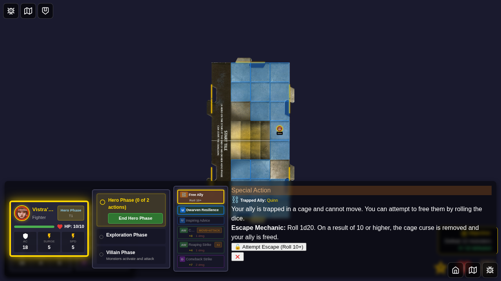

# E2E Test 083: Cage Curse Complete Lifecycle

## User Story

As a player, when my hero is afflicted with the "Cage" curse:
1. My hero's AC is reduced by 2
2. My hero cannot move
3. Another hero on the same tile can attempt to free me by clicking the "Free Ally" action card and then clicking "Attempt Escape" in the details panel
4. When freed, my AC returns to normal and I can move again

## Test Steps

### Step 1: Character Selection

- Navigate to character selection
- Select Quinn and Vistra from the bottom edge

### Step 2: Game Start

- Game starts with deterministic seed
- Both heroes are on the board

### Step 3: Cage Curse Card Displayed

- Encounter card "Cage" is drawn
- Card describes the curse effect

### Step 4: Curse Applied

- Quinn receives the Cage curse
- Quinn's AC is reduced from 17 to 15 (-2 penalty)
- Status icon appears on player panel

### Step 5: Movement Prevented

- Quinn has the cage curse active
- Movement is prevented (no blue movement highlights shown)

### Step 6: Heroes on Same Tile

- Both Quinn and Vistra are moved to position (3, 3)
- They are on the same tile, enabling escape attempt
- **UI Note**: A golden "Free Ally" action card appears in the power cards list (right side) showing that an ally is caged and can be freed

### Step 7: Cage Escape Details Panel Opened

- Player clicks the "Free Ally" action card
- Details panel opens showing:
  - Cage icon (⛓️) and "Free Caged Ally" header
  - Information about which ally is trapped
  - Explanation of the escape mechanic
  - "🔓 Attempt Escape (Roll 10+)" button

### Step 8: Cage Escape Attempted

- Player clicks the "Attempt Escape" button in the details panel
- Vistra attempts to free Quinn with a d20 roll
- Message shows the result (success on 10+ roll)

### Step 9: Cage Curse Removed

- After successful escape roll (10+), curse is removed
- Quinn's AC is restored to 17
- Quinn can move again
- "Free Ally" action card is no longer shown

### Step 10: Test Complete

- Game state is valid
- Both heroes are present
- Quinn is free of the curse

## Implementation Details

- **Action**: `attemptCageEscape` in gameSlice.ts
- **Status Type**: `curse-cage` in statusEffects.ts
- **Effect**: AC -2, prevents movement
- **Removal**: DC 10+ roll by hero on same tile
- **AC Penalty**: Automatically applied/removed via `getModifiedAC()`
- **UI Pattern**: Action card in power cards list → Details panel → Activation button

## Success Criteria

- ✅ Cage curse applies AC -2 penalty
- ✅ Cage curse prevents movement
- ✅ "Free Ally" action card appears when ally is caged on same tile
- ✅ Clicking action card opens details panel
- ✅ Details panel shows escape information and activation button
- ✅ Clicking "Attempt Escape" button executes escape roll (DC 10+)
- ✅ AC is restored when curse is removed
- ✅ Escape attempt only works when heroes are on same tile
