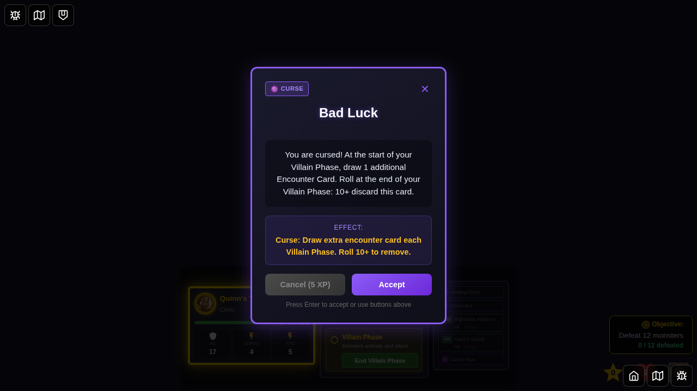
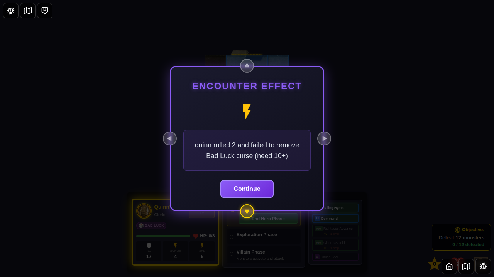
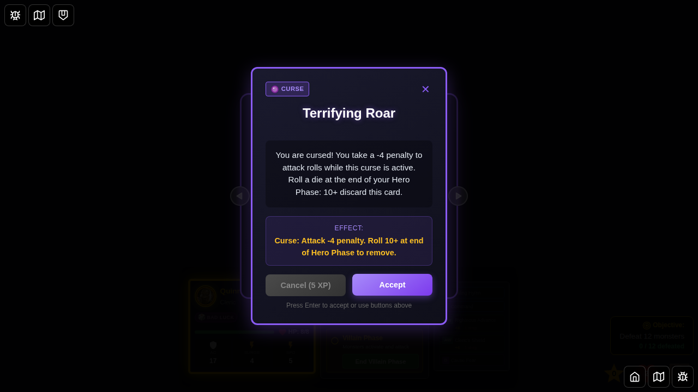

# Test 084 - Bad Luck Curse Complete Lifecycle

## User Story

As a player, when my hero is afflicted with the Bad Luck curse, I want the curse to force me to draw an extra encounter card each turn during the Villain Phase, and I want the ability to automatically attempt to remove the curse at the end of each Villain Phase with a d20 roll (10+ removes it).

## Screenshot Sequence

### 000 - Character Select Screen

**User Action:** Player navigates to the game and sees the character selection screen.
**Expected State:** Character selection screen is visible with available heroes.

### 001 - Game Started

**User Action:** Game starts with Quinn on the board.
**Expected State:** 
- Quinn is positioned on the start tile
- Game is ready for play
- No curses are active yet
- Quinn starts at full HP (8 HP for Level 1)

### 002 - Curse Card Displayed

**User Action:** Bad Luck curse encounter card is drawn during Villain Phase.
**Expected State:**
- Encounter card modal is visible
- Card displays "Bad Luck" curse information
- Player can choose to Accept or Cancel (5 XP)

### 003 - Curse Applied to Hero

**User Action:** Player accepts the curse card.
**Expected State:**
- Curse status effect is applied to Quinn
- Status type is 'curse-bad-luck'
- Source is 'bad-luck'
- Curse icon appears in hero's status display

### 004 - First Encounter Drawn with Bad Luck Flag Set

**User Action:** Game transitions through phases (end villain → end hero → end exploration) to trigger new Villain Phase.
**Expected State:**
- First encounter card is drawn as normal
- **Internal flag `badLuckExtraEncounterPending` is set to `true`**
- This flag signals that an extra encounter should be drawn after this one is dismissed
- Encounter card is displayed to the player

### 005 - Extra Encounter Drawn from Bad Luck

**User Action:** Player dismisses the first encounter card.
**Expected State:**
- **Bad Luck curse triggers automatic extra encounter draw**
- Second encounter card is immediately displayed
- **Internal flag `badLuckExtraEncounterPending` is cleared to `false`**
- Notification message displays: "Bad Luck curse: quinn draws an extra encounter!"
- Player must resolve this extra encounter before continuing

## Verification Points

### Bad Luck Curse Mechanics
1. ✅ Curse is applied as status effect when encounter card is accepted
2. ✅ Flag `badLuckExtraEncounterPending` is set when encounter is drawn in Villain Phase for cursed hero
3. ✅ Extra encounter is automatically drawn after dismissing first encounter
4. ✅ Flag is cleared after extra encounter is drawn
5. ✅ Notification message informs player of extra draw
6. ✅ Curse persists until removal roll succeeds
7. ✅ Automatic d20 roll at end of Villain Phase (10+ removes curse)
8. ✅ Result message displays roll and outcome

### Edge Cases Tested
- Curse application through encounter card
- Phase transitions while cursed
- Extra encounter draw mechanism
- Encounter result popups (damage/attack encounters)
- Curse removal roll mechanics
- Multiple turns with persistent curse

## Technical Details

**Modified Files:**
- `src/store/gameSlice.ts` - Bad Luck curse logic
  - `endExplorationPhase`: Sets flag when encounter drawn for cursed hero
  - `dismissEncounterCard`: Draws extra encounter when flag is set
  - `endVillainPhase`: Automatic curse removal roll
- `src/store/statusEffects.ts` - Status effect definition
- `src/store/types.ts` - Encounter card definition

**Key Functions:**
- `endExplorationPhase` - Checks if current hero has Bad Luck curse, sets `badLuckExtraEncounterPending` flag
- `dismissEncounterCard` - Draws extra encounter if flag is set, displays notification message
- `endVillainPhase` - Automatically rolls d20 for curse removal (10+ removes curse)

**Extra Encounter Draw Flow:**
1. Villain Phase begins for cursed hero
2. Normal encounter is drawn in `endExplorationPhase`
3. Check if current hero has 'curse-bad-luck' status
4. If yes, set `badLuckExtraEncounterPending = true`
5. Player dismisses first encounter
6. `dismissEncounterCard` checks flag
7. If flag is true, draw extra encounter from deck
8. Display notification: "Bad Luck curse: {heroId} draws an extra encounter!"
9. Clear flag: `badLuckExtraEncounterPending = false`
10. Show extra encounter to player

**Curse Removal Flow:**
1. Villain Phase ends
2. `endVillainPhase` is called
3. Check if current hero has 'curse-bad-luck' status
4. If yes, automatically roll d20
5. If roll >= 10: Remove curse from hero's status effects
6. Display result message with roll value
7. Transition to next Hero Phase

## Card Rules (from Wrath of Ashardalon)

**Bad Luck (Curse)**
- Type: Curse
- Effect: "Draw an extra Encounter Card each turn"
- Removal: "Roll d20 at end of Villain Phase, 10+ removes curse"

## Implementation References

- Bad Luck curse logic: `src/store/gameSlice.ts`
  - `endExplorationPhase`: Sets flag when encounter drawn for cursed hero
  - `dismissEncounterCard`: Draws extra encounter when flag is set
  - `endVillainPhase`: Automatic curse removal roll
- Status effect definition: `src/store/statusEffects.ts`
- Encounter card definition: `src/store/types.ts`

## Related Tests

- Test 081: Bloodlust Curse (damage at turn start, removed by defeating monster)
- Test 082: Dragon Fear Curse (damage on tile change, roll to remove at end of Hero Phase)
- Test 083: Cage Curse (AC penalty + cannot move, other hero can free with roll)

## Notes

- Uses deterministic seed for reproducible game state
- Selects hero from bottom edge per E2E testing guidelines
- Follows numbered screenshot pattern (000-005)
- Validates both programmatic state and visual UI
- Documents complete user story from curse application through extra encounter draw
- The curse persists across multiple turns until removal roll succeeds
- Extra encounter is drawn AFTER the first encounter is dismissed (not simultaneously)
- Special encounters (Hidden Treasure, Deadly Poison) that also draw extra encounters are handled correctly
- Bad Luck extra is drawn first, then special encounter extra (if any)

