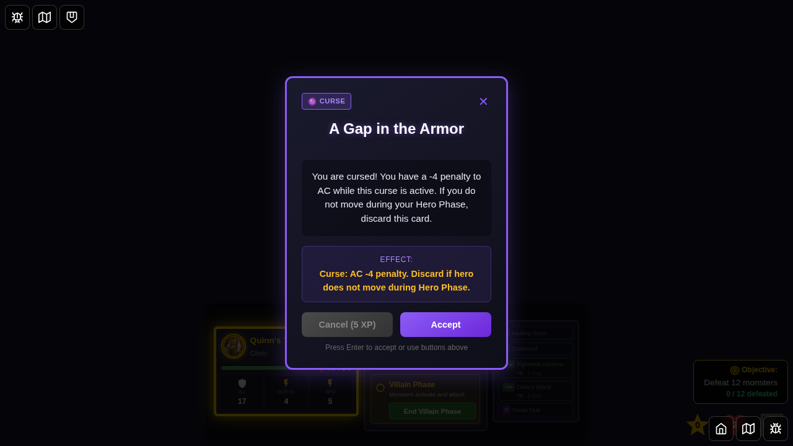
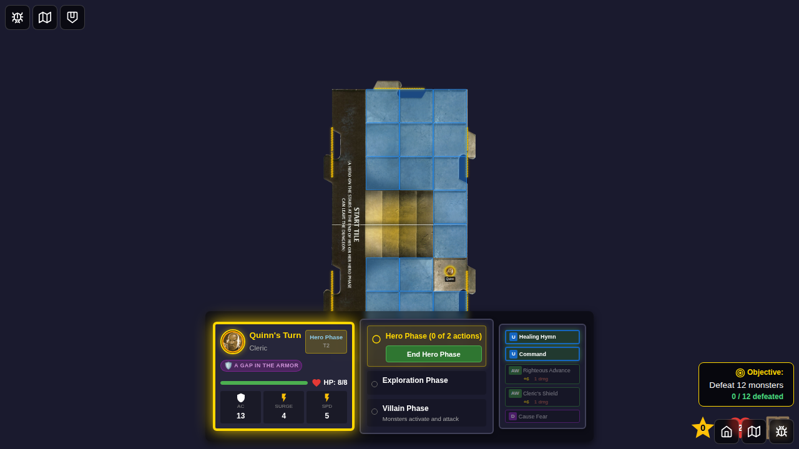
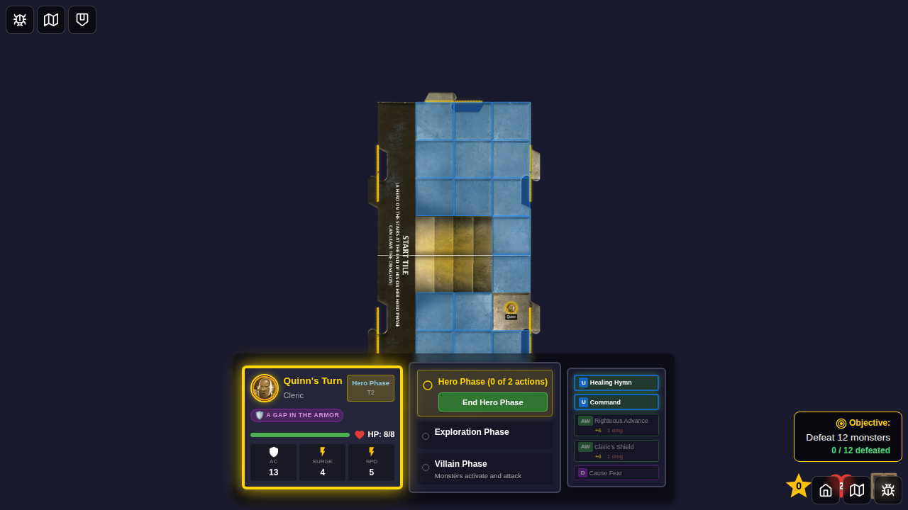
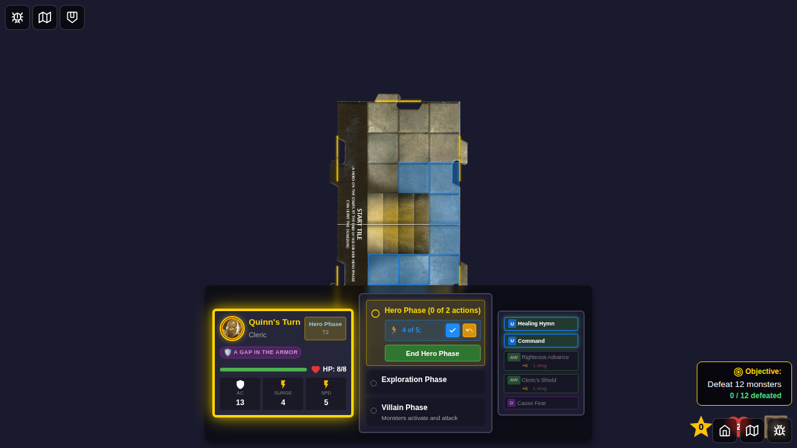
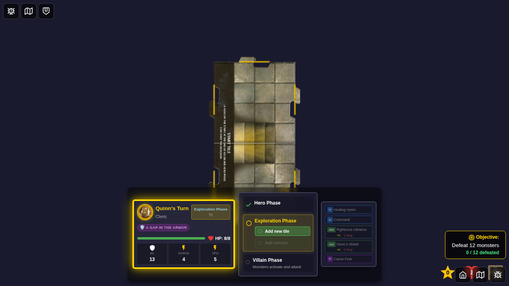
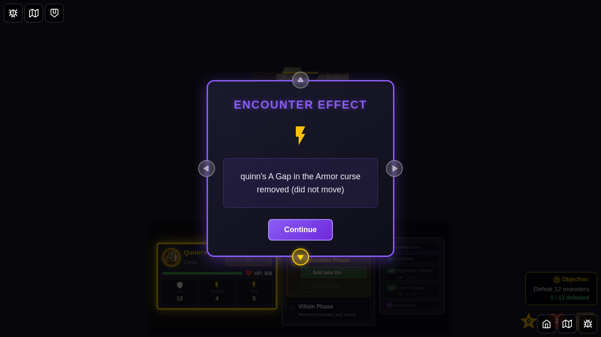

# 085 - Gap in the Armor Curse Effect

## User Story

As a player with the "A Gap in the Armor" curse, I want to suffer an AC -4 penalty and have the curse automatically removed if I don't move during my Hero Phase, so that the curse mechanic functions according to the game rules.

## Test Scenario

This test demonstrates the "A Gap in the Armor" curse effect:
1. Player accepts the "A Gap in the Armor" curse encounter card
2. Curse is applied to the hero with AC -4 penalty
3. Hero enters Hero Phase with the curse active
4. Hero moves during Hero Phase (curse should persist)
5. Hero ends Hero Phase after moving (curse still active - NOT removed)
6. Curse is applied again for second scenario
7. Hero ends Hero Phase without moving (curse should be removed)
8. Curse removal message displays: "effect removed because you did not move"

## Screenshots

*Starting screen with character selection*

*Game board loaded, hero phase begins*

*"A Gap in the Armor" curse encounter card shown to player*

*Curse status added to hero after accepting the encounter, AC penalty applied*

*Hero phase resumes with curse active, hero has not moved yet*

*Hero moves during Hero Phase, curse remains active*

*After moving and ending Hero Phase, curse is NOT removed (persists because hero moved)*

*In second scenario, hero ends phase without moving - curse is automatically removed with notification message*

## Verification Checklist

- [x] "A Gap in the Armor" encounter card displayed correctly
- [x] Curse applied to hero after accepting encounter
- [x] AC -4 penalty applied when curse is active
- [x] Hero movement tracked during Hero Phase (heroMovedThisPhase flag)
- [x] Curse removed automatically if hero doesn't move during Hero Phase
- [x] Removal message displayed: "{heroId}'s A Gap in the Armor curse removed (did not move)"
- [x] Curse persists if hero moves during Hero Phase
- [x] Curse NOT removed if hero moved
- [x] AC penalty recalculated when curse is removed

## Implementation Notes

### Gap in the Armor Effect Logic

The "A Gap in the Armor" curse applies an AC -4 penalty until the hero doesn't move during their Hero Phase. The implementation:

1. **AC Penalty**: Applied via `getModifiedAC()` function in statusEffects.ts
2. **Movement Tracking**: `heroMovedThisPhase` flag tracks if hero moved during current Hero Phase
3. **Flag Setting**: Set to `true` in `moveHero` reducer when hero moves
4. **Flag Reset**: Reset to `false` at start of each Hero Phase (in `endVillainPhase`)
5. **Curse Removal**: At end of Hero Phase, if hero has curse and didn't move, curse is removed
6. **Message Display**: Removal message shows hero name and reason: "did not move"
7. **AC Recalculation**: AC is automatically recalculated when curse is removed

### Code Location

- **AC Penalty Logic**: `src/store/statusEffects.ts` (getModifiedAC function, lines ~418-430)
- **Movement Tracking**: `src/store/gameSlice.ts` (heroMovedThisPhase state field)
- **Movement Flag Set**: `src/store/gameSlice.ts` (moveHero reducer, lines ~1034-1037)
- **Movement Flag Reset**: `src/store/gameSlice.ts` (endVillainPhase reducer, lines ~1767-1771)
- **Curse Removal Logic**: `src/store/gameSlice.ts` (endHeroPhase reducer, lines ~1362-1382)
- **Curse Definition**: `src/store/statusEffects.ts` (STATUS_EFFECT_DEFINITIONS)
- **Unit Tests**: `src/store/gapInArmorCurse.test.ts`

### Related Issue

This implementation addresses issue [egirard/Ashardalon#51](https://github.com/egirard/Ashardalon/issues/51).

## Testing Notes

- Test uses deterministic game seed for consistent screenshot comparison
- Test demonstrates both scenarios: not moving (curse removed) and moving (curse persists)
- Movement tracking verified via heroMovedThisPhase flag in game state
- Curse status verified in hero's status array before and after each action
- Removal message verified to contain both curse name and "did not move" reason
- AC penalty calculation verified (base 17 - 4 = 13)
- Test confirms curse removal only applies to current hero (not other heroes with the curse)
