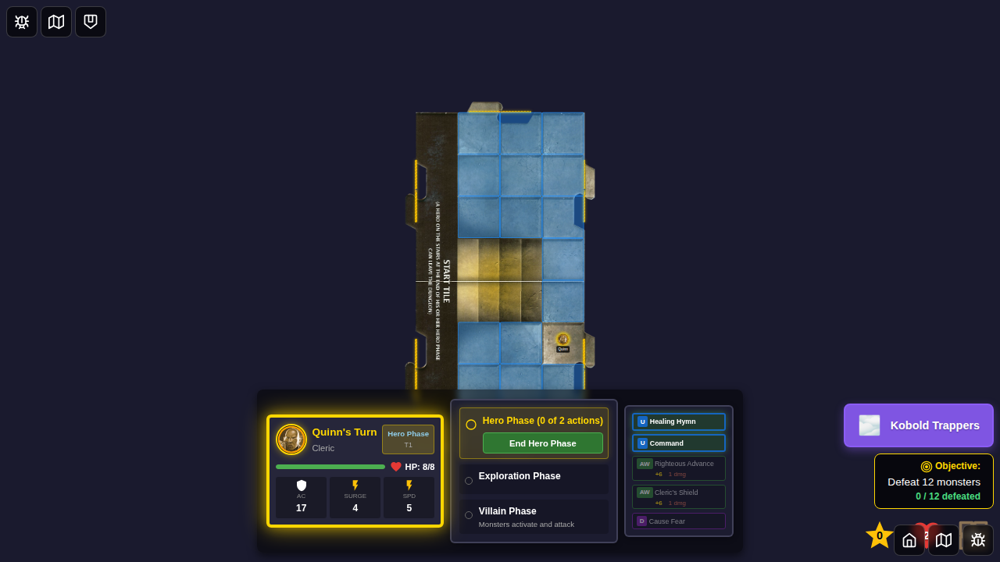
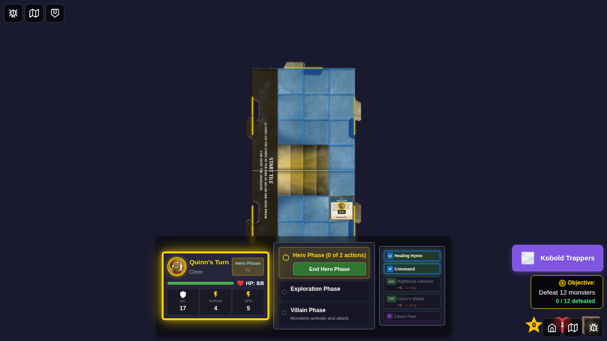
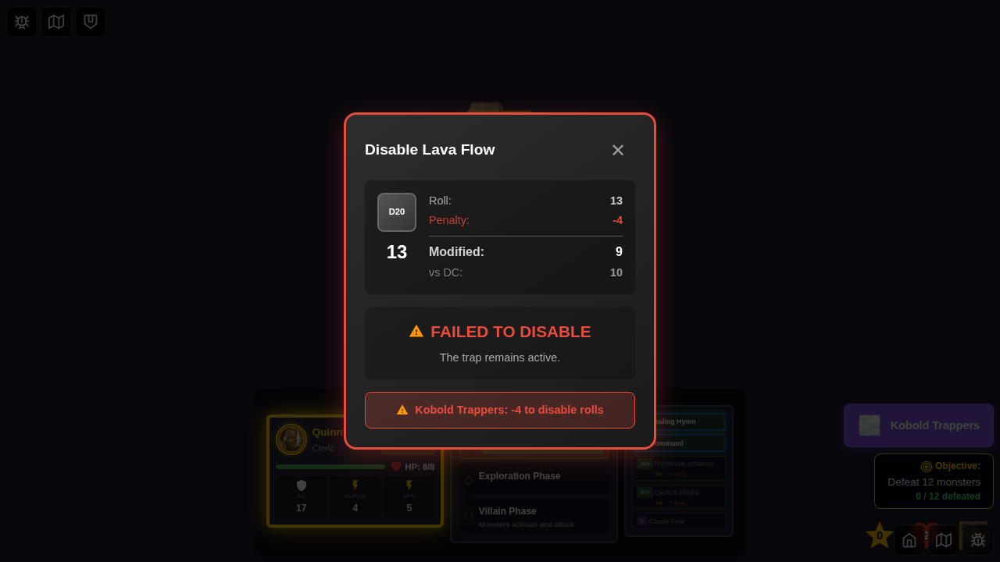
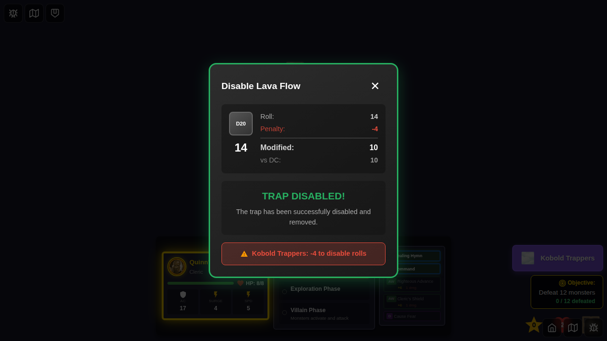
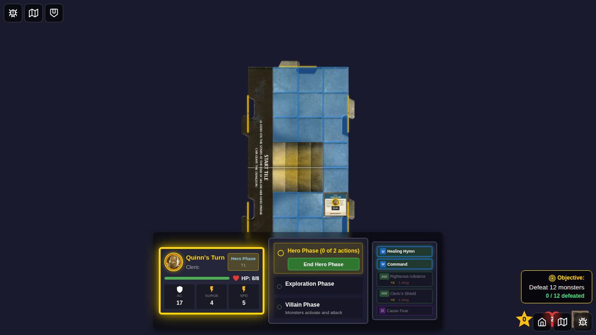
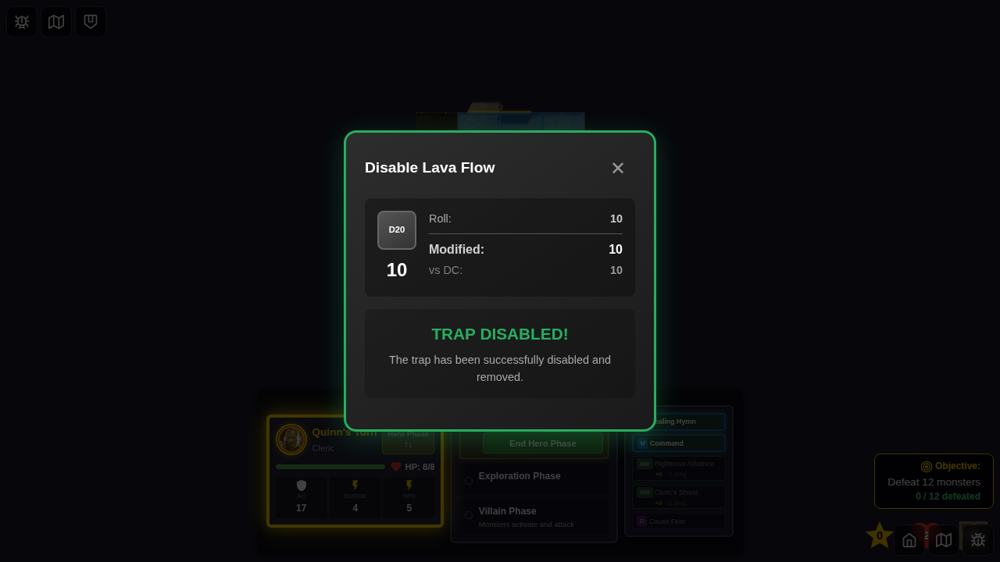

# E2E Test 086 - Kobold Trappers Trap Disable Penalty

## User Story

As a player, when the Kobold Trappers environment card is active, I want trap disable rolls to have a -4 penalty so that traps are harder to disable, making the dungeon more challenging.

## Test Scenario

This test verifies the Kobold Trappers environment card effect:
- **Environment Effect**: "You take a -4 penalty to disable trap rolls while this Environment is active."
- **Expected Behavior**: When attempting to disable a trap with the Kobold Trappers environment active, the d20 roll receives a -4 penalty.

## Test Flow

### 1. Initial Setup

- Start game with Quinn from the bottom edge
- Character selection screen is visible with 5 heroes available

### 2. Game Started - No Environment

- Game board is visible with Quinn's token on the start tile
- No environment indicator is visible (no environment is active)
- No traps exist on the board
- Hero Phase begins

### 3. Kobold Trappers Environment Active

- Kobold Trappers environment is activated programmatically
- Environment indicator appears showing "Kobold Trappers"
- Environment icon is displayed at the top of the screen

### 4. Trap Placed at Hero Position

- A Lava Flow trap (DC 10) is placed at Quinn's position
- Trap marker is visible on the game board at Quinn's location
- Game state confirms trap exists with disableDC of 10

### 5. Disable Attempt Failed with Penalty

- **Attempt 1**: Roll 13 with -4 penalty = 9 (modified roll)
- **Result**: Failed (9 < DC 10)
- Trap remains on the board
- **Verification**: The -4 penalty correctly prevents a roll of 13 from meeting DC 10

### 6. Disable Attempt Succeeded Despite Penalty

- **Attempt 2**: Roll 14 with -4 penalty = 10 (modified roll)
- **Result**: Success (10 >= DC 10)
- Trap is removed from the board
- **Verification**: A sufficiently high roll (14) can still succeed despite the penalty

### 7. Environment Deactivated - New Trap Placed

- Kobold Trappers environment is deactivated
- Environment indicator disappears
- A new Lava Flow trap (DC 10) is placed at Quinn's position
- This trap will be used to verify behavior without the environment penalty

### 8. Disable Succeeded Without Environment

- **Attempt 3**: Roll 10 with no penalty = 10 (modified roll)
- **Result**: Success (10 >= DC 10)
- Trap is removed from the board
- **Key Comparison**: The same roll of 10 that succeeds here would have resulted in 6 (10 - 4) with Kobold Trappers active, which would have failed

## Verification Points

### Programmatic Checks

1. **Environment Activation**:
   - `activeEnvironmentId` is set to `'kobold-trappers'`
   - Environment indicator is visible
   - Environment indicator displays "Kobold Trappers"

2. **Trap Placement**:
   - Trap exists in game state with correct `encounterId`, `position`, and `disableDC`
   - Trap marker is visible on the game board
   - Trap is at the hero's position

3. **Disable with Penalty (Roll 13)**:
   - Roll: 13, DC: 10, Penalty: -4
   - Modified Roll: 13 - 4 = 9
   - Result: Failed (9 < 10)
   - Trap count remains 1

4. **Disable with Penalty (Roll 14)**:
   - Roll: 14, DC: 10, Penalty: -4
   - Modified Roll: 14 - 4 = 10
   - Result: Success (10 >= 10)
   - Trap count becomes 0

5. **Disable without Penalty (Roll 10)**:
   - Roll: 10, DC: 10, Penalty: 0
   - Modified Roll: 10 - 0 = 10
   - Result: Success (10 >= 10)
   - Trap count becomes 0

## Implementation Details

### Code Changes

The implementation adds a Kobold Trappers penalty check in `gameSlice.ts`:

```typescript
// Roll d20 vs DC
const roll = Math.floor(randomFn() * 20) + 1;

// Apply Kobold Trappers environment penalty (-4 to trap disable rolls)
const koboldTrappersPenalty = state.activeEnvironmentId === 'kobold-trappers' ? -4 : 0;
const modifiedRoll = roll + koboldTrappersPenalty;

const success = modifiedRoll >= trap.disableDC;
```

### Unit Tests

Five comprehensive unit tests verify:
1. ✅ Trap disables on successful roll without environment
2. ✅ Trap remains on low roll without environment
3. ✅ Kobold Trappers applies -4 penalty (roll 13 fails at DC 10)
4. ✅ High roll succeeds despite penalty (roll 14 succeeds at DC 10)
5. ✅ Trap disable is location-dependent (hero must be on trap tile)

## Manual Verification Checklist

- [ ] Character selection screen displays correctly
- [ ] Game board renders with hero token on start tile
- [ ] Kobold Trappers environment indicator appears when activated
- [ ] Environment indicator displays the correct environment name and icon
- [ ] Trap marker appears at hero's position when trap is placed
- [ ] Trap marker is visually distinct and identifiable
- [ ] Environment indicator disappears when environment is deactivated
- [ ] All programmatic state checks pass for each step

## Related Issues

- Issue: Implement trap system and full E2E for 'Kobold Trappers' environment card
- PR: Kobold Trappers trap system implementation
- Documentation: ENCOUNTER_CARDS_IMPLEMENTATION.md

## Notes

This E2E test demonstrates the Kobold Trappers -4 trap disable penalty as requested in the requirements. The test:
- Activates the Kobold Trappers environment programmatically
- Places traps and attempts to disable them with controlled dice rolls
- Verifies that the -4 penalty is correctly applied
- Compares behavior with and without the environment active
- Uses deterministic random values to ensure consistent test results

The test follows E2E test guidelines with:
- Numbered test (086)
- Deterministic game initialization
- Screenshot sequence documenting each step
- Programmatic verification at each step
- Human-verifiable visual documentation
