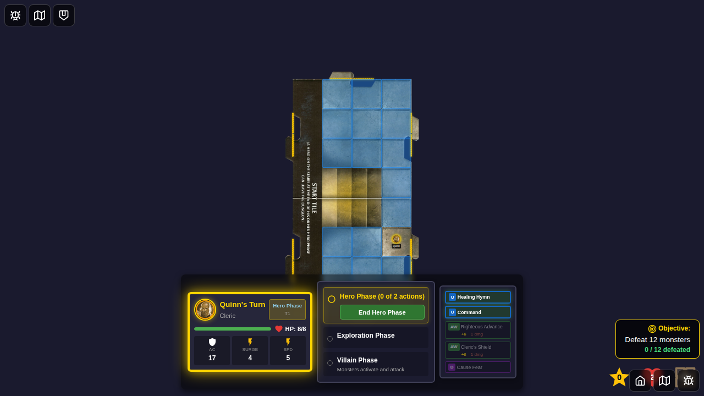
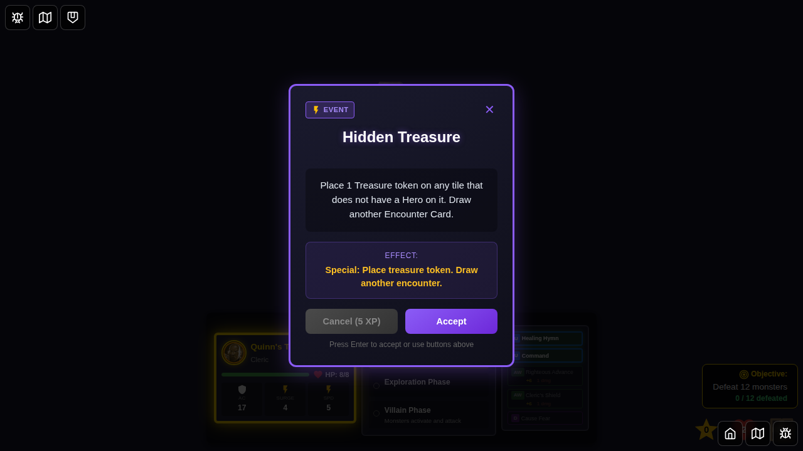
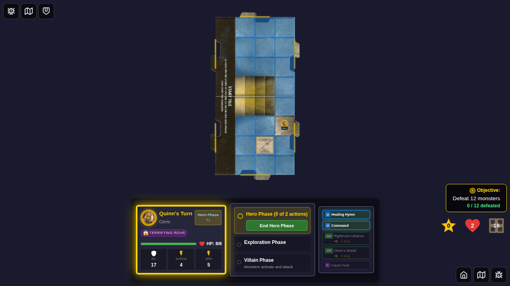

# 087 - Hidden Treasure Encounter Card

## User Story

As a player, when I draw the "Hidden Treasure" encounter card, I want the game to:
1. Prompt me to manually select a tile to place the treasure token
2. Show me which tiles are valid (tiles without heroes) with visual indicators
3. Place the treasure token on the tile I select
4. Display the treasure token marker on the game board
5. Allow me to collect the treasure by moving to that tile (tested in code)
6. Draw another encounter card after placing the treasure token

## Test Coverage

This E2E test verifies:
- Hidden Treasure encounter card can be drawn
- Player receives a prompt to select a tile for treasure placement
- Valid squares (tiles without heroes) are highlighted with gem icons
- Player can click a highlighted square to place the treasure token
- Treasure token marker is visible on the game board at the selected position
- Follow-up encounter card is drawn after placement

Note: Treasure collection is implemented in the `moveHero` reducer and automatically triggers when a hero moves to a tile containing a treasure token. The collection logic draws a treasure card and removes the token from the board.

## Screenshots

### 000 - Character Select Screen

Initial character selection screen showing available heroes.

### 001 - Game Started (No Treasure Tokens)

Game board after starting - no treasure tokens present initially.

### 002 - Hidden Treasure Encounter Drawn

The Hidden Treasure encounter card is displayed with its description: "Place 1 Treasure token on any tile that does not have a Hero on it."

### 003 - Treasure Placement Prompt

After accepting the encounter card, the player sees a non-modal prompt on their player card: "Choose a tile to place the treasure token". Valid squares (tiles without heroes) are highlighted with gem (💎) icons.

### 004 - Treasure Token Placed on Tile

After the player clicks a highlighted square, the treasure token is placed on the selected tile. The token marker is now visible on the game board. No modal notification is shown - the player can immediately see the token.

## Manual Verification Checklist

- [x] Hidden Treasure encounter card displays correctly
- [x] Encounter card shows proper description and special effect type
- [x] Player receives prompt message to select a tile
- [x] Valid squares (tiles without heroes) are highlighted with gem icons
- [x] Player can click a highlighted square to place treasure token
- [x] Treasure token is placed on the selected tile
- [x] Treasure token marker appears on the game board with treasure icon
- [x] Follow-up encounter card is drawn after placement
- [x] System tracks treasure tokens in game state

## Implementation Notes

**Treasure Token Placement:**
- Player-driven placement: prompts user to select a tile
- Sets `pendingTreasurePlacement` state when Hidden Treasure is dismissed
- Computes `validTreasurePlacementSquares` across all explored tiles (excluding tiles with heroes)
- Displays gem (💎) icons on valid squares for visual feedback
- `placeTreasureToken` reducer handles player's tile selection
- Creates `TreasureTokenState` with unique ID, encounter ID, and selected position
- Token is added to `game.treasureTokens` array in Redux state
- Follow-up encounter card is drawn automatically after placement

**Treasure Token Collection:**
- Implemented in `moveHero` reducer (gameSlice.ts)
- When hero moves to tile with treasure token:
  - Token is removed from `game.treasureTokens`
  - Treasure card is drawn from treasure deck
  - `drawnTreasure` is set, triggering treasure card UI
  - `treasureDrawnThisTurn` flag prevents multiple draws per turn

**UI Components:**
- `TreasureTokenMarker.svelte` renders treasure tokens on game board
- Uses Token_TreasureTreasure.png asset for token visual
- Token includes pulse animation to draw attention
- Integrated into GameBoard rendering pipeline

## Related Files

- `src/store/types.ts` - TreasureTokenState interface
- `src/store/trapsHazards.ts` - Treasure token helper functions
- `src/store/gameSlice.ts` - Token placement and collection logic
- `src/components/TreasureTokenMarker.svelte` - Token visual component
- `src/components/GameBoard.svelte` - Token rendering integration
