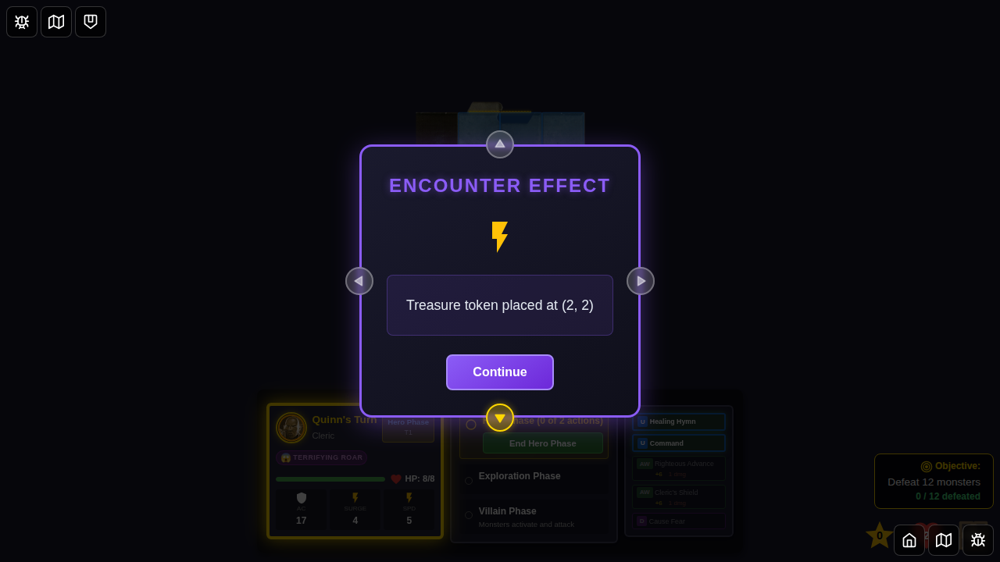

# 087 - Hidden Treasure Encounter Card

## User Story

As a player, when I draw the "Hidden Treasure" encounter card, I want the game to:
1. Place a treasure token on a random tile that does not have any heroes on it
2. Display the treasure token marker on the game board
3. Allow me to collect the treasure by moving to that tile (tested in code)
4. Draw another encounter card after accepting the Hidden Treasure card

## Test Coverage

This E2E test verifies:
- Hidden Treasure encounter card can be drawn
- Treasure token is placed on a tile without heroes
- Treasure token marker is visible on the game board
- Token placement logic works correctly

Note: Treasure collection is implemented in the `moveHero` reducer and automatically triggers when a hero moves to a tile containing a treasure token. The collection logic draws a treasure card and removes the token from the board.

## Screenshots

### 000 - Character Select Screen

Initial character selection screen showing available heroes.

### 001 - Game Started (No Treasure Tokens)

Game board after starting - no treasure tokens present initially.

### 002 - Hidden Treasure Encounter Drawn

The Hidden Treasure encounter card is displayed with its description: "Place 1 Treasure token on any tile that does not have a Hero on it."

### 003 - Treasure Token Placed on Tile

After accepting the encounter card, a treasure token has been placed on a tile. The token marker is visible on the game board.

### 004 - Test Complete (Token Visible)

Final state showing the treasure token remains on the board, ready to be collected by a hero who moves to that tile.

## Manual Verification Checklist

- [x] Hidden Treasure encounter card displays correctly
- [x] Encounter card shows proper description and special effect type
- [x] Treasure token is placed on a tile without heroes
- [x] Treasure token marker appears on the game board with treasure icon
- [x] Token placement uses random tile selection logic
- [x] System tracks treasure tokens in game state

## Implementation Notes

**Treasure Token Placement:**
- Uses `findValidTreasurePlacement()` function to select a random tile without heroes
- Creates `TreasureTokenState` with unique ID, encounter ID, and position
- Token is added to `game.treasureTokens` array in Redux state

**Treasure Token Collection:**
- Implemented in `moveHero` reducer (gameSlice.ts)
- When hero moves to tile with treasure token:
  - Token is removed from `game.treasureTokens`
  - Treasure card is drawn from treasure deck
  - `drawnTreasure` is set, triggering treasure card UI
  - `treasureDrawnThisTurn` flag prevents multiple draws per turn

**UI Components:**
- `TreasureTokenMarker.svelte` renders treasure tokens on game board
- Uses Token_TreasureTreasure.png asset for token visual
- Token includes pulse animation to draw attention
- Integrated into GameBoard rendering pipeline

## Related Files

- `src/store/types.ts` - TreasureTokenState interface
- `src/store/trapsHazards.ts` - Treasure token helper functions
- `src/store/gameSlice.ts` - Token placement and collection logic
- `src/components/TreasureTokenMarker.svelte` - Token visual component
- `src/components/GameBoard.svelte` - Token rendering integration
