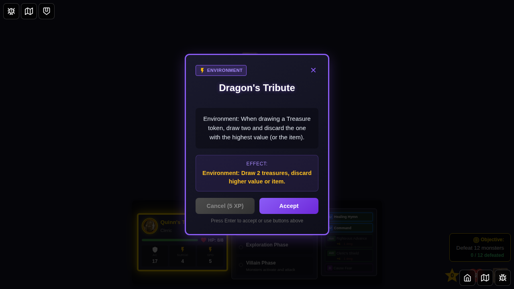
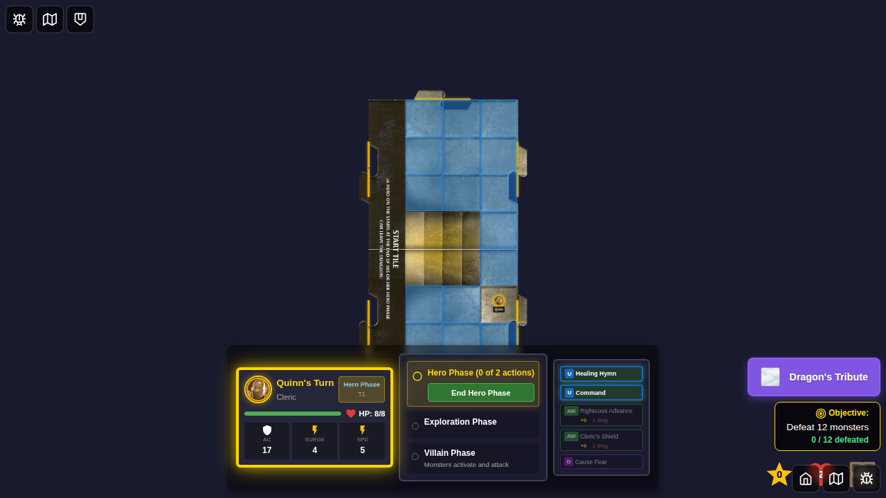

# E2E Test 088: Dragon's Tribute Environment Card

This E2E test validates the Dragon's Tribute encounter card mechanics and UI.

## Test Coverage

### Test: Dragon's Tribute encounter card and environment activation

This test demonstrates the complete lifecycle of the Dragon's Tribute encounter card:

1. **Character Selection** - Shows the initial character selection screen
2. **Game Started** - Shows the game board after starting
3. **Dragon's Tribute Encounter Drawn** - Displays the encounter card with its description: "draw two and discard the one with the highest value"
4. **Dragon's Tribute Environment Active** - Shows the environment indicator after accepting the card

## Dragon's Tribute Mechanic

**Effect**: When drawing a Treasure token, draw two treasures and discard the one with the highest value (or the item).

**Implementation**: 
- When a hero collects a treasure token while Dragon's Tribute is active, the game draws two treasures
- A special UI component (`DragonsTributeTreasureChoice.svelte`) displays both treasures side-by-side
- The UI highlights the higher-value treasure with a "HIGHER" badge
- The UI recommends keeping the lower-value treasure (per game rules)
- Player can select either treasure to keep
- The selected treasure proceeds to normal assignment; the other is discarded

## Screenshots

| Step | Screenshot | Description |
|------|------------|-------------|
| 000 |  | Character selection screen with Quinn selected from bottom edge |
| 001 |  | Game board after starting, hero phase |
| 002 |  | Dragon's Tribute encounter card displayed with full description |
| 003 |  | Environment indicator showing Dragon's Tribute is active |
| 004 |  | Documents that the Dragon's Tribute selection UI triggers through normal treasure collection |

## Notes

The Dragon's Tribute selection UI (showing two treasures side-by-side) requires proper treasure collection through gameplay:
- Hero must move to a treasure token while Dragon's Tribute environment is active
- The `moveHero` reducer automatically draws two treasures when Dragon's Tribute is active
- The `DragonsTributeTreasureChoice` component renders when both `drawnTreasure` and `dragonsTributeSecondTreasure` are set in Redux state

## Implementation Files

- `src/store/gameSlice.ts` - State management and treasure drawing logic
- `src/components/DragonsTributeTreasureChoice.svelte` - Two-treasure selection UI
- `src/components/GameBoard.svelte` - Integration of Dragon's Tribute component
- `docs/ENCOUNTER_CARDS_IMPLEMENTATION.md` - Documentation (Dragon's Tribute marked as fully implemented)
