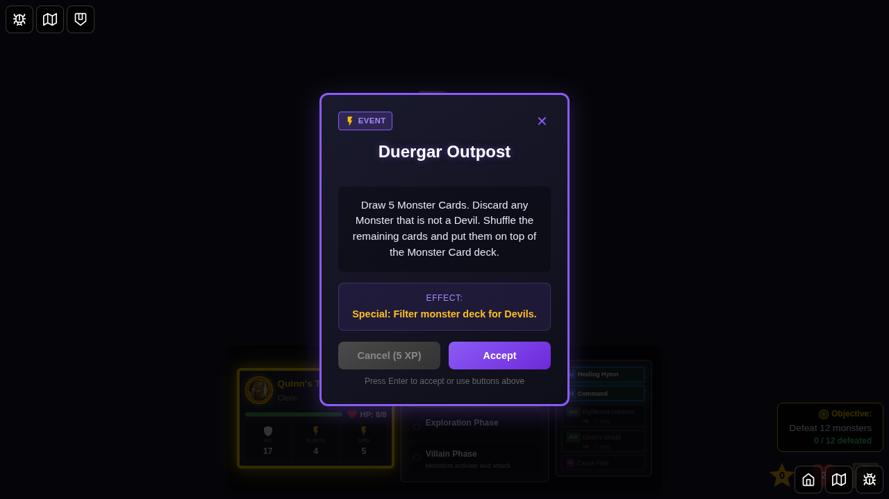
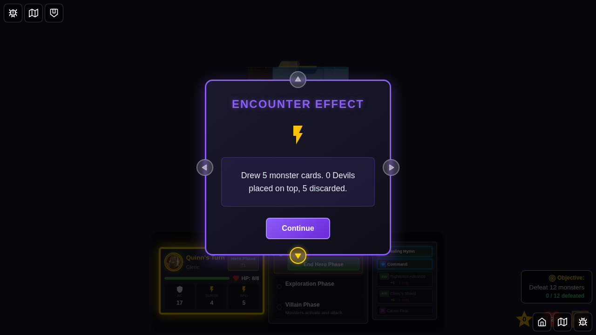

# 089 - Duergar Outpost Encounter Card

## User Story

As a player, when I draw the "Duergar Outpost" encounter card, the game should filter the monster deck for Devil monsters, place any found on top of the deck, and discard the rest. This demonstrates that the card's mechanics are fully functional.

## Test Flow

1. **Character Selection** - Player selects Quinn from the bottom edge
2. **Game Starts** - Game board loads with deterministic seed for reproducibility
3. **Initial State** - Verify hero phase and initial monster deck state
4. **Draw Encounter** - Force draw the "Duergar Outpost" encounter card
5. **Display Card** - Verify card is displayed with correct name and description
6. **Dismiss Card** - Player accepts the encounter, triggering the effect
7. **Effect Applied** - Monster deck is filtered: 5 cards drawn, Devils placed on top, non-Devils discarded
8. **Effect Message** - Message displays the result (e.g., "0 Devils placed on top, 5 discarded")

## Screenshots

### 000 - Character Select Screen

The character selection screen with Quinn available for selection.

### 001 - Game Started

Game board loaded with Quinn as the active hero. Monster deck is initialized and ready.

### 002 - Duergar Outpost Encounter Drawn

The "Duergar Outpost" encounter card is displayed, showing:
- Card name: "Duergar Outpost"
- Card description mentioning filtering for Devils
- "Accept" button to apply the effect

### 003 - Duergar Outpost Effect Applied

After accepting the encounter:
- Encounter card is dismissed
- Monster deck has been filtered
- 5 cards were drawn from the deck
- Since there are no Devils in the current deck (only kobold, snake, cultist), all 5 cards are discarded
- Draw pile reduced by 5, discard pile increased by 5

### 004 - Effect Complete

After the effect is applied:
- Effect message remains in game state
- Game continues normally in hero phase
- Encounter card is fully dismissed

## Programmatic Verification

Each screenshot includes programmatic checks:

1. **Character Select**: Verifies character select screen is visible
2. **Game Started**: Verifies hero phase is active
3. **Encounter Drawn**: Verifies card ID, name, and description contain "Devil"
4. **Effect Applied**: Verifies:
   - Encounter card is dismissed
   - Monster deck draw pile decreased by 5
   - Monster deck discard pile increased by 5
   - Effect message indicates correct filtering result
5. **Message Displayed**: Verifies effect message persists in game state and game continues normally

## Implementation Details

The "Duergar Outpost" card uses the following game mechanics:

- **Card ID**: `duergar-outpost`
- **Category Mapping**: Maps to `devil` monster category
- **Filter Function**: `filterMonsterDeckByCategory(deck, 'devil', 5)`
- **Effect**: Draws 5 monster cards, keeps Devils on top, discards non-Devils

The implementation is located in:
- Card definition: `src/store/types.ts` (line 965)
- Category mapping: `src/store/encounters.ts` (`getMonsterCategoryForEncounter`)
- Effect application: `src/store/gameSlice.ts` (lines 2128-2144 in `dismissEncounterCard` reducer)

## Notes

- The current monster deck contains only kobold, snake, and cultist monsters (no Devils)
- This test verifies the filtering logic works correctly even when no matching monsters are found
- When Devils are added to the game, this test will still pass and demonstrate the correct behavior
- The test uses a deterministic seed to ensure reproducible game state for consistent screenshots
