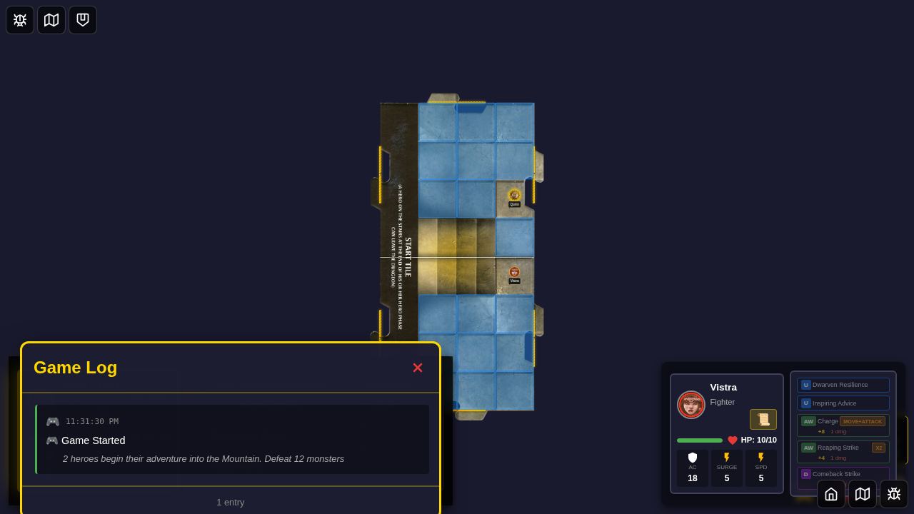
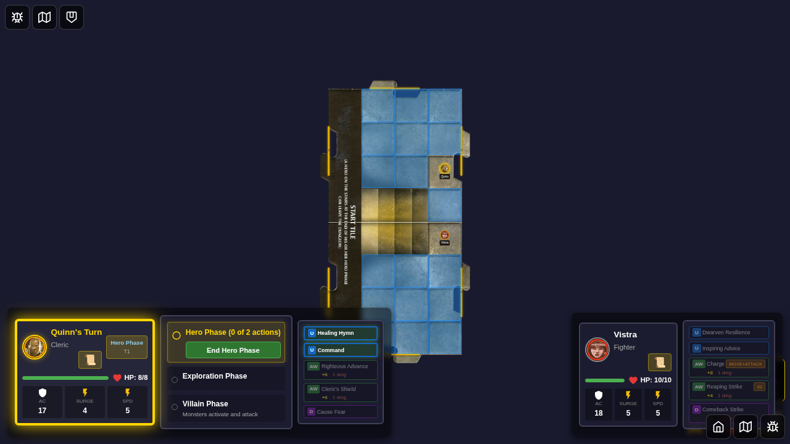
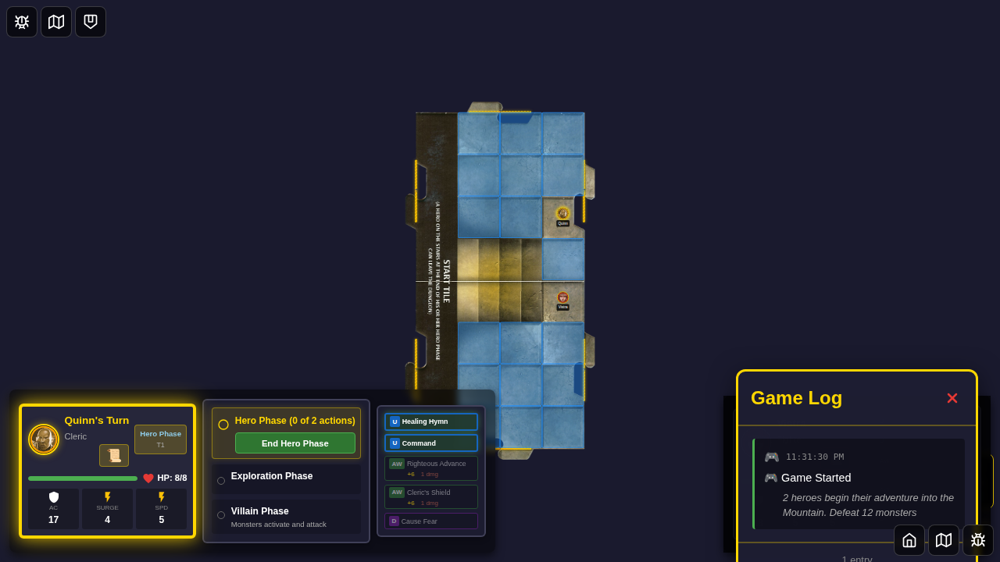

# 090 - Player Log Viewer

## User Story

As a player, I want to view a scrollable history of game events so that I can review what happened during my adventure. The log should be accessible via a button on each player's card and display timestamped entries starting with a "Game Started" message.

## Test Scenario

This test verifies the player-visible logging system by:
1. Selecting two heroes and starting a game
2. Clicking the log button (📜) on the active player's card
3. Verifying the log viewer displays with the "Game Started" entry
4. Closing the log viewer
5. Opening the log from the second player's card to verify shared log access

## Screenshots

### 000 - Character Selection

**What this verifies:**
- Character selection screen is visible
- Start button is disabled with no heroes selected

### 001 - Heroes Selected

**What this verifies:**
- Two heroes (Quinn and Vistra) are selected from the bottom edge
- Start button is enabled
- Selected count shows "2 heroes selected"

### 002 - Game Board

**What this verifies:**
- Game board is visible with both player cards
- Log button (📜) is visible on player cards
- Redux store contains log entries with "Game Started" message
- Both player cards are positioned correctly

### 003 - Log Viewer Opened

**What this verifies:**
- Log viewer overlay is displayed
- "Game Started" log entry is visible with timestamp
- Game-event icon (🎮) is displayed
- Log entry shows "2 heroes begin their adventure"
- Entry count footer shows "1 entry"

### 004 - Log Viewer Closed

**What this verifies:**
- Log viewer is closed and not visible
- Game board remains visible
- Log button is still available for reopening

### 005 - Log Viewer from Second Player

**What this verifies:**
- Log viewer can be opened from any player's card
- Same log entries are visible (shared log)
- All players have access to the same game history

## Manual Verification Checklist

- [ ] Character selection screen displays correctly
- [ ] Two heroes can be selected from the bottom edge
- [ ] Game starts and displays both player cards
- [ ] Log button (📜) is visible on each player card
- [ ] Clicking log button opens the log viewer overlay
- [ ] "Game Started" entry displays with timestamp
- [ ] Game-event icon (🎮) is shown on the entry
- [ ] Entry details mention "2 heroes begin their adventure"
- [ ] Entry count shows "1 entry"
- [ ] Close button dismisses the log viewer
- [ ] Log can be reopened from any player's card
- [ ] All players see the same log entries

## Technical Notes

- Uses deterministic game initialization for stable screenshots
- Positions heroes at fixed coordinates for consistent visuals
- Hides movement overlay before capturing game board
- Verifies Redux store state for log entries
- Tests shared log access across multiple player cards
