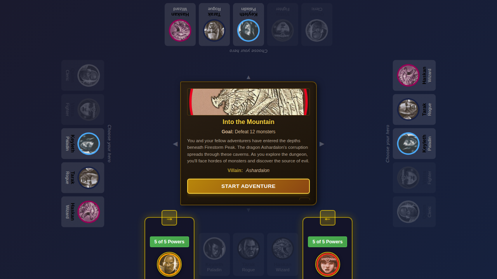
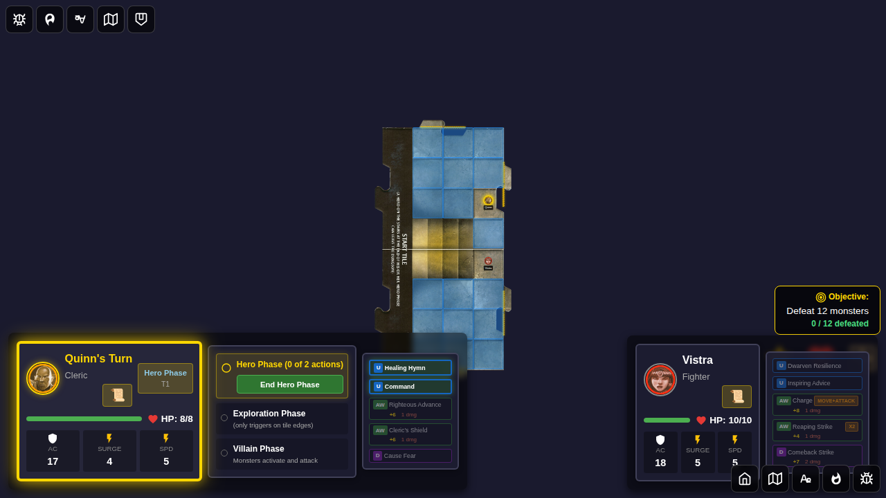
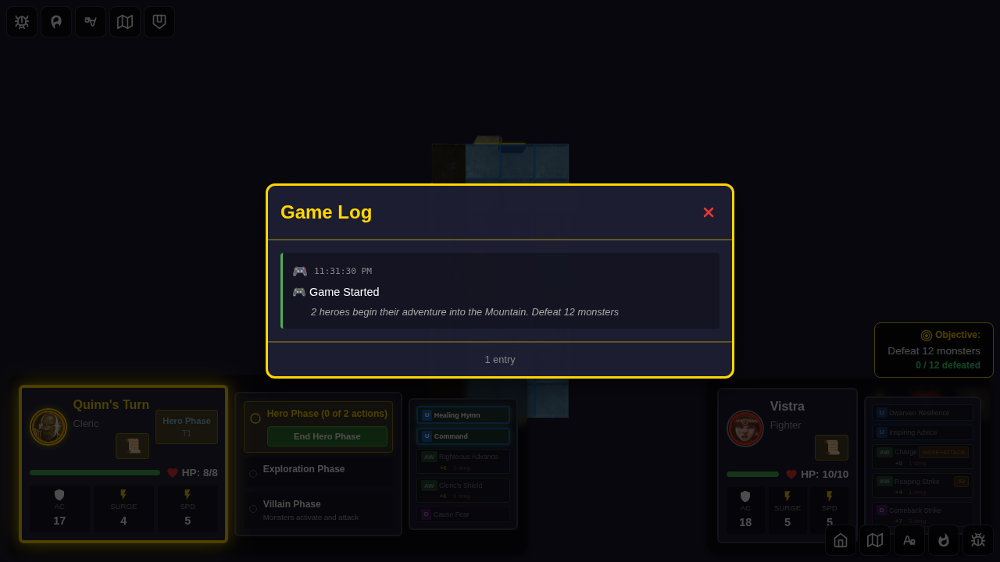
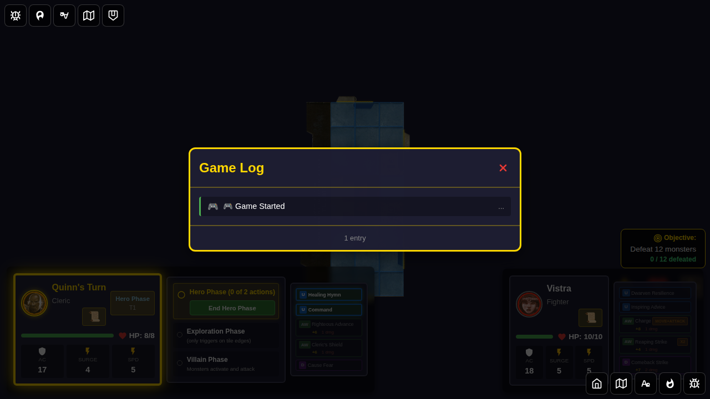
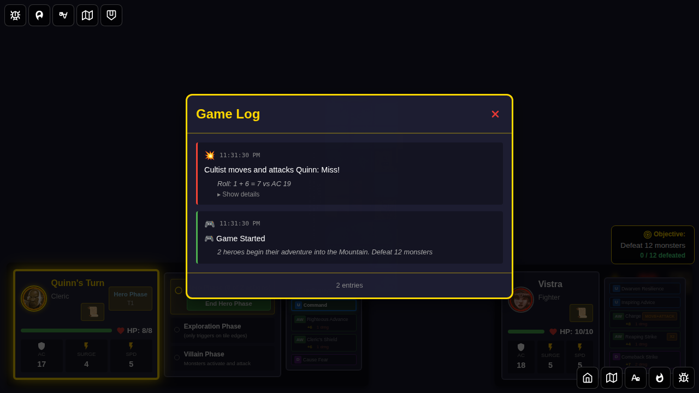
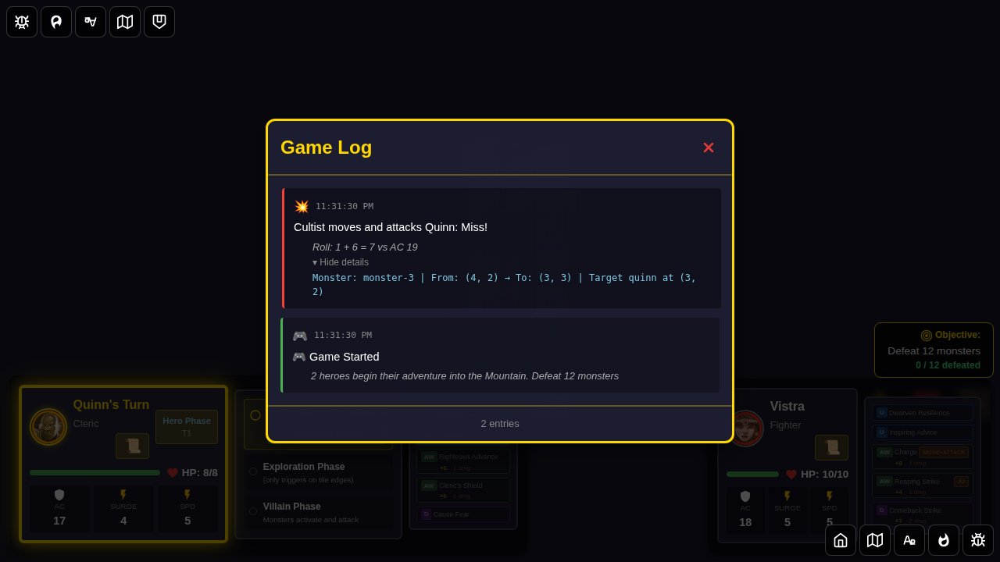
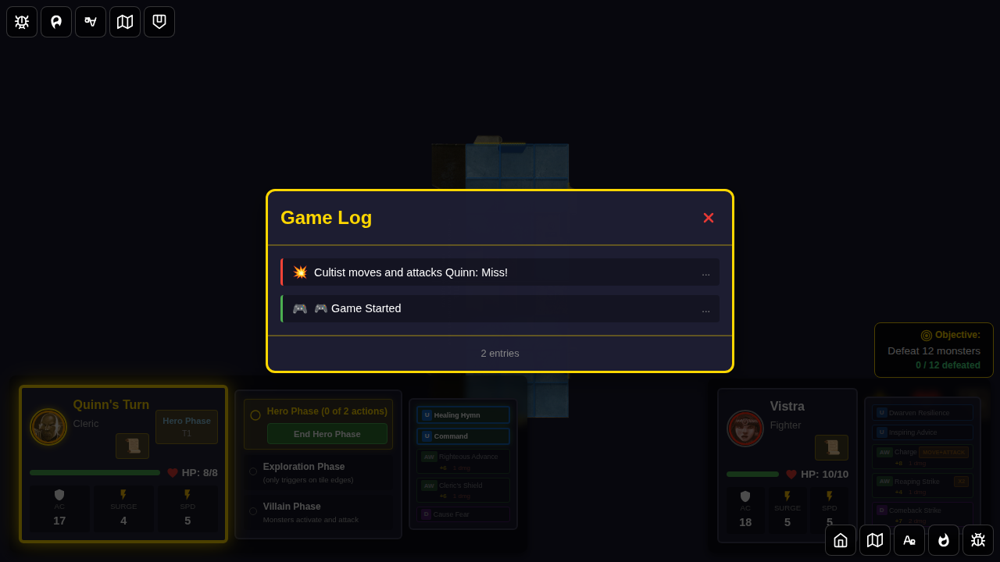

# 090 - Player Log Viewer

## User Story

As a player, I want to view a scrollable history of game events so that I can review what happened during my adventure. The log should be accessible via a button on each player's card and display entries starting with a "Game Started" message. Each entry collapses to a single line; entries with additional details show a "..." indicator and can be expanded to reveal the timestamp and full details.

## Test Scenario

This test verifies the player-visible logging system by:
1. Selecting two heroes and starting a game
2. Clicking the log button (📜) on the active player's card
3. Verifying the log viewer displays with the "Game Started" entry (collapsed to single line, timestamp hidden)
4. Closing the log viewer
5. Opening the log from the second player's card to verify shared log access
6. Injecting a combat log entry with `extendedDetails` (positional data)
7. Verifying the "..." expansion indicator appears on entries with extra info
8. Clicking the entry to expand and verify the positional details and timestamp are shown
9. Collapsing the entry and verifying it returns to the collapsed single-line state

## Screenshots

### 000 - Character Selection

**What this verifies:**
- Character selection screen is visible
- Start button is disabled with no heroes selected

### 001 - Heroes Selected

**What this verifies:**
- Two heroes (Quinn and Vistra) are selected from the bottom edge
- Start button is enabled
- Selected count shows "2 heroes selected"

### 002 - Game Board

**What this verifies:**
- Game board is visible with both player cards
- Log button (📜) is visible on player cards
- Redux store contains log entries with "Game Started" message
- Both player cards are positioned correctly

### 003 - Log Viewer Opened

**What this verifies:**
- Log viewer overlay is displayed
- "Game Started" log entry is visible as a collapsed single line
- Timestamp is NOT visible in the collapsed view (moved to expanded view)
- Game-event icon (🎮) is displayed
- "..." expansion indicator is shown (entry has details)
- Entry count footer shows "1 entry"

### 004 - Log Viewer Closed

**What this verifies:**
- Log viewer is closed and not visible
- Game board remains visible
- Log button is still available for reopening

### 005 - Log Viewer from Second Player

**What this verifies:**
- Log viewer can be opened from any player's card
- Same log entries are visible (shared log)
- All players have access to the same game history

### 006 - Log Entry with Expand Toggle

**What this verifies:**
- A combat entry with `extendedDetails` shows a "..." expansion indicator on the single-line summary
- Extended details and timestamp are hidden by default
- The entry row is a clickable button (aria-label="Show details")

### 007 - Log Entry Expanded Details

**What this verifies:**
- Clicking the entry expands to reveal timestamp, details, and extended details inline
- Extended details show monster instance ID, from/to positions, and target position
- The expansion indicator changes to "▾" when expanded

### 008 - Log Entry Details Collapsed

**What this verifies:**
- Clicking "▾" collapses the extended info back to single line
- The expansion indicator reverts to "..."
- The entry returns to its default compact single-line view

## Manual Verification Checklist

- [ ] Character selection screen displays correctly
- [ ] Two heroes can be selected from the bottom edge
- [ ] Game starts and displays both player cards
- [ ] Log button (📜) is visible on each player card
- [ ] Clicking log button opens the log viewer overlay
- [ ] "Game Started" entry collapses to a single line with icon + message
- [ ] Timestamp is NOT shown in the collapsed view
- [ ] "..." indicator appears on entries with additional details
- [ ] Clicking entry expands to show timestamp and details
- [ ] Game-event icon (🎮) is shown on the entry
- [ ] Entry count shows "1 entry"
- [ ] Close button dismisses the log viewer
- [ ] Log can be reopened from any player's card
- [ ] All players see the same log entries
- [ ] Combat entries with extended positional data show "..." expansion indicator
- [ ] Clicking the entry expands inline to show monster position, from/to coords, and target
- [ ] Clicking again collapses the details back to single line

## Technical Notes

- Uses deterministic game initialization for stable screenshots
- Positions heroes at fixed coordinates for consistent visuals
- Hides movement overlay before capturing game board
- Verifies Redux store state for log entries
- Tests shared log access across multiple player cards
- Injects a synthetic combat log entry with `extendedDetails` via Redux to test the expand/collapse UI
