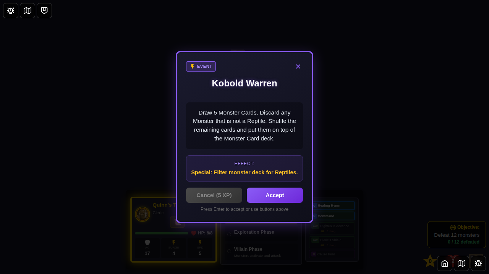
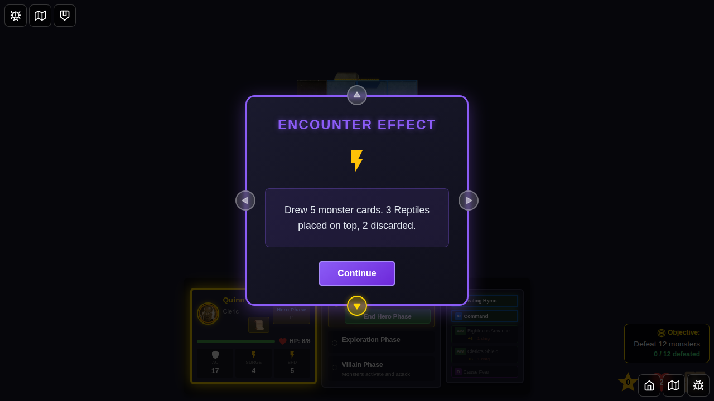

# 091 - Kobold Warren Encounter Card

## User Story

As a player, when I draw the "Kobold Warren" encounter card, the game should filter the monster deck for Reptile monsters, place the matching cards on top, and discard the rest so that the card's mechanics resolve correctly.

## Test Flow

1. **Character Selection** - Player selects Quinn from the bottom edge
2. **Game Starts** - Game board loads with deterministic seed for reproducibility
3. **Initial State** - Verify hero phase and initial monster deck state
4. **Draw Encounter** - Force draw the "Kobold Warren" encounter card
5. **Display Card** - Verify card is displayed with correct name and description
6. **Dismiss Card** - Apply the deck filtering effect
7. **Effect Applied** - Monster deck is filtered for Reptiles and effect message recorded
8. **Effect Notification** - Encounter effect notification displays the result
9. **Effect Complete** - Game continues in hero phase

## Screenshots

### 000 - Character Select Screen

The character selection screen with Quinn available for selection.

### 001 - Game Started

Game board loaded with Quinn as the active hero.

### 002 - Kobold Warren Encounter Drawn

The "Kobold Warren" encounter card is displayed, showing the Reptile filtering instructions.

### 003 - Kobold Warren Effect Applied

After accepting the encounter, the deck is filtered and the effect message updates.

### 004 - Encounter Effect Notification

The encounter effect notification shows the filtering summary.

### 005 - Effect Complete

The encounter effect notification is dismissed and the game continues.

## Programmatic Verification

Each screenshot includes programmatic checks:

1. **Character Select**: Verifies the character select screen is visible
2. **Game Started**: Verifies hero phase is active and the monster deck is initialized
3. **Encounter Drawn**: Verifies the drawn encounter card and description
4. **Effect Applied**: Verifies encounter effect message and filtered deck state
5. **Effect Notification**: Verifies encounter effect notification content
6. **Effect Complete**: Verifies encounter card is dismissed and hero phase continues

## Implementation Details

The "Kobold Warren" card uses the following mechanics:

- **Card ID**: `kobold-warren`
- **Category Mapping**: Maps to the `reptile` monster category
- **Filter Function**: `filterMonsterDeckByCategory(deck, 'reptile', 5)`
- **Effect**: Draws 5 monster cards, keeps Reptiles on top, discards non-Reptiles

Implementation lives in:
- Card definition: `src/store/types.ts` (Kobold Warren definition)
- Category mapping: `src/store/encounters.ts` (`getMonsterCategoryForEncounter`)
- Effect application: `src/store/gameSlice.ts` (`dismissEncounterCard` special handling)
