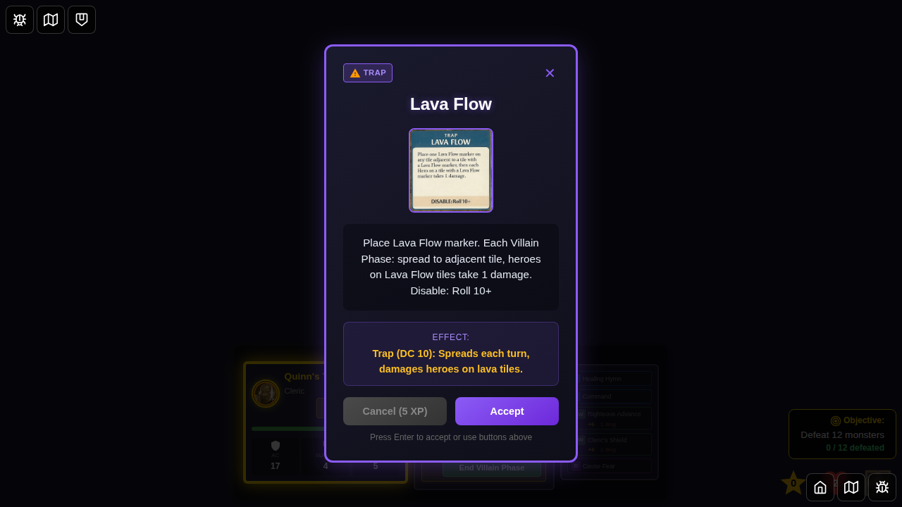
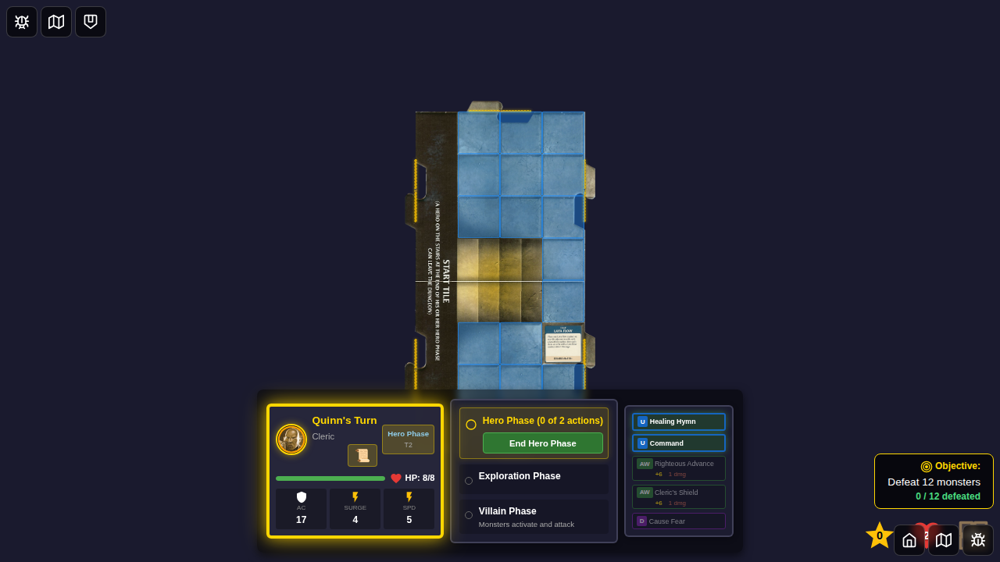
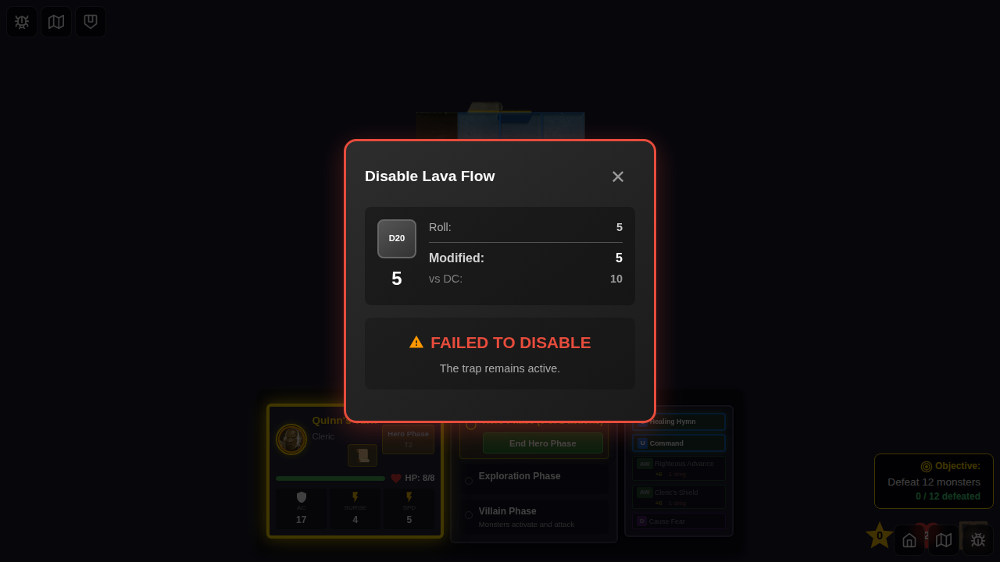
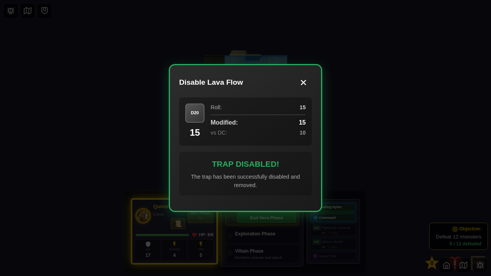
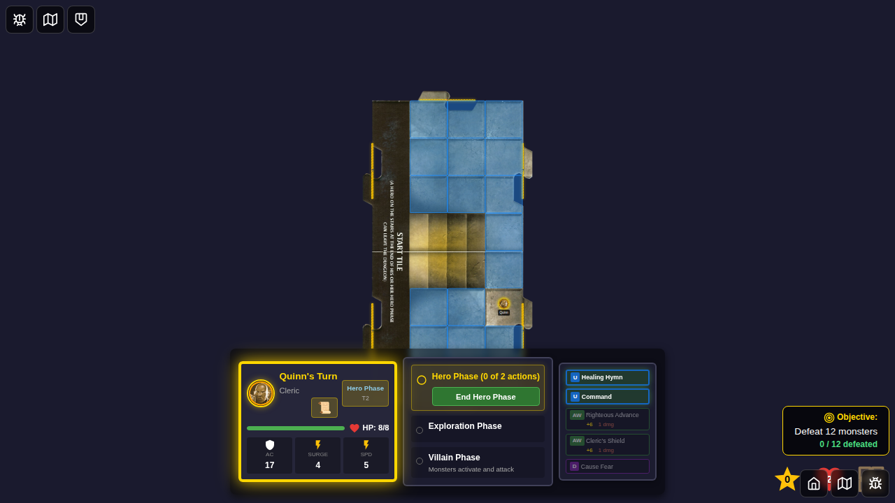

# E2E Test 092: Trap Disable Interaction

## User Story

As a player, I want to click on trap markers during my hero phase to attempt to disable them, so that I can remove dangerous traps from the game board through direct UI interaction.

## Test Steps

This test demonstrates the complete trap disable interaction lifecycle:

1. **Character Selection** - Select Quinn from bottom edge
2. **Game Start** - Start game with deterministic seed
3. **Draw Trap Card** - Transition to Villain Phase and draw Lava Flow trap encounter
4. **Place Trap** - Accept encounter card to place trap marker on hero's tile
5. **Return to Hero Phase** - Trap becomes clickable when hero is on same tile
6. **Failed Disable Attempt** - Dispatch attemptDisableTrap with low roll (5 vs DC 10) - trap remains
7. **Trap Still Active** - Verify trap marker is still visible and can be attempted again
8. **Successful Disable Attempt** - Dispatch attemptDisableTrap with high roll (15 vs DC 10) - trap removed
9. **Verify Trap Removed** - Confirm trap marker is no longer visible on board

## Screenshot Gallery

### 000 - Character Selection Screen

**What to verify:**
- Character selection screen is visible
- All hero cards are displayed

### 001 - Game Started

**What to verify:**
- Game board is loaded
- Quinn is on the start tile
- No traps are present
- Current phase is Hero Phase

### 002 - Lava Flow Trap Card Drawn

**What to verify:**
- Encounter card modal is visible
- Card shows "Lava Flow" trap
- Card description explains trap mechanics
- Accept and Cancel buttons are present

### 003 - Trap Placed on Hero Tile

**What to verify:**
- Trap marker is visible on game board
- Trap is placed at Quinn's position
- Encounter card modal is dismissed
- Trap marker displays the Lava Flow icon

### 004 - Back to Hero Phase, Trap Clickable

**What to verify:**
- Current phase is Hero Phase
- Trap marker is still visible
- Quinn is on the same tile as the trap
- Trap should show hover effects when cursor over it

### 005 - Disable Attempt Failed (Low Roll)

**What to verify:**
- Trap disable result dialog is visible
- Shows "Lava Flow" trap name
- Dice roll shows 5
- DC shows 10
- Modified roll shows 5
- Result text shows "FAILED TO DISABLE"
- Trap marker is still visible in background

### 006 - Trap Still Active After Failed Attempt

**What to verify:**
- Trap marker is still visible on game board
- Trap remains at Quinn's position
- Quinn can attempt to disable again

### 007 - Disable Attempt Succeeded (High Roll)

**What to verify:**
- Trap disable result dialog is visible
- Shows "Lava Flow" trap name
- Dice roll shows 15
- DC shows 10
- Modified roll shows 15
- Result text shows "TRAP DISABLED!"
- Success styling (green border/text)

### 008 - Trap Removed from Board

**What to verify:**
- Trap marker is no longer visible
- Game board is clear of traps
- Quinn is still on the same tile
- Normal gameplay can continue

## Manual Verification Checklist

- [ ] Trap marker is not clickable during Villain Phase
- [ ] Trap marker is not clickable when hero is on different tile
- [ ] Trap marker shows hover effects (scale, brightness) when clickable
- [ ] Trap marker shows "Click to disable" hint on hover
- [ ] Clicking trap marker triggers disable attempt
- [ ] Disable result dialog shows correct trap name
- [ ] Disable result dialog shows dice roll and DC
- [ ] Failed disable attempt keeps trap on board
- [ ] Successful disable attempt removes trap from board
- [ ] Trap disable works with keyboard (Enter/Space on focused trap)
- [ ] Trap marker has proper ARIA labels for accessibility

## Key Features Demonstrated

1. **Interactive Trap Markers** - Traps can be clicked to attempt disable
2. **Phase-Aware Interaction** - Traps only clickable during hero phase
3. **Position-Aware Interaction** - Traps only clickable when hero is on same tile
4. **Visual Feedback** - Hover effects indicate clickable state
5. **Dice Roll Mechanics** - d20 roll vs DC 10 determines success
6. **Immediate Result Display** - Result dialog shows roll details
7. **State Management** - Trap removed from game state on success

## Technical Implementation

- **GameBoard.svelte**: Added `handleTrapClick` function and pass to TrapMarker
- **TrapMarker.svelte**: Changed to `<button>` element with click handlers
- **Visual States**: Hover, focus, clickable/non-clickable
- **Accessibility**: ARIA labels, keyboard support
- **Redux Actions**: `attemptDisableTrap` dispatched on click
