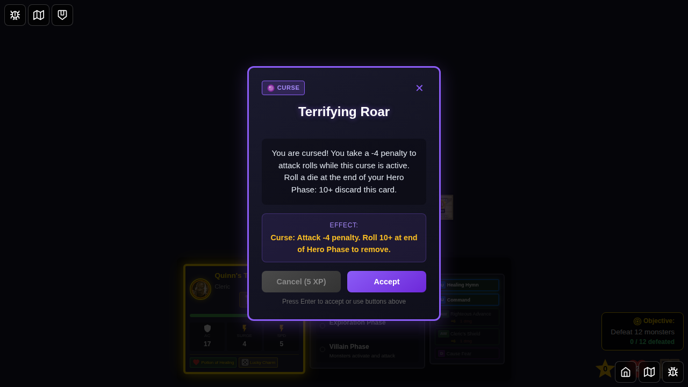
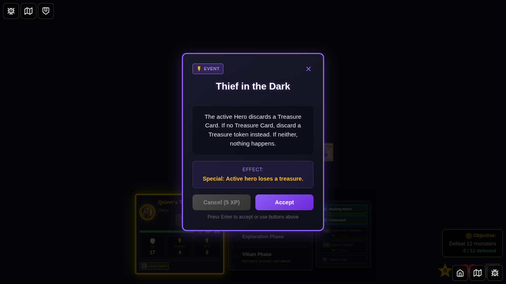
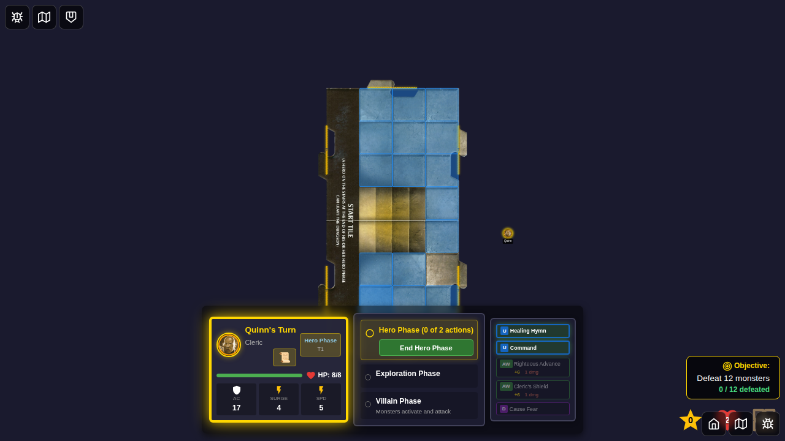

# 093 - Thief in the Dark Encounter Card

## User Story

As a player, when I draw the "Thief in the Dark" encounter card, I expect the game to:
1. **First priority**: Remove a treasure card from my inventory if I have one
2. **Second priority**: Remove a treasure token from my tile if I have no cards but a token is present
3. **Third priority**: Show a message that "the thief gets nothing" if I have neither

This test validates the complete "Thief in the Dark" encounter card mechanics by testing all three scenarios in sequence.

## Test Flow

### Screenshots

**Initial State**: Character selection screen showing all available heroes.

---

**Game Setup**: Quinn has been given 2 treasure cards (Potion of Healing and Lucky Charm) and has 1 treasure token on their tile.

---

**First Encounter**: "Thief in the Dark" drawn for the first time. Quinn has 2 treasure cards and 1 treasure token.

---

**First Loss**: The thief steals Quinn's first treasure card (Potion of Healing). Quinn now has 1 card (Lucky Charm) and 1 token remaining.

---

**Second Encounter**: "Thief in the Dark" drawn again. Quinn has 1 treasure card and 1 treasure token.

---

**Second Loss**: The thief steals Quinn's second treasure card (Lucky Charm). Quinn now has 0 cards but still has 1 token.

---

**Third Encounter**: "Thief in the Dark" drawn again. Quinn has no treasure cards but has 1 treasure token.

---

**Third Loss**: The thief steals Quinn's treasure token. Quinn now has no treasures left.

---

**Fourth Encounter**: "Thief in the Dark" drawn again. Quinn has no treasure cards and no treasure tokens.

---

**Fourth Result**: The thief gets nothing - Quinn has no treasures to steal.

---

**Final State**: Game continues with Quinn having no treasures.

## Manual Verification Checklist

When reviewing this test, verify:

### Scenario 1: Hero has treasure cards
- [ ] "Thief in the Dark" card displays correctly
- [ ] Message shows the specific treasure card name that was lost
- [ ] Treasure card is removed from hero's inventory
- [ ] Treasure tokens remain untouched

### Scenario 2: Hero has no cards but has treasure token
- [ ] "Thief in the Dark" card displays correctly
- [ ] Message shows "lost a treasure token"
- [ ] Treasure token is removed from the board
- [ ] Hero still has no treasure cards

### Scenario 3: Hero has neither cards nor tokens
- [ ] "Thief in the Dark" card displays correctly
- [ ] Message shows "the thief gets nothing"
- [ ] No changes to game state
- [ ] Game continues normally

### General Mechanics
- [ ] Encounter card can be drawn multiple times
- [ ] Each scenario is tested in sequence
- [ ] UI displays correct messages for each scenario
- [ ] Game state is consistent after each encounter
- [ ] No errors or crashes occur

## Implementation Details

**Card Rule**: "The active Hero discards a Treasure Card. If the active Hero has no Treasure Card, discard a Treasure token instead. If the active Hero has neither, the thief in the dark gets nothing."

**Test Approach**: This test uses Redux store manipulation to:
1. Add specific treasure cards to Quinn's inventory
2. Place a treasure token on Quinn's tile
3. Repeatedly draw the "Thief in the Dark" encounter
4. Verify the correct treasure loss priority

**Deterministic Setup**: Uses `setupDeterministicGame()` to ensure consistent game state and screenshot comparisons.
